# Obscura Protocol Architecture Reference (v1)

> **Document type:** Canonical Ecosystem Architecture Reference  
> **Status:** CANONICAL · LIVE (Arbitrum Sepolia testnet production)  
> **Version:** v1.1  
> **Network:** Arbitrum Sepolia · chainId `421614`  
> **Cut date:** 2026-05-29  
> **Audience:** Investors · Auditors · Engineers · Judges · Ecosystem partners  
>
> **Source-of-truth inputs (merged):**
> - [docs/pay_wave5.md](docs/pay_wave5.md) — Obscura Pay Protocol Documentation
> - [credit_wave5_protocol_bible_v1.md](credit_wave5_protocol_bible_v1.md) — Obscura Credit Architecture Reference
> - [vote_wave5_protocol_bible_v1.md](vote_wave5_protocol_bible_v1.md) — Obscura Vote Protocol Documentation (v1.3)
>
> **Deployment registry:** [contracts-hardhat/deployments/arb-sepolia.json](contracts-hardhat/deployments/arb-sepolia.json)  
> **Production frontend:** `https://obscura-os-nine.vercel.app`  
> **Production API:** `https://obscura-api-n62v.onrender.com`  
> **Production worker:** `https://obscura-worker-0ppj.onrender.com`  
> **Supabase:** `https://quoovjkjwgtdqwdofubh.supabase.co`

This document is the **single canonical architecture reference** for the Obscura privacy finance ecosystem. It merges Pay, Credit, and Vote protocol documentation into one institutional-grade system reference. Anything not marked **ACTIVE** is **LEGACY**, **ARCHIVED**, or **TESTNET-ONLY**.

---

## Document Conventions

| Symbol | Meaning |
|---|---|
| 🟢 **ACTIVE** | Deployed, wired, reachable from canonical UI today |
| 🟡 **LEGACY/TESTNET** | Deployed; gated behind Advanced toggle or superseded |
| 🔴 **ARCHIVED** | On-chain address retained for history; do not use in new flows |
| 🔐 **ENCRYPTED** | Stored as `euint64` / `ebool` / `eaddress`; plaintext never on-chain except explicit reveal |
| 🌐 **PUBLIC** | Plaintext on-chain by design (aggregates, metadata, OZ Governor tallies) |
| 🛡️ **REVEAL-ON-DEMAND** | User must click to decrypt; never auto-decrypted on mount |
| ⚡ **TWO-STEP** | CoFHE pattern requiring chained transactions (transfer + record) |
| ⚠️ **OPERATOR NOTE** | Known sharp edge documented for operators and auditors |

Cross-references use `(§N)`. Addresses are EIP-55 mixed case. Amounts use **6 decimals** for `ocUSDC` unless noted.

---

## Table of Contents

1. [Executive Vision](#1-executive-vision)
2. [Why Obscura Exists](#2-why-obscura-exists)
3. [Privacy Problem Statement](#3-privacy-problem-statement)
4. [Why FHE Changes Everything](#4-why-fhe-changes-everything)
5. [Why Fhenix Was Chosen](#5-why-fhenix-was-chosen)
6. [Full Ecosystem Overview](#6-full-ecosystem-overview)
7. [Obscura Architecture Map](#7-obscura-architecture-map)
8. [Product Philosophy](#8-product-philosophy)
9. [Pay Deep Dive](#9-pay-deep-dive)
10. [Credit Deep Dive](#10-credit-deep-dive)
11. [Vote Deep Dive](#11-vote-deep-dive)
12. [Shared Reputation System](#12-shared-reputation-system)
13. [Shared Activity System](#13-shared-activity-system)
14. [Shared Notification System](#14-shared-notification-system)
15. [Shared Identity Layer](#15-shared-identity-layer)
16. [Governance Architecture](#16-governance-architecture)
17. [Privacy Architecture](#17-privacy-architecture)
18. [CoFHE Architecture](#18-cofhe-architecture)
19. [Security Model](#19-security-model)
20. [Data Flow Atlas](#20-data-flow-atlas)
21. [Contract Atlas](#21-contract-atlas)
22. [Frontend Architecture](#22-frontend-architecture)
23. [Backend Architecture](#23-backend-architecture)
24. [Supabase Architecture](#24-supabase-architecture)
25. [Infrastructure Architecture](#25-infrastructure-architecture)
26. [Deployment Architecture](#26-deployment-architecture)
27. [User Journeys](#27-user-journeys)
28. [Product UX Philosophy](#28-product-ux-philosophy)
29. [Competitive Positioning](#29-competitive-positioning)
30. [Why Obscura Is Different](#30-why-obscura-is-different)
31. [End-to-End Lifecycle Diagrams](#31-end-to-end-lifecycle-diagrams)
32. [Complete Contract Registry](#32-complete-contract-registry)
33. [Complete Service Registry](#33-complete-service-registry)
34. [Environment Architecture](#34-environment-architecture)
35. [Operational Model](#35-operational-model)
36. [Future Expansion Roadmap](#36-future-expansion-roadmap)
37. [Ecosystem Scale](#37-ecosystem-scale)
38. [Why Obscura Is Technically Difficult](#38-why-obscura-is-technically-difficult)

---

## 1. Executive Vision

Obscura is a **privacy-first decentralized finance ecosystem** on **Arbitrum Sepolia** where financial activity — payments, lending positions, governance ballots, and reputation signals — can remain **encrypted on-chain** until the user explicitly chooses to reveal.

The ecosystem comprises three production products unified under the **Harmony workspace**:

| Product | Route | Core capability |
|---|---|---|
| **Obscura Pay** | `/pay` | Private USDC payments, streams, escrows, invoices, stealth receiving, public-mode smart accounts |
| **Obscura Credit** | `/credit` | Encrypted money-market lending against Pay-backed `ocUSDC_Pay` |
| **Obscura Vote** | `/vote` | FHE-encrypted multi-option governance, treasury, rewards, and executable OZ Governor |

All three products share:

- **Fhenix CoFHE** for homomorphic encryption on Arbitrum Sepolia
- **`ocUSDC_Pay`** (`0xEd46020Df8abe7BB1E096f27d089F4326D223a53`) as the canonical confidential asset
- **Supabase** activity, reputation, and notification infrastructure
- **Render** API and worker backend services
- **Vercel** frontend deployment
- **Reveal-on-demand UX** — encrypted values display as masked placeholders until user action

**Environment boundary:** Fhenix CoFHE is testnet-only as of this reference. Arbitrum Sepolia is the canonical production deployment target. Mainnet availability is an infrastructure unlock, not a missing product feature.

---

## 2. Why Obscura Exists

Public blockchains expose transaction graphs, balances, and behavioral patterns by default. For individuals, businesses, and institutions operating on-chain, this creates structural problems:

1. **Payment privacy** — Salary, invoice, and payroll amounts are visible to competitors and counterparties.
2. **Credit privacy** — Borrowing and collateral positions reveal financial health to MEV actors and adversaries.
3. **Governance privacy** — On-chain votes enable coercion, vote-buying verification, and strategic targeting.
4. **Reputation composability** — Without a unified privacy-aware reputation layer, products cannot safely share trust signals.

Obscura addresses these by building **encrypted state machines** on-chain — contracts that store `euint64` ciphertext handles rather than plaintext amounts — while preserving **public aggregates** where transparency is intentional (TVL, utilization, participation counts, finalized tallies after explicit reveal).

The product progression reflects increasing privacy scope:

```
Private Payments  →  Private Credit  →  Private Reputation  →  Private Governance
```

Each layer consumes signals from the prior layer without leaking individual transaction details.

---

## 3. Privacy Problem Statement

### 3.1 On-chain transparency defaults

| Surface | Default public-chain behavior | Obscura target |
|---|---|---|
| Token transfers | Amount + sender + recipient visible | Amount encrypted (`ConfidentialTransfer` omits amount) |
| Lending positions | Collateral and debt visible | Per-user shares encrypted; public TVL only |
| Governance votes | Option + weight visible | Option index encrypted; weight public only at aggregate |
| Activity indexing | Event args may leak amounts | Worker sanitizes sensitive fields before Supabase insert |
| UI display | Wallets show balances automatically | Masked until explicit Reveal click |

### 3.2 Residual public metadata (testnet)

Even with FHE, certain metadata remains public by design or limitation:

- Wallet addresses in events (sender, recipient, stealth address, participants)
- Block timestamps and transaction hashes
- Proposal titles, deadlines, categories (Vote metadata)
- `hasVoted` flags and `voterParticipation` counters
- Public delegation mappings (`delegateTo`)
- Shield/unshield bridge amounts (public USDC enters/exits wrapper)
- Indexed activity timing and participant sets in Supabase

Auditors and partners must treat **event timing + participant graphs** as public inference surfaces even when amounts are encrypted.

### 3.3 Trust boundaries

| Boundary | What crosses it | Privacy guarantee |
|---|---|---|
| User ↔ CoFHE SDK | Encrypt/decrypt permits | User-triggered only; no mount-time auto-decrypt |
| User ↔ Chain | Signed transactions | Encrypted inputs bound to immediate caller (EOA) |
| Chain ↔ Worker | Event logs | Sanitized before database; amount fields stripped where applicable |
| Worker ↔ Supabase | Activity/reputation rows | No decrypted private amounts stored |
| API ↔ Frontend | Reputation summary | Capped weights; tier buckets only |

---

## 4. Why FHE Changes Everything

Fully Homomorphic Encryption (FHE) enables **computation on encrypted data** without decrypting it on-chain. In Obscura:

- Balances are `euint64` handles (`bytes32` on-chain)
- Contracts perform `FHE.add`, `FHE.sub`, `FHE.gt`, `FHE.eq`, `FHE.select` on ciphertext
- Only holders of ACL permissions can decrypt — typically the user, via CoFHE coprocessor permits

This differs from:

| Approach | Limitation | Obscura FHE advantage |
|---|---|---|
| Mixers / privacy pools | Linkability, regulatory friction, fixed denominations | Continuous balances; no pool exit graph |
| ZK proofs for amounts | Prover complexity; limited composability | Homomorphic updates across contract calls |
| Off-chain private state | Trust in operator; no on-chain verifiability | Ciphertext handles live on-chain; ACL enforced by Fhenix |
| View keys / optional encryption | Opt-in leaks; inconsistent coverage | Default encrypted state in product contracts |

FHE enables **composable encrypted DeFi**: Pay streams can fund Credit repayments; Credit scores can read Vote participation — all without publishing individual amounts.

---

## 5. Why Fhenix Was Chosen

**Fhenix CoFHE** provides a coprocessor model integrated with EVM chains:

| Factor | Fhenix CoFHE | Implication for Obscura |
|---|---|---|
| EVM compatibility | Runs on Arbitrum Sepolia | Reuse Solidity, Hardhat, wagmi, existing DeFi patterns |
| `euint64` / `InEuint64` types | Native in `@fhenixprotocol/cofhe-contracts` | Contract-level encrypted accounting |
| ACL model | `FHE.allowThis`, `FHE.allow`, `FHE.allowTransient`, `FHE.allowPublic` | Fine-grained decrypt permissions |
| Client SDK | `@fhenixprotocol/cofhe-sdk` | Browser encryption + user-triggered decrypt |
| Coprocessor execution | Off-chain FHE compute, on-chain handle storage | Chain stays Arbitrum; FHE is not the L1 |

**Why not alternatives:** Obscura requires encrypted state **inside** lending markets and governance tallies — not just hidden transfers. Fhenix provides the contract primitives and ACL lifecycle that Morpho-style isolated markets and multi-option votes need.

**Current constraint:** CoFHE mainnet is not available for this product path. Obscura deploys on Arbitrum Sepolia with Fhenix testnet coprocessing. This is documented as an environment boundary, not a protocol defect.

---

## 6. Full Ecosystem Overview

```mermaid
flowchart TB
  subgraph USERS[Users]
    EOA[EOA Wallet / Passkey Smart Account]
  end

  subgraph PRODUCTS[Obscura Products · Vercel]
    PAY[/pay · Obscura Pay]
    CREDIT[/credit · Obscura Credit]
    VOTE[/vote · Obscura Vote]
  end

  subgraph ASSET[Shared Asset Layer]
    USDC[Circle USDC · public]
    OCUSDC[ocUSDC_Pay · FHERC20 wrapper\n0xEd46…3a53]
  end

  subgraph CHAIN[Arbitrum Sepolia 421614]
    PAYC[Pay contracts\nstreams · escrow · invoice · stealth]
    CREDC[Credit contracts\nmarket · router · auction · score]
    VOTEC[Vote contracts\nVote · Treasury · Rewards · Governor]
  end

  subgraph BACKEND[Render Backend]
    API[obscura-api\nrelay · notifications · reputation]
    WK[obscura-worker\nindexer · reputation · push]
  end

  subgraph DATA[Supabase]
    ACT[obscura_activity]
    REP[obscura_reputation_events]
    SUB[obscura_push_subscriptions]
    PREF[obscura_notification_prefs]
  end

  EOA --> PRODUCTS
  PAY & CREDIT --> OCUSDC
  USDC -->|shield| OCUSDC
  PRODUCTS --> CHAIN
  WK --> CHAIN
  WK --> ACT & REP
  WK -->|Web Push| EOA
  API --> ACT & SUB & PREF
  ACT -->|Realtime| PRODUCTS
  API -->|GET /reputation| PRODUCTS
```

### 6.1 Product maturity (2026-05-29)

| Product | Status | Canonical contract anchor |
|---|---|---|
| Pay | Production-complete on Sepolia | `ocUSDC_Pay`, `ObscuraPayStreamV3` |
| Credit | Production-complete on Sepolia | `CreditCanonicalPayOcUSDCMarket` `0x1Ec1…f551` |
| Vote | Production-complete on Sepolia | `ObscuraVote V5` `0xe358…1730` |

Quantitative scale metrics: (§37).

### 6.2 Cross-product value flows

| Flow | Mechanism |
|---|---|
| Pay → Credit | Shared `ocUSDC_Pay` balance; shield in Pay, borrow in Credit |
| Pay → Reputation | Indexed Pay events → `obscura_reputation_events` |
| Vote → Credit | `voterParticipation` → `ObscuraCreditScoreV2` → LLTV boost |
| Vote → Reputation | Vote/Governor/Treasury/Rewards events → reputation signals |
| Credit → Reputation | Market/vault/auction events → credit signal types |
| Governor → Credit | Timelock → `ObscuraCreditGovernanceProxy` → Factory params |
| Governor → Pay | Timelock → `ObscuraTreasuryStreamer` → Pay streams |

---

## 7. Obscura Architecture Map

```mermaid
flowchart LR
  subgraph CLIENT[Client Tier]
    FE[Vite + React + wagmi v2]
    FHE_SDK[@fhenixprotocol/cofhe-sdk]
    SW[Service Worker /sw.js]
  end

  subgraph COMPUTE[Compute Tier]
    ARB[Arbitrum Sepolia EVM]
    COFHE[Fhenix CoFHE Coprocessor]
  end

  subgraph INDEX[Index Tier]
    WK[obscura-worker]
    RPC[RPC fallback mesh]
  end

  subgraph API_TIER[API Tier]
    API[obscura-api]
    BUNDLER[ERC-4337 Bundler]
  end

  subgraph PERSIST[Persistence Tier]
    SB[(Supabase Postgres)]
    RT[Supabase Realtime]
  end

  FE --> FHE_SDK
  FE --> ARB
  FHE_SDK --> COFHE
  ARB --> COFHE
  WK --> RPC --> ARB
  WK --> SB
  API --> SB
  API --> BUNDLER
  SB --> RT --> FE
  WK --> SW
  API --> FE
```

### 7.1 Layer responsibilities

| Layer | Responsibility | Failure mode |
|---|---|---|
| Client | UX, encryption, wallet signing, reveal-on-demand | User sees masked values; no auto-decrypt spam |
| EVM + CoFHE | Encrypted state, ACL, public aggregates | ACL errors if `FHE.allowThis` omitted |
| Index | Event decode, sanitize, activity insert, reputation derive, push | Worker health red → empty activity feed |
| API | Prefs, subscriptions, reputation summary, UserOp relay | Cold start ~30s on Render free tier |
| Persistence | Activity history, reputation signals, push state | RLS permissive on testnet — harden for mainnet |

---

## 8. Product Philosophy

Obscura follows a deliberate product stack where each layer builds on the prior:

```
┌─────────────────────────────────────────────────────────────┐
│  PRIVATE GOVERNANCE (Vote)                                   │
│  Encrypted ballots · Treasury · Rewards · OZ Governor       │
├─────────────────────────────────────────────────────────────┤
│  PRIVATE REPUTATION (Shared)                                 │
│  Cross-product signals · tiered summary · Credit Score V2    │
├─────────────────────────────────────────────────────────────┤
│  PRIVATE CREDIT (Credit)                                     │
│  Encrypted borrow/supply/collateral · sealed liquidation     │
├─────────────────────────────────────────────────────────────┤
│  PRIVATE PAYMENTS (Pay)                                      │
│  ocUSDC · stealth · streams · escrow · invoice · AA public   │
└─────────────────────────────────────────────────────────────┘
```

### 8.1 Design principles

1. **Encrypted by default** — Sensitive amounts are `euint64`, not plaintext.
2. **Reveal on demand** — No `decryptForView` or permit operations in `useEffect`.
3. **Public where intentional** — TVL, utilization, participation counts, finalized tallies after `allowPublic`.
4. **User-intent navigation** — Pay uses Pay/Get Paid/Automations; Credit uses Borrow/Position/Earn; Vote uses Proposals/Participation.
5. **Shared infrastructure** — One worker, one API, one Supabase project, one reputation endpoint.
6. **EOA-first for FHE writes** — Smart accounts cannot forward `InEuint64` proofs (CoFHE `InvalidSigner`).
7. **Receipt-gated UX** — `waitForTransactionReceipt` before `FHEStepStatus.READY`.

### 8.2 Harmony design system

Shared across Pay, Credit, and Vote:

- Institutional surfaces (white/black Harmony tokens)
- `HarmonyAppShell` sidebar + mobile bottom nav
- Masked encrypted values (`***` / `███████`) until Reveal
- FHE stepper: `IDLE → ENCRYPTING → COMPUTING → SENDING → SETTLING → READY → IDLE`
- Plain-language copy — no "euint", "ctHash", "ACL", "coprocessor" in user-facing text

---

## 9. Pay Deep Dive

**Source:** [docs/pay_wave5.md](docs/pay_wave5.md)  
**Route:** `/pay` · **Asset:** `ocUSDC_Pay` `0xEd46020Df8abe7BB1E096f27d089F4326D223a53`

Obscura Pay is the payment layer: encrypted ocUSDC balances, stealth-address receiving, private invoices, confidential escrows, recurring streams, insurance subscriptions, browser-local receipts, indexed activity, push notifications, and a public-mode ERC-4337 smart-account path.

### 9.1 Execution modes

| Mode | Asset | Route | Privacy rule |
|---|---|---|---|
| **Private Mode** | Pay ocUSDC | EOA wallet | Encrypted FHE writes only; smart-account forwarding rejected |
| **Public Mode** | Circle USDC | Passkey smart account + ERC-4337 relay | Public token transfers; no encrypted ocUSDC via AA |

Private path rejects smart-account forwarding because CoFHE input proofs bind to the immediate caller (`InvalidSigner` on forward).

### 9.2 Core active Pay contracts (6)

| Contract | Address | Role |
|---|---|---|
| `ObscuraPay` | `0x91CdD9a481C732bEB09Ce039da23DC11e83547a4` | Wave 1 payroll foundation; indexes `EmployeePaid` |
| `ocUSDC_Pay` | `0xEd46020Df8abe7BB1E096f27d089F4326D223a53` | Confidential USDC wrapper (6 dec) |
| `ObscuraPayStreamV3` | `0xE4328F139F03138D63f7fdF90A8Ef240e04653fA` | Handle-based recurring stream engine |
| `ObscuraPayrollResolverV3` | `0xB077c231448EF2252060E4B4dD404078DBD94180` | V3 stream escrow release resolver |
| `ObscuraConfidentialEscrow` | `0x293810A2081114CcE0c98A709a0c31aE07c01D75` | Confidential escrow (one-off + V3 cycles) |
| `ObscuraInsuranceSubscriptionV2` | `0xEA9Fc5800F41d090dFB90f9735F4CF3824d6743D` | Handle-based recurring debit primitive |

### 9.3 Worker-indexed Pay event sources (6)

| Contract | Events |
|---|---|
| `ObscuraPay` | `EmployeePaid` |
| `ObscuraPayStreamV3` | `StreamCreated`, `StreamCancelled`, `CycleSettled` |
| `ObscuraInvoice` | `InvoiceCreated`, `InvoicePaid` |
| `ObscuraConfidentialEscrow` | `EscrowCreated`, `EscrowFunded`, `EscrowRedeemed`, `EscrowCancelled`, `EscrowRefunded` |
| `ObscuraInsuranceSubscriptionV2` | `Subscribed`, `Consumed`, `Cancelled` |
| `ObscuraStealthRegistry` | `Announcement`, `MetaAddressSet` |

Note: Direct `ocUSDC_Pay` token events are **not** worker-indexed; activity may rely on paired indexed events or local receipts.

### 9.4 Pay navigation (6 tabs)

| Tab | Purpose |
|---|---|
| Overview | State-driven home, balances, quick actions |
| Pay | Send, make USDC private (shield), bridge |
| Get Paid | Private inbox, setup, payment requests, inbound streams |
| Automations | Streams, escrows, subscriptions, payroll |
| Activity | Indexed chain activity + local receipts |
| Settings | Preferences, privacy, contacts, local data, legacy tools |

### 9.5 Key Pay hooks

| Hook | Purpose |
|---|---|
| `useOcUSDCBalance` | Shield/unshield/reveal — **must** use `OBSCURA_PAY_OCUSDC_ADDRESS` |
| `useOcUSDCTransfer` | Direct private send |
| `UnifiedSendForm` | Stealth send + announce retry pattern |
| `usePayStreamV3` | V3 stream create/tick |
| `useInvoice` | Encrypted invoice create/pay |
| `useOcUSDCEscrow` | Escrow lifecycle |
| `useStealthInbox` / `useStealthScan` | Private inbox (explicit unlock) |
| `useSmartAccount` | Public-mode ERC-4337 |
| `useActivityFeed` | Supabase Realtime + poll |

### 9.6 Handle-transfer pattern (Pay)

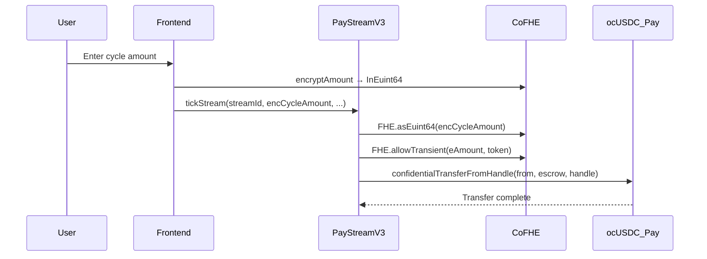

Active in `ObscuraPayStreamV3` and `ObscuraInsuranceSubscriptionV2`.

### 9.7 Pay transaction lifecycles (summary)

| Lifecycle | Key steps |
|---|---|
| Shield | Approve USDC → `shield(amount)` → `FHE.allowThis` |
| Unshield | Encrypt → `unshield(amtPlain, encAmt, to)` |
| Direct send | Encrypt → `confidentialTransfer(to, encAmount)` |
| Stealth send | Derive stealth → transfer → `sleep(2500)` → `announce()` (retryable) |
| Invoice | `create` → ocUSDC transfer → `recordPayment` |
| Escrow | `create` → transfer → `fund` → `redeem`/`cancel`/`refund` |
| Stream V3 | `createStream` → `setOperator` → `tickStream` → escrow cycle |
| Public UserOp | Build → sign → `POST /relay` → poll `/userop-receipt` |

### 9.8 Pay support contracts

| Contract | Address | Role |
|---|---|---|
| `ObscuraInvoice` | `0x62a86C8d68fF32ea41Faf349db6EF7EF496620b7` | Confidential invoices |
| `ObscuraStealthRegistry` | `0xa36e791a611D36e2C817a7DA0f41547D30D4917d` | ERC-5564 meta-address + announce |
| `ObscuraInboxIndex` | `0xDF195fcfa6806F07740A5e3Bf664eE765eC98131` | Ignore/spam bloom filter |
| `ObscuraSocialResolver` | `0xCe79E7a6134b17EBC7B594C2D85090Ef3cf37578` | Handle → owner/stealth resolution |
| `ObscuraAddressBook` | `0x4095065ee7cc4C9f5210A328EC08e29B4Ac74Eef` | Encrypted contacts (labels local-only) |
| `ObscuraStealthRotation` | `0x47D4a7c2B2b7EDACCBf5B9d9e9C281671B2b5289` | Meta-address rotation history |

### 9.9 Public-mode AA infrastructure

| Contract | Address |
|---|---|
| EntryPoint v0.7 | `0x0000000071727De22E5E9d8BAf0edAc6f37da032` |
| `ObscuraSmartAccountFactory` | `0xFaC683D8AB872cCf5eBfaE1659a9CD44C6FB4feB` |
| `ObscuraSmartAccountImplementation` | `0x0415945e442C4C5533367Fbb6f0D40528e0D7809` |
| `ObscuraPaymaster` v2 | `0x7a8D880D9c5F88Ba8bd4435c450256628F66dd0C` |

### 9.10 Pay operator notes

| Note | Detail |
|---|---|
| Do not confuse Pay vs Credit ocUSDC | Pay wrapper `0xEd46…`; Credit faucet `0xf963…` |
| Subscription UI nuance | `SubscriptionForm` has legacy V2 schedule path + direct tick |
| CCTP bridge | Mints public USDC; does not auto-shield |
| Escrow redeem | Silent-failure semantics — revealed balance is truth |
| Rate limits | CoFHE quota vs Alchemy RPC 429 — distinct UX patterns |

---

## 10. Credit Deep Dive

**Source:** [credit_wave5_protocol_bible_v1.md](credit_wave5_protocol_bible_v1.md)  
**Route:** `/credit` · **Canonical market:** `0x1Ec113297c7F9516A6604aa3b18C180559a6f551`

Obscura Credit is a **privacy-first money market** (Morpho Blue-shaped isolated markets) where per-user supply shares, borrow shares, and collateral are `euint64` ciphertext handles. Public aggregates (TVL, utilization) remain plaintext.

### 10.1 Canonical market parameters

| Parameter | Value |
|---|---|
| Market | Private USDC Credit Line |
| `loanAsset` / `collateralAsset` | `ocUSDC_Pay` |
| `lltvBps` | 8600 (86%) |
| `liqThresholdBps` | 9000 (90%) |
| `liqBonusBps` | 500 (5%) |
| Oracle feed | Chainlink USDC/USD adapter `0xc65e…2c4A` |

### 10.2 Credit product surface (6 tabs)

| Tab | Purpose | FHE decrypt? |
|---|---|---|
| Overview | Market status, TVL, ActivityFeed | No |
| Borrow | BorrowForm, canonical market card | Reveal-on-demand |
| Position | EncryptedTiles, HF, action forms | Reveal-on-demand |
| Earn | Supply, vaults (Advanced) | Reveal-on-demand |
| Liquidations | Sealed auction cards | No (encrypted bids) |
| Risk | Reputation, notifications, ActivityFeed | No |

Settings slide-over: Advanced markets toggle, notifications, operator config, CreditScoreRing.

### 10.3 Core Credit contracts

| Contract | Address | Role |
|---|---|---|
| `ObscuraCreditMarket` | `0x1Ec1…f551` | Isolated FHE money market (canonical) |
| `ObscuraCreditRouter` | `0x46275A34e26C9dBb46fB1716852a5D221564a43F` | Wallet-native multicall |
| `ObscuraCreditAuction` | `0x205FfC0A3b8207B645c1a6B1b4805eb3FfC828F0` | Sealed-bid liquidation auction |
| `ObscuraCreditScoreV2` | `0xe5B0c6c06C0B1fd7d7CD5D2e93997693863d3D4D` | Encrypted reputation oracle |
| `ObscuraCreditOracle` | `0x5F00910533AB6fc12a35a87BaFe856EF2cb323c3` | Public feed → euint64 bridge |
| `ObscuraCreditIRM` | `0xA072c038cE98dEC8F5350D451145fB98F5EA57Bc` | Linear-kink rate model |
| `ObscuraCreditFactory` | `0x5aDC1965D155f4b18119222CBA7a7A4be4F45680` | CREATE2 market builder |
| `ObscuraCreditGovernanceProxy` | `0x1C6892cCF24A6ade21B6778D9B5C288Ab85DA49C` | Timelock → Factory bridge |
| `ObscuraCreditStreamHook` | `0x740580C5FF321440C61c6Af667C191Eea2249F96` | Auto-repay from Pay streams |
| `ObscuraCreditInsuranceHook` | `0x55f632401d238dFBEdd63B4adDF5B64DfB178190` | Anti-liquidation top-up |

### 10.4 Credit architecture diagram

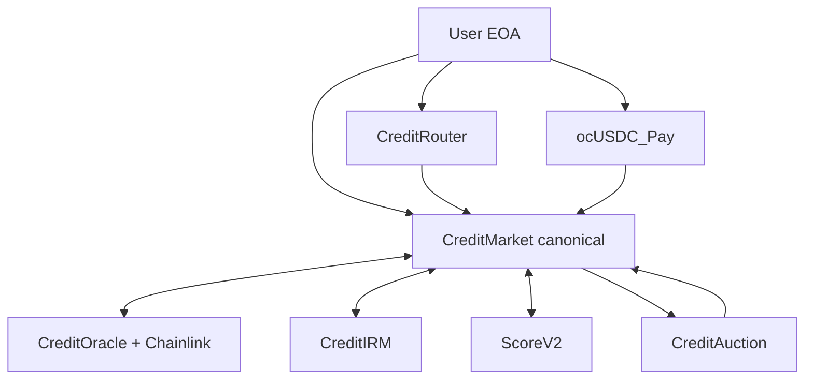

### 10.5 Two-step CoFHE pattern (Credit)

CoFHE rate limiter requires follow-up FHE op on same handle:

1. User calls `cToken.confidentialTransfer(target, encAmt)` directly
2. User calls `target.recordWithEnc(amtPlain, encAmt2)` re-encrypting same value

Used for supply, borrow, repay, collateral operations. Router pattern works because CoFHE binds to encryption signer, not `msg.sender`.

### 10.6 FHE.eq guard pattern

Market uses encrypted equality checks with **plaintext shadow mirrors** for revert guards. If user submits wrong plaintext in guard path, shadow diverges — loss on user, safety for pool.

### 10.7 Score V2 integration

ScoreV2 reads Pay (`streamsByEmployer`), AddressBook (`listContactIds`), Vote (`voterParticipation`). Market reads `userTier` (public bucket) and optionally `allowTransientForMarket` for encrypted score. Tier ≥ 3 → effective LLTV +400 bps via `FHE.select`.

### 10.8 Legacy/testnet markets (Advanced toggle)

| Market | Address | Status |
|---|---|---|
| v316 reference | `0x269f59672F3fd7f95bF440941e618b54Ebc5717A` | 🟡 Legacy faucet ocUSDC |
| v2_M86 | `0xcf98d97934F37Ac9A05bc037437E43cb6788eC8b` | 🟡 86% LLTV |
| v319_M70WETH | `0x0b645441D65A0CCb91A82b5a2eE3156C1c89207B` | 🟡 WETH collateral |
| Vault Conservative/Balanced | `0xCEBb…` / `0xF508…` | 🟡 MetaMorpho-shaped vaults |

Canonical UI defaults to **only** the Pay-backed market (`§10.1`).

---

## 11. Vote Deep Dive

**Source:** [vote_wave5_protocol_bible_v1.md](vote_wave5_protocol_bible_v1.md) v1.3  
**Route:** `/vote` · **Canonical contract:** `ObscuraVote V5` `0xe358776AfdbA95d7c9F040e6ef1f5A021aF91730`

Obscura Vote provides **FHE-encrypted multi-option governance** with weighted delegation, anti-coercion revotes, aggregate-only public reveal, treasury spend attestation, voter rewards, and a complementary **OpenZeppelin Governor** track for executable proposals.

### 11.1 Two governance tracks (both ACTIVE)

| Track | Contract | Ballot privacy | Primary UI |
|---|---|---|---|
| **Private app governance** | `ObscuraVote` | Encrypted option index | Proposals → Vote / Results |
| **Executable OZ governance** | `ObscuraGovernor` + Timelock | Plaintext support/weight | Advanced → Governor |

### 11.2 Vote stack contracts

| Contract | Address | Role |
|---|---|---|
| `ObscuraVote` V5 | `0xe358776AfdbA95d7c9F040e6ef1f5A021aF91730` | FHE ballots, delegation, finalization |
| `ObscuraTreasury` | `0x89252ee3f920978EEfDB650760fe56BA1Ede8c08` | ETH vault + FHE-attested spends |
| `ObscuraRewards` | `0x435ea117404553A6868fbe728A7A284FCEd15BC2` | 0.001 ETH/vote accrual |
| `ObscuraToken` ($OBS) | `0xf4A1219b0aaB83f772B240Ed508e3A37d7F55ED2` | Eligibility gate (`lastClaim > 0`) |
| `ObscuraGovernor` | `0xE4807C9F90a0da8F5B5bafa4361B15ff855b7186` | OZ executable governance |
| `ObscuraTimelock` | `0x07b7961627f433a1d9001F82Ac4af9F19b9a9E05` | 2-day min delay |
| `ObscuraTreasuryStreamer` | `0x4af75Ae3B46C34B70d6E85FEcDb71E99EC490FeD` | Timelock → Pay streams |
| `ObscuraCreditGovernanceProxy` | `0x1C6892cCF24A6ade21B6778D9B5C288Ab85DA49C` | Timelock → CreditFactory |

### 11.3 Vote navigation

```
/vote (HarmonyAppShell)
├── Overview          → KPIs + active proposal rail
├── Proposals         → Browse | Vote | Create | Results
├── Participation     → Profile · Rewards · Delegation · Activity
└── Advanced          → Treasury | Governor
```

### 11.4 ObscuraVote contract summary

| Field | Detail |
|---|---|
| Eligibility | `obsToken.lastClaim(user) > 0` |
| MAX_OPTIONS | 10 |
| Encrypted state | `tallies`, `voterEncryptedVote` |
| Public state | `hasVoted`, `voterParticipation`, `delegateTo`, `delegationWeight` |
| Key writes | `createProposal`, `castVote`, `finalizeVote`, `delegate`, `undelegate` |
| Revote | Second+ `castVote` emits `VoteChanged`; adjusts tallies |

### 11.5 Proposal lifecycle

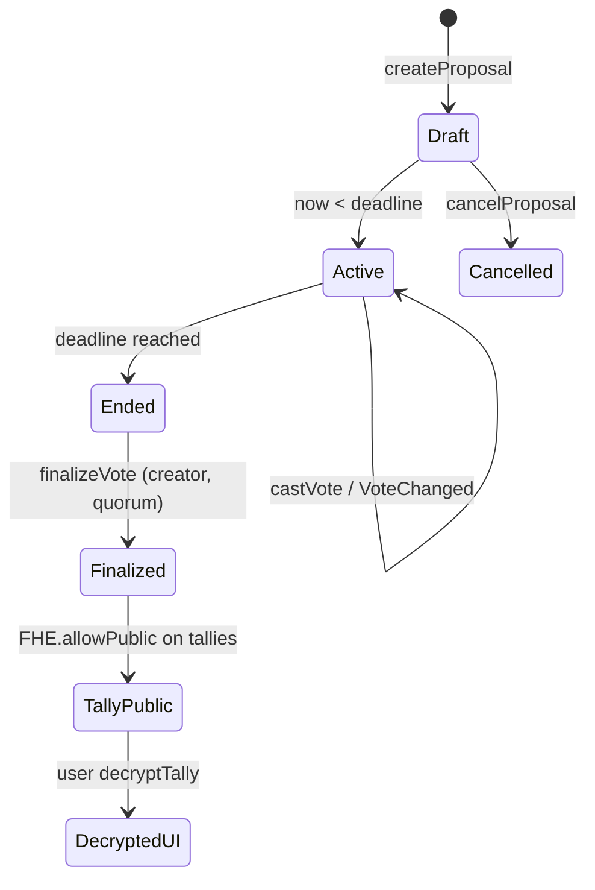

### 11.6 Treasury lifecycle

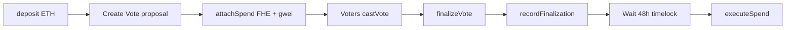

**Dual timelock:** Treasury `timelockDuration` (48h default) is independent of OZ TimelockController (2 days for Governor).

### 11.7 Rewards lifecycle

- **Rate:** `REWARD_PER_VOTE_GWEI = 1_000_000` → **0.001 ETH** per accrual
- **Flow:** Vote + finalize → `accrueReward` → `encRewardBalance` + plain ledger → `requestWithdrawal` → `withdraw`
- **Operator note:** `FHE.sub` skipped on withdraw (CoFHE rate limits); plain ledger is authoritative for payouts

### 11.8 Governor parameters

| Parameter | Value |
|---|---|
| `votingDelay` | 1 block |
| `votingPeriod` | 50,400 blocks (~3 days) |
| `proposalThreshold` | 1 (`voterParticipation ≥ 1`) |
| `quorumVotes` | 3 |
| Timelock min delay | 172,800 s (2 days) |
| Voting power source | `ObscuraVote.voterParticipation` |

### 11.9 Index plane (production)

Worker indexes **four contracts:** ObscuraVote, ObscuraGovernor, ObscuraTreasury, ObscuraRewards.

| Contract | Reputation signals |
|---|---|
| ObscuraVote | `vote_participated`, `vote_changed`, `vote_delegated`, `vote_delegation_removed` |
| ObscuraGovernor | `governance_proposed`, `governance_vote_cast` (sanitized) |
| ObscuraTreasury | `treasury_spend_attached`, `treasury_spend_executed` |
| ObscuraRewards | `vote_reward_accrued`, `vote_reward_withdrawn` |

Amount fields stripped from Supabase `args` for Treasury/Rewards/Governor vote events.

### 11.10 Vote production status (2026-05-29)

| Area | Status |
|---|---|
| Private vote lifecycle | ✅ E2E validated (proposal #8) |
| Treasury lifecycle | ✅ E2E validated (proposal #9) |
| Rewards accrual | ✅ Validated |
| Governor propose/vote/queue/execute | ✅ Production verified |
| Four-contract indexer + ABI pipeline | ✅ Deployed (`sync-vote-abis`) |

---

## 12. Shared Reputation System

**Sources:** Pay §12.3, Credit §16, Vote §16

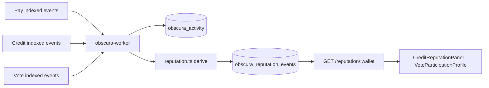

### 12.1 Pipeline

1. Chain event decoded by worker indexer
2. Row inserted into `obscura_activity` (idempotent `tx_hash + log_index`)
3. `reputation.ts` derives capped signals → `obscura_reputation_events`
4. API aggregates with tier buckets → frontend panels

Deduplication key: `(wallet, source_app, signal_type, event_ref)`.

### 12.2 Pay reputation signals

| Source event | `signal_type` |
|---|---|
| `ObscuraStealthRegistry.Announcement` | `private_payment_sent`, `private_payment_received` |
| `ObscuraPay.EmployeePaid` | `private_payment_sent`, `private_payment_received` |
| `ObscuraPayStreamV3.StreamCreated` | `stream_created` |
| `ObscuraPayStreamV3.CycleSettled` | `stream_cycle_settled` |
| `ObscuraConfidentialEscrow.EscrowRedeemed` | `escrow_redeemed` |
| `ObscuraInvoice.InvoicePaid` | `invoice_paid` |
| `ObscuraInsuranceSubscriptionV2.Consumed` | `subscription_consumed` |

### 12.3 Credit reputation signals

| Event | `signal_type` | API cap |
|---|---|---|
| `CreditMarket.Supplied` | `credit_liquidity_supplied` | 20 |
| `CreditMarket.Borrowed` | `credit_borrowed` | 20 |
| `CreditMarket.Repaid` | `credit_repaid` | **24** |
| `CreditMarket.LiquidationOpened` | `credit_liquidation_opened` | 5 |
| `CreditAuction.AuctionSettled` | `credit_auction_won` | 10 |
| `CreditVault.Deposited` | `credit_vault_deposited` | 20 |
| `CreditScore.ScoreUpdated` | `credit_score_updated` | 10 |

### 12.4 Vote reputation signals

| Event | `signal_type` |
|---|---|
| `ObscuraVote.VoteCast` | `vote_participated` |
| `ObscuraVote.VoteChanged` | `vote_changed` |
| `ObscuraVote.DelegateSet` | `vote_delegated` |
| `ObscuraGovernor.VoteCast` | `governance_vote_cast` |
| `ObscuraTreasury.SpendAttached` | `treasury_spend_attached` |
| `ObscuraTreasury.SpendExecuted` | `treasury_spend_executed` |
| `ObscuraRewards.RewardAccrued` | `vote_reward_accrued` |
| `ObscuraRewards.RewardWithdrawn` | `vote_reward_withdrawn` |

### 12.5 API summary shape

`GET https://obscura-api-n62v.onrender.com/reputation/:wallet`:

```jsonc
{
  "wallet": "0x...",
  "sourceApp": "all",
  "totalCappedWeight": 47,
  "tier": "steady",
  "signals": { "credit_repaid": { "count": 2, "cappedWeight": 24, ... } },
  "sources": { "credit": 44, "pay": 3, "vote": 0 },
  "updatedAt": "ISO-8601"
}
```

**Tier thresholds:** `new` < 3 ≤ `active` < 12 ≤ `steady` < 24 ≤ `reliable`

### 12.6 On-chain reputation (Score V2)

`ObscuraCreditScoreV2` stores encrypted `_score[user]` (euint64) and public `userTier[user]` (0–3 bucket). Markets read tier for LLTV boost; encrypted score requires user attestation via `allowTransientForMarket`.

---

## 13. Shared Activity System

**Sources:** Pay §8.11, Credit §25, Vote §17

### 13.1 Architecture

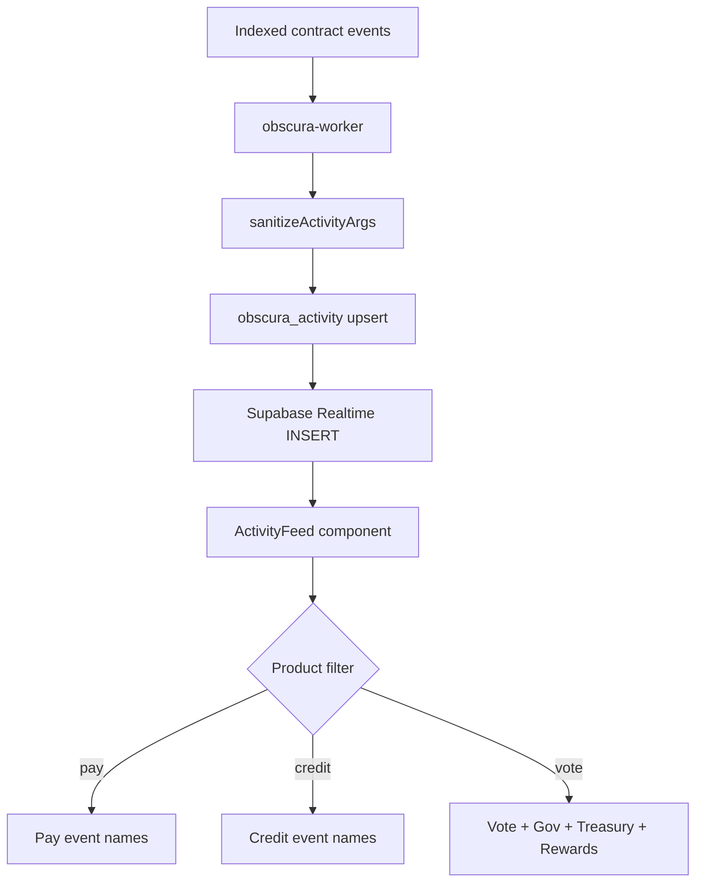

### 13.2 Activity row schema

| Field | Meaning |
|---|---|
| `chain_id` | `421614` |
| `block_number`, `tx_hash`, `log_index` | Idempotency key |
| `contract_address` | Lowercased source |
| `event_name` | Namespaced e.g. `ObscuraVote.VoteCast` |
| `wallet` | Primary extracted wallet |
| `participants` | All addresses from event args |
| `args` | JSON — sanitized; amount fields stripped where required |

### 13.3 Frontend consumption

- **Hook:** `useActivityFeed` — Supabase Realtime + 30s polling fallback
- **Component:** `ActivityFeed` — product filter prop (`pay` | `credit` | `vote`)
- **No REST `/activity` endpoint** — direct Supabase read by design
- **Privacy:** Vote filter includes Treasury/Rewards; Governor args sanitized

### 13.4 Query contract

| Consumer | Access | Filter |
|---|---|---|
| ActivityFeed | Supabase anon client | `participants @> wallet` + event name set |
| Local receipts (Pay) | `useReceipts` localStorage | Wallet-scoped; not indexed |

---

## 14. Shared Notification System

**Sources:** Pay §12.2, Credit §24, Vote §18

### 14.1 Dispatch pipeline

```mermaid
flowchart LR
  ACT[obscura_activity INSERT] --> WK[Worker dispatchActivityNotification]
  ACT --> API_RT[API Realtime listener]
  WK --> PREFS[obscura_notification_prefs]
  WK --> SUBS[obscura_push_subscriptions]
  PREFS --> FILTER[Event alias match]
  SUBS --> PUSH[Web Push via web-push]
  PUSH --> SW[/sw.js service worker]
  SW --> BROWSER[Browser notification]
```

### 14.2 API notification routes

| Method | Path | Purpose |
|---|---|---|
| `GET` | `/vapid-public-key` | Web Push public key |
| `POST` | `/subscribe` | Save push subscription |
| `DELETE` | `/subscribe` | Remove subscription |
| `POST` | `/prefs` | Save notification preferences |
| `GET` | `/prefs/:wallet` | Read preferences |
| `POST` | `/debug/push-test` | Test push (5/min/IP) |

### 14.3 Notification alias examples

| Alias prefix | Deep link |
|---|---|
| `pay.*`, stream/invoice/escrow events | `/pay` |
| `credit.*` | `/credit` |
| `vote.*`, `governor.*`, `treasury.*`, `rewards.*` | `/vote` |

Payloads are **generic and amount-free** — no decrypted values in push body.

### 14.4 Frontend notification UX

| Rule | Implementation |
|---|---|
| Opt-in only | User triggers permission from Settings |
| Service worker | `/sw.js` handles click navigation |
| Foreground toast | Sonner via `main.tsx` push message listener |
| Stale subscriptions | Removed on Web Push 404/410 |

### 14.5 Credit-local alerts

`useCreditAlerts` — browser Notifications keyed off `useHealthEngine` HF severity. **Local-only**, not server push.

---

## 15. Shared Identity Layer

**Sources:** Pay §9.8, Credit §4.1 (StealthRegistry), Vote §8.7 (ObscuraToken)

### 15.1 Identity components

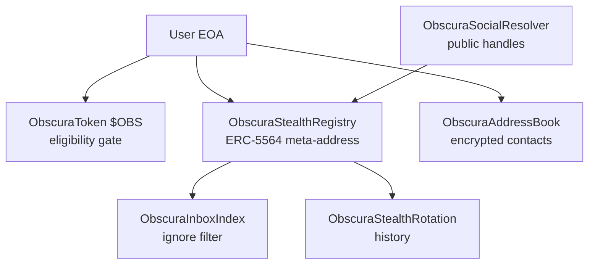

### 15.2 Stealth payment model

| Element | Storage | Privacy |
|---|---|---|
| Meta-address | On-chain registry (public) | Receiving pubkey material |
| View/spend keys | Client encrypted local storage | Never on-chain |
| Stealth address | Derived per payment (public) | One-time recipient |
| Announcement | On-chain event + Supabase index | Ephemeral pubkey + view tag |
| Labels | Browser localStorage only | PII never on-chain |

### 15.3 Cross-product identity usage

| Product | Identity dependency |
|---|---|
| Pay | Stealth registry, address book, social resolver, inbox index |
| Credit | Stealth registry (router stealth borrow variant), ScoreV2 reads address book |
| Vote | ObscuraToken `lastClaim` eligibility; no stealth in vote path |

### 15.4 Public-mode identity

Passkey WebAuthn/P-256 via `ObscuraSmartAccount` — separate from FHE identity layer. Used only for public USDC ERC-4337 flows.

---

## 16. Governance Architecture

Obscura implements **dual-track governance** spanning Vote and Credit products.

### 16.1 Architecture diagram

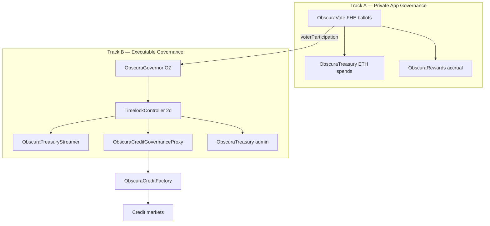

### 16.2 Track A — ObscuraVote (encrypted)

| Capability | Mechanism |
|---|---|
| Community polls | Multi-option FHE ballots |
| Treasury spends | Proposal-linked `attachSpend` + vote + timelock + execute |
| Voter incentives | `ObscuraRewards` accrual after finalize |
| Delegation | Public mapping; encrypted vote choice |
| Quorum | Weighted `totalVoters` units |

### 16.3 Track B — ObscuraGovernor (executable)

| Capability | Mechanism |
|---|---|
| Parameter changes | Propose → vote → queue → timelock → execute |
| Credit params | Timelock → `CreditGovernanceProxy` → Factory approvals |
| Pay streams | Timelock → `TreasuryStreamer` → `ObscuraPayStreamV2` |
| Voting power | `voterParticipation` at vote block (monotone) |
| Ballot format | Plaintext For/Against/Abstain (OZ standard) |

### 16.4 Credit governance proxy capabilities

Governance can via Timelock execution:

- Approve/revoke LLTV, liqBonus, liqThreshold, IRM, Oracle values
- Wire auction engine (`setMarketAuctionEngine`)
- Whitelist/blacklist repay routers (`setMarketRepayRouter`)
- Reveal IRM curve (`FHE.allowPublic` on constants)

### 16.5 Architecture decision records (Vote)

| ID | Decision | Rationale |
|---|---|---|
| ADR-V1 | Separate ObscuraVote from OZ Governor | FHE ballots incompatible with plaintext Governor storage |
| ADR-V2 | `voterParticipation` as Governor weight | Monotone counter safe for block-number clock |
| ADR-V3 | Creator-only finalize | Prevents premature aggregate reveal |
| ADR-V4 | Public delegation mapping | Required for weight; choice stays encrypted |
| ADR-V5 | Plain reward ledger + FHE mirror | CoFHE rate limits on FHE.sub |

---

## 17. Privacy Architecture

### 17.1 Encrypted vs public surfaces

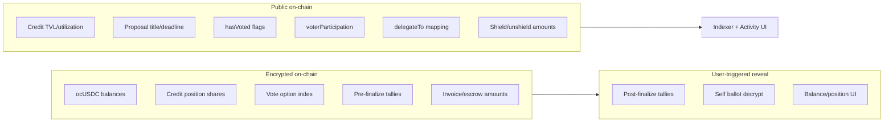

### 17.2 Product-specific privacy guarantees

| Product | Encrypted | Public by design |
|---|---|---|
| Pay | Transfer amounts, invoice/escrow/stream values, ocUSDC balances | Addresses, announce events, shield/unshield bridge amounts |
| Credit | Supply/borrow/collateral shares, auction bids, encrypted score | TVL, utilization, HF shadows, public tier bucket |
| Vote | Ballot option, pre-finalize tallies, enc reward balance | Proposal metadata, participation, delegation, post-finalize aggregates |

### 17.3 Indexer privacy sanitization

| Event class | Sanitization |
|---|---|
| ObscuraGovernor.VoteCast | Strip `support`, `weight`, `reason` |
| ObscuraTreasury.SpendExecuted | Strip amount fields from `args` |
| ObscuraRewards.RewardAccrued/Withdrawn | Strip gwei/wei from `args` |
| Credit market events | Amount-free by contract design |

### 17.4 Core privacy invariant (Vote)

**Observers learn participation and aggregates; never individual choices unless voter opts in to self-decrypt.**

### 17.5 Frontend privacy rules (all products)

| Rule | Enforcement |
|---|---|
| No auto-decrypt on mount | No `decryptForView` in `useEffect` |
| Mask by default | `***` / `███████` until Reveal |
| User-triggered permits | Decrypt only on click |
| Plain-language UX | No FHE jargon in UI copy |
| Local PII | Contact labels and receipts in browser storage only |

---

## 18. CoFHE Architecture

### 18.1 Type vocabulary

| Type | Where | Meaning |
|---|---|---|
| `InEuint64` | Frontend → contract | Encrypted input + ZK proof bound to encryption signer |
| `euint64` | Solidity state | Encrypted handle (`bytes32` on-chain) |
| `InEaddress` | Frontend → contract | Encrypted address input |
| `eaddress` | Solidity state | Encrypted address handle |
| `ebool` | Solidity intermediate | Encrypted boolean for `FHE.select` |
| `InEuint64` forwarding | **Blocked** | Smart accounts cannot forward — `InvalidSigner` |

### 18.2 ACL model

| Operation | Required call |
|---|---|
| Mutate encrypted state | `FHE.allowThis(newValue)` after every mutation |
| User decrypt own value | `FHE.allow(value, user)` |
| Cross-contract same-tx | `FHE.allowTransient(value, target)` |
| Public aggregate reveal | `FHE.allowPublic(value)` at finalize |
| Encrypted branch | `FHE.select(cond, a, b)` — never `if (ebool)` |

### 18.3 CoFHE execution model

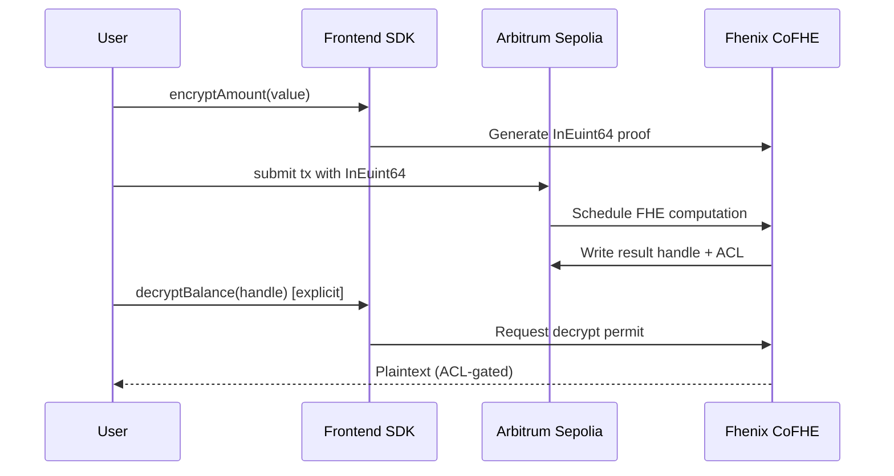

CoFHE is a **coprocessor**, not the chain. Chain remains Arbitrum Sepolia.

### 18.4 Patterns by product

| Pattern | Products | Description |
|---|---|---|
| Direct encrypt + call | Pay send, Vote cast | User encrypts; EOA calls contract directly |
| Handle-transfer | Pay V3 streams, insurance | Contract converts InEuint64 → handle → `allowTransient` → token |
| Two-step | Credit supply/borrow | `confidentialTransfer` then `recordWithEnc` |
| FHE.eq + select | Vote tally, Credit guards | Homomorphic compare and conditional update |
| allowPublic | Vote finalize, Credit IRM reveal | Aggregate decrypt after explicit finalization |

### 18.5 FHE step status (UI)

```
IDLE → ENCRYPTING → COMPUTING → SENDING → SETTLING → READY → IDLE
```

- `SETTLING` includes `waitForTransactionReceipt` + optional CoFHE settle poll
- `READY` only after successful receipt (`status === 'success'`)
- `fhe` must be in every write `useCallback` dependency array

### 18.6 Rate limit boundaries

| Error | Source | UX response |
|---|---|---|
| `Request is being rate limited` | CoFHE coprocessor | ~30s cooldown; friendly message |
| `RPC submit: Request is being rate limited` | Alchemy RPC 429 | 2.5s sleep between receipt and follow-up tx; retry button |

`writeContractAsync` is **never** silently retried (new MetaMask prompt each attempt).

---

## 19. Security Model

### 19.1 On-chain security

| Control | Implementation |
|---|---|
| Encrypted state | FHE handles for sensitive amounts/balances |
| ACL lifecycle | `allowThis` after every encrypted mutation |
| Encrypted conditionals | `FHE.select` only |
| Operator grants | Time-bounded `setOperator` for streams/hooks/router |
| Plaintext shadows | Revert guards; diverge on user misreport (user bears loss) |
| Governor timelock | 2-day delay on executable proposals |
| Treasury timelock | 48h default on spend execution |
| Paymaster limits | 20 ops/user/period; 0.1 ETH daily global cap |

### 19.2 Wallet and key security

| Area | Behavior |
|---|---|
| Stealth keys | Client-generated; encrypted local persistence |
| Contact labels | Local-only plaintext |
| Browser receipts | Wallet-scoped localStorage |
| Push keys | Server-side; VAPID private key never in frontend |
| Passkey accounts | WebAuthn/P-256 via RIP-7212 precompile `0x100` |

### 19.3 Backend security

| Control | Behavior |
|---|---|
| CORS | Configured frontend origins |
| JSON body limit | 16 KB (API) |
| Relay rate limit | 20 req/min/IP |
| Debug push limit | 5 req/min/IP |
| Secrets | Render dashboard only; `sync: false` in render.yaml |
| Service role | Supabase writes via API/worker only |

### 19.4 Trust assumptions

| Assumption | Impact if violated |
|---|---|
| Fhenix ACL correctness | Unauthorized decrypt or blocked legitimate decrypt |
| Wallet provider integrity | Wrong-chain signing, key exfiltration |
| Chainlink feed freshness | Incorrect liquidation/oracle pricing |
| Governance Timelock integrity | Unauthorized parameter changes |
| Worker indexer honesty | Missing activity/reputation (not fund theft) |
| Supabase service role protection | Database tampering |

### 19.5 Threat model summary

| Threat | Mitigation |
|---|---|
| Wrong-chain operations | Chain verification before decrypt/write |
| Auto-decrypt spam | No mount-time permits |
| Activity inference | Amount-free events; sanitized Governor args |
| RPC outage | Fallback transport mesh; worker health endpoint |
| Reorg (testnet) | Idempotent upsert; mainnet needs confirmation depth |
| Legacy contract confusion | Canonical UI defaults; Advanced toggle for legacy |
| Smart account + FHE | Explicit rejection of encrypted writes via AA |

---

## 20. Data Flow Atlas

### 20.1 Ecosystem data flow (master)

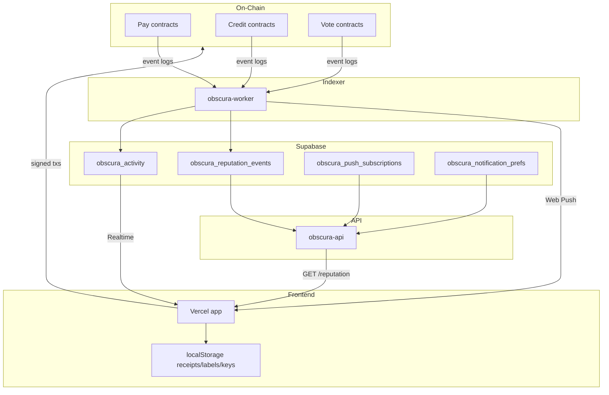

### 20.2 Pay shield flow

| Step | Data | Surface |
|---|---|---|
| 1 | USDC allowance read | Public RPC |
| 2 | `shield(amount)` | Public amount in `Shielded` event |
| 3 | Encrypted balance update | Encrypted on-chain |
| 4 | UI refresh | Local tracked units / optional reveal |

### 20.3 Credit borrow flow

| Step | Data | Surface |
|---|---|---|
| 1 | Encrypt borrow amount | Client only |
| 2 | `confidentialTransfer` + `borrow` | Encrypted handles on-chain |
| 3 | `CreditMarket.Borrowed` event | Amount-free |
| 4 | Worker → activity → reputation | Sanitized args |
| 5 | Position UI | Masked until Reveal |

### 20.4 Vote cast flow

| Step | Data | Surface |
|---|---|---|
| 1 | Encrypt option index | Client only |
| 2 | `castVote(proposalId, InEuint64)` | Encrypted ballot on-chain |
| 3 | `VoteCast` event | Voter address public; option encrypted |
| 4 | Tally homomorphic update | Encrypted tallies |
| 5 | Worker → activity → reputation | `vote_participated` signal |

### 20.5 Governor execution flow

| Step | Data | Surface |
|---|---|---|
| 1 | `propose(targets, values, calldatas, desc)` | Public calldata |
| 2 | `castVote(proposalId, support)` | Plaintext support on-chain |
| 3 | `queue` → Timelock schedule | Public |
| 4 | `execute` after delay | Target contract state change |
| 5 | Indexer | Sanitized VoteCast in activity feed |

### 20.6 Reputation aggregation flow

```
obscura_activity.id → deriveSignal() → obscura_reputation_events
  → API cap per signal_type → tier bucket → frontend panel
```

Parallel path: ScoreV2 on-chain reads Pay/Book/Vote counters directly for encrypted score computation.

---

## 21. Contract Atlas

Major contracts grouped by domain. Full addresses in §32.

### 21.1 Pay domain

| Contract | Purpose | Key functions |
|---|---|---|
| `ObscuraConfidentialToken` / ocUSDC_Pay | FHERC20 wrapper | `shield`, `unshield`, `confidentialTransfer`, `confidentialTransferFromHandle`, `setOperator` |
| `ObscuraPay` | Payroll foundation | Encrypted payroll; `EmployeePaid` event |
| `ObscuraPayStreamV3` | Recurring streams | `createStream`, `tickStream`, handle-transfer to escrow |
| `ObscuraPayrollResolverV3` | Stream escrow release | `onConditionSet`, commit/salt approve/cancel |
| `ObscuraConfidentialEscrow` | One-off + batch escrow | `create`, `fund`, `redeem`, `cancel`, `refund`, `createBatch` |
| `ObscuraInvoice` | Confidential invoices | `create`, `recordPayment`, `grantAuditor` |
| `ObscuraInsuranceSubscriptionV2` | Recurring debits | `subscribe`, `consume` (handle-transfer) |
| `ObscuraStealthRegistry` | Stealth identity | `setMetaAddress`, `announce` |
| `ObscuraSmartAccount` | ERC-4337 account | `execute`, `executeBatch`, WebAuthn validation |
| `ObscuraPaymaster` | Gas sponsorship | Whitelist, rate limits, daily cap |

### 21.2 Credit domain

| Contract | Purpose | Key functions |
|---|---|---|
| `ObscuraCreditMarket` | Isolated FHE market | `supply`, `withdraw`, `borrow`, `repay`, `supplyCollateral`, `liquidate` |
| `ObscuraCreditRouter` | Wallet multicall | `setupAndBorrow`, `repayAndWithdraw`, stealth variant |
| `ObscuraCreditAuction` | Sealed liquidation | `openAuction`, `submitBid`, `settle` |
| `ObscuraCreditOracle` | Price bridge | Public feed → encrypted price handles |
| `ObscuraCreditIRM` | Rate model | Utilization → borrow rate; encrypted curve |
| `ObscuraCreditFactory` | Market deployer | CREATE2 markets; governance-approved sets |
| `ObscuraCreditScoreV2` | Reputation oracle | `scoreOf`, `userTier`, `allowTransientForMarket` |
| `ObscuraCreditStreamHook` | Auto-repay | Operator-pull from Pay streams |
| `ObscuraCreditInsuranceHook` | Collateral top-up | Anti-liquidation injection |
| `ObscuraCreditVault` | MetaMorpho vault | Deposit/withdraw/reallocate (legacy markets) |
| `ChainlinkPriceAdapter` | Feed scaler | 8-dec → 18-dec for oracle |

### 21.3 Vote domain

| Contract | Purpose | Key functions |
|---|---|---|
| `ObscuraVote` | FHE governance | `createProposal`, `castVote`, `finalizeVote`, `delegate` |
| `ObscuraTreasury` | ETH vault | `attachSpend`, `recordFinalization`, `executeSpend`, `deposit` |
| `ObscuraRewards` | Voter incentives | `accrueReward`, `requestWithdrawal`, `withdraw`, `fundRewards` |
| `ObscuraGovernor` | OZ Governor | `propose`, `castVote`, `queue`, `execute` |
| `ObscuraTreasuryStreamer` | Timelock streams | `openStream`, `setPaused` |
| `ObscuraCreditGovernanceProxy` | Credit admin bridge | Forwards Timelock calls to Factory/markets |
| `ObscuraToken` | $OBS faucet gate | `claim`, `lastClaim` |
| `ObscuraPermissions` | Shared RBAC | `grantRole`, `revokeRole`, `Role.ADMIN` |
| `TimelockController` | OZ timelock | Standard schedule/execute |

### 21.4 Contract relationship map

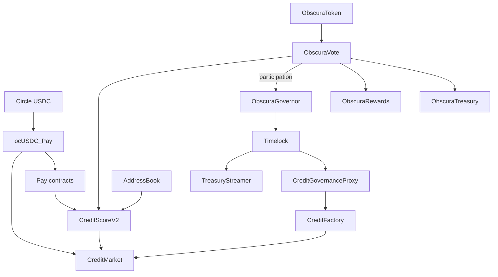

---

## 22. Frontend Architecture

### 22.1 Stack (shared)

| Layer | Technology |
|---|---|
| Build | Vite + TypeScript |
| Framework | React 18 + React Router |
| Chain | wagmi v2 + viem |
| Wallets | Injected + WalletConnect |
| UI | shadcn/ui + Harmony design system + Tailwind |
| FHE | `@fhenixprotocol/cofhe-sdk` + `src/lib/fhe.ts` |
| State | React hooks; no global FHE auto-init |
| Notifications | Service worker + Sonner + Web Push |
| Database reads | Supabase anon client |

### 22.2 Repository layout

```
frontend/obscura-os-main/src/
  pages/
    PayPage.tsx          /pay
    CreditPage.tsx       /credit
    VotePage.tsx         /vote
  components/
    harmony/             HarmonyAppShell, shared chrome
    pay-v4/              Pay feature components
    credit/              Credit feature components
    vote/                Vote feature components
  hooks/
    useOcUSDCBalance.ts  useCredit.ts  useEncryptedVote.ts  ...
    useActivityFeed.ts   useReputationSummary.ts  useFHEStatus.ts
  config/
    pay.ts payV3.ts credit.ts contracts.ts wagmi.ts
  abis/
    vote/*.json          Generated by sync-vote-abis
```

### 22.3 Product page composition

**Pay:** 6-tab shell (Overview/Pay/Get Paid/Automations/Activity/Settings) in `PayHarmonyTabShell`.

**Credit:** 6-tab shell (Overview/Borrow/Position/Earn/Liquidations/Risk) + Settings slide-over + HealthRibbon + SetupSheet.

**Vote:** 4-section shell (Overview/Proposals/Participation/Advanced) in `VotePage.tsx`.

### 22.4 Shared components

| Component | Used by |
|---|---|
| `HarmonyAppShell` | Pay, Credit, Vote |
| `ActivityFeed` | All three (filter prop) |
| `HarmonyEncryptedValue` | Pay, Credit |
| `FHEStepper` | Pay, Credit, Vote writes |
| `useNotificationPrefs` | Pay, Credit, Vote |
| `useReputationSummary` | Credit, Vote |

### 22.5 Frontend environment pattern

All contract addresses loaded from `VITE_*` env vars with fallbacks to `contracts-hardhat/deployments/arb-sepolia.json` values in config modules.

---

## 23. Backend Architecture

### 23.1 Service overview

| Service | Port | Platform | Root |
|---|---:|---|---|
| `obscura-api` | 3000 | Render web | `backend/obscura-api` |
| `obscura-worker` | 3001 | Render web | `backend/obscura-worker` |

Both expose `/health` for Render health checks and operational monitoring.

### 23.2 API service (`obscura-api`)

**Runtime:** Node.js + Express

| Route | Method | Purpose |
|---|---|---|
| `/health` | GET | Service + EntryPoint + Paymaster status |
| `/relay` | POST | Submit ERC-4337 UserOperation (20/min/IP) |
| `/userop-gas-price` | GET | Bundler gas prices |
| `/estimate-userop-gas` | POST | UserOp gas estimate |
| `/userop-receipt/:hash` | GET | UserOp receipt poll |
| `/vapid-public-key` | GET | Web Push public key |
| `/subscribe` | POST/DELETE | Push subscription management |
| `/prefs` | POST | Save notification prefs |
| `/prefs/:wallet` | GET | Read notification prefs |
| `/debug/push-test` | POST | Push test (5/min/IP) |
| `/reputation/:wallet` | GET | Aggregated reputation summary |

Boot behavior: starts Supabase Realtime listener on `obscura_activity` INSERT for notification fallback dispatch.

### 23.3 Worker service (`obscura-worker`)

**Subsystems:**

| Subsystem | Status | Purpose |
|---|---|---|
| Pay indexer | Always on | 6 Pay event-source contracts |
| Credit indexer | Env CSV lists | Markets, vaults, auctions, score |
| Vote indexer | Always on | Vote, Governor, Treasury, Rewards |
| Reputation engine | Default on | `REPUTATION_EVENTS_ENABLED` |
| Reputation backfill | Default on | `REPUTATION_BACKFILL_ON_START` |
| Notification dispatch | Always on | Web Push after activity insert |
| Credit keeper | Optional off | `KEEPER_ENABLED=true` + key required |

**Indexer config defaults:**

| Setting | Value |
|---|---|
| Max getLogs span | 10 blocks |
| Retry count | 3 |
| Retry base | 1000 ms |
| Live poll | 5000 ms |
| Startup recent blocks | 5000 |
| Backfill delay | 15000 ms |

**Health check:**

```bash
curl https://obscura-worker-0ppj.onrender.com/health
```

Expect `indexer.consecutiveFailures: 0`.

### 23.4 Backend file map

```
backend/obscura-api/src/
  index.ts          Express boot + Realtime listener
  relay.ts          ERC-4337 bundler proxy
  notifications.ts  Prefs + subscribe + dispatch
  reputation.ts     GET /reputation aggregation
  db.ts             Supabase client

backend/obscura-worker/src/
  index.ts          Boot indexer + reputation + health server
  indexer/index.ts  Contract registry + poll loop
  indexer/events.ts PAY/CREDIT/VOTE/GOVERNOR/TREASURY/REWARDS ABIs
  reputation.ts     Signal derivation per product
  notifications.ts  Push dispatch + alias resolution
  keeper/           Optional liquidation keeper (dry-run default)
  migrations/       Supabase SQL migrations
```

---

## 24. Supabase Architecture

### 24.1 Tables

| Table | Migration | Purpose |
|---|---|---|
| `obscura_activity` | `001_create_activity_tables.sql` | Indexed on-chain events |
| `obscura_push_subscriptions` | `001` | Browser push endpoints |
| `obscura_notification_prefs` | `001` | Per-wallet notification prefs |
| `obscura_reputation_events` | `002_create_reputation_events.sql` | Capped reputation signals |

### 24.2 Activity lifecycle

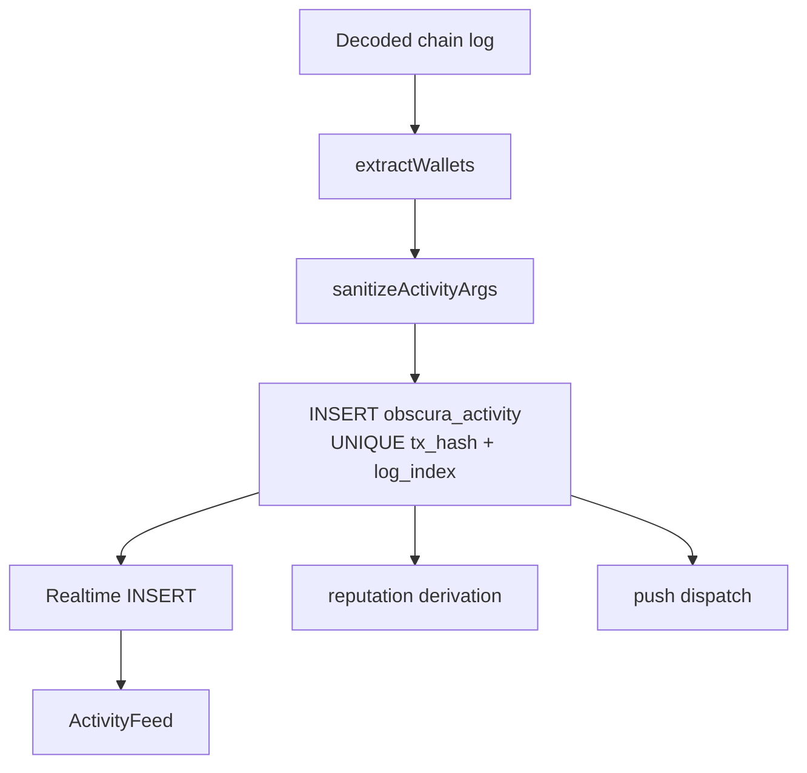

### 24.3 Row privacy classes

| Table | Privacy expectation |
|---|---|
| `obscura_activity` | Event metadata public on testnet; amounts stripped where required |
| `obscura_reputation_events` | Capped signals only; no raw amounts |
| `obscura_push_subscriptions` | Service-role only |
| `obscura_notification_prefs` | API-mediated reads/writes |

### 24.4 RLS posture

Testnet: permissive SELECT on activity for development. Push subscriptions deny-all for anon clients. **Mainnet requirement:** wallet-scoped reads, API-mediated activity access, auth on Realtime channels.

### 24.5 Realtime UX contract

- ActivityFeed shows connection state (`Connecting`, `Realtime on`, `Idle`)
- Empty feed ≠ protocol failure — may mean no indexed events for wallet
- Worker health red → no frontend patch restores activity; worker must recover

---

## 25. Infrastructure Architecture

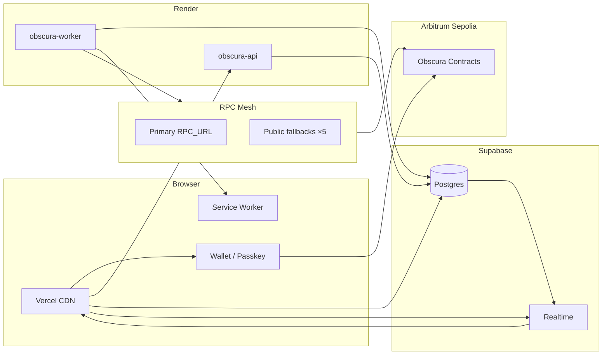

### 25.1 Runtime split

| Component | Role | Critical path |
|---|---|---|
| Vercel | Static UI + public env | User-facing |
| Wallet | Tx signing + CoFHE permits | All writes/decrypts |
| Render worker | Continuous log polling | Activity/reputation/push |
| Render API | Request/response services | Relay, prefs, reputation |
| Supabase | System of record | Activity + prefs + signals |
| RPC mesh | Chain access | Indexer + frontend reads |
| CoFHE | FHE compute | Encrypted state mutations |

### 25.2 RPC fallback pool (frontend reads)

1. `VITE_ARBITRUM_SEPOLIA_RPC` (if set)
2. `https://arbitrum-sepolia-rpc.publicnode.com`
3. `https://arbitrum-sepolia.drpc.org`
4. `https://endpoints.omniatech.io/v1/arbitrum/sepolia/public`
5. `https://sepolia-rollup.arbitrum.io/rpc`
6. `https://arbitrum-sepolia.gateway.tenderly.co`

Worker uses `RPC_URL` primary + public fallbacks in transport mesh.

---

## 26. Deployment Architecture

### 26.1 Frontend (Vercel)

| Item | Value |
|---|---|
| Platform | Vercel |
| Root | `frontend/obscura-os-main` |
| Build | `npm run build` → `dist/` |
| URL | `https://obscura-os-nine.vercel.app` |
| Deploy trigger | Push to `main` |
| Secrets | All `VITE_*` in Vercel dashboard (not in repo) |

### 26.2 Backend (Render)

Defined in [render.yaml](render.yaml):

| Service | Root | Build | Start |
|---|---|---|---|
| `obscura-api` | `backend/obscura-api` | `npm install && npm run build` | `node dist/index.js` |
| `obscura-worker` | `backend/obscura-worker` | `npm install && npm run build` | `node dist/index.js` |

Secrets (`sync: false`): `BUNDLER_URL`, `SUPABASE_SERVICE_ROLE_KEY`, `VAPID_PRIVATE_KEY`, `RPC_URL`, `KEEPER_PRIVATE_KEY`, optional `RESEND_API_KEY`.

### 26.3 Contracts (Hardhat)

| Item | Location |
|---|---|
| Source | `contracts-hardhat/contracts/` |
| Deploy scripts | `contracts-hardhat/scripts/deploy*.ts` |
| Registry | `contracts-hardhat/deployments/arb-sepolia.json` |
| Vote ABI sync | `npm run sync:vote-abis` → `frontend/.../abis/vote/*.json` |
| Tests | `contracts-hardhat/test/` + frontend vitest gates |

### 26.4 Deployment topology diagram

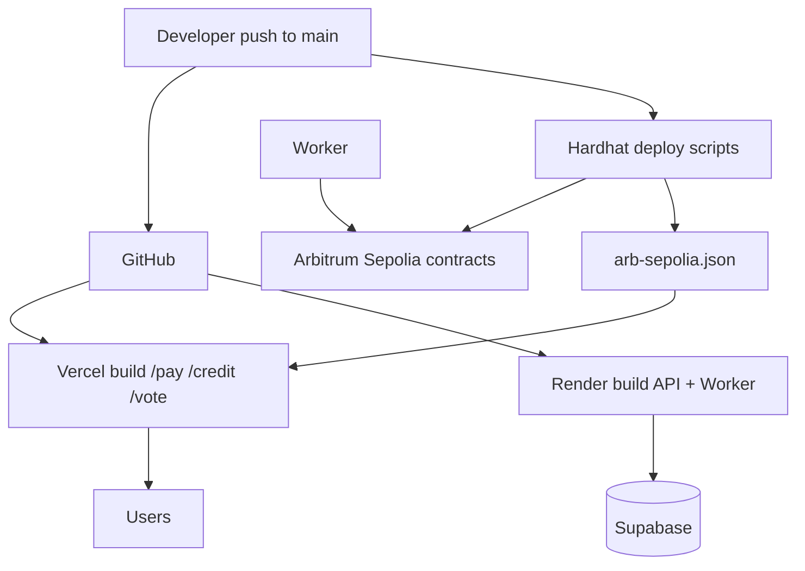

---

## 27. User Journeys

### 27.1 New Pay user

1. Connect wallet on `/pay`
2. Obtain Arbitrum Sepolia ETH (gas)
3. Acquire Circle USDC (faucet/CCTP)
4. **Make private:** shield USDC → ocUSDC_Pay
5. Optional: register stealth meta-address (Get Paid → Setup)
6. Send private payment or create automation
7. Enable push notifications in Settings (optional)

### 27.2 Pay → Credit user

1. Complete Pay shield (ocUSDC balance)
2. Navigate to `/credit` → Setup ("Shield in Pay · Reuse same private ocUSDC")
3. Supply collateral + borrow on canonical market
4. Monitor Position tab (Reveal for encrypted shares)
5. HealthRibbon tracks HF across tabs
6. Repay via Position or StreamHook auto-repay (if configured)

### 27.3 Credit liquidation participant

1. Navigate to Liquidations tab
2. View sealed auction cards (public metadata only)
3. Submit encrypted bid via `useCreditAuctions`
4. Settle if winner
5. Activity + reputation signals update automatically

### 27.4 First-time Vote user

1. Land `/vote` Overview
2. Claim $OBS if `lastClaim == 0`
3. Proposals → Browse → Vote privately
4. Submit encrypted ballot → wait FHE stepper READY
5. After deadline: creator finalizes
6. Results → Decrypt Public Tally
7. Participation → Rewards → Claim 0.001 ETH

### 27.5 Treasury proposal author

1. Create Treasury-category proposal
2. Advanced → Treasury → Attach spend
3. Campaign for votes
4. Finalize → recordFinalization → wait 48h → executeSpend

### 27.6 Governor operator

1. Advanced → Governor (requires `voterParticipation ≥ 1`)
2. Propose → Active vote (plaintext For/Against)
3. Succeeded → Queue → wait OZ timelock → Execute

### 27.7 Public-mode Pay user

1. Switch to Public Mode in Pay
2. Register passkey → deploy smart account
3. Fund with public USDC
4. Execute transfer via UserOp relay
5. Poll receipt until `success === true`

---

## 28. Product UX Philosophy

### 28.1 Privacy UX principles

| Principle | Implementation |
|---|---|
| Intent over protocol | "Make private" not "Shield"; "Private inbox" not "Stealth inbox" |
| No surprise prompts | FHE permits only on explicit Reveal or submit |
| Honest loading states | FHE stepper shows Encrypt/Submit/Compute/Settled |
| Recoverable failures | Announce retry, rate-limit countdown, push repair |
| Separate modes | Private vs Public workspaces visually distinct |

### 28.2 Copy rules

**Never show users:** euint, ctHash, ACL, permit, CoFHE, coprocessor, ciphertext, ZKPoK

**Say instead:** encrypted, private, recurring payment, make private, convert to USDC

### 28.3 Onboarding progression (Pay)

Stages via `useOnboardingState`: `not-connected` → `new` → `has-eth` → `has-usdc` → `shielded` → `registered` → `active`

Smart banners guide one step at a time on Overview.

### 28.4 Credit UX patterns

- Canonical market only by default; legacy behind Advanced toggle
- HealthRibbon sticky across tabs when positioned
- Local browser notifications for HF severity (`useCreditAlerts`)
- SetupSheet consolidates collateral + borrow for first-time users

### 28.5 Vote UX patterns (UX-POLISH-002)

- Four-section IA for 30-second comprehension
- Rewards discoverability: Participation tab leads with rewards hero
- Institutional Harmony tokens (`vote-harmony-panel` CSS)
- Governor calldata hidden behind `<details>`
- Confirm dialogs for queue/execute

---

## 29. Competitive Positioning

Obscura occupies a distinct position: **composable encrypted DeFi on EVM** rather than single-purpose privacy tools.

| Category | Typical approach | Obscura differentiation |
|---|---|---|
| Private payments | Mixers, standalone stealth chains | Integrated ocUSDC + invoices + streams + escrow + AA public mode |
| Private lending | Off-chain credit, ZK collateral proofs | On-chain encrypted positions in Morpho-shaped isolated markets |
| Private governance | Snapshot (off-chain), plain on-chain votes | FHE encrypted ballots with homomorphic tally + OZ execution track |
| Reputation | Credit bureau oracles, plain on-chain scores | Cross-product capped signals + encrypted ScoreV2 |
| Privacy L1/L2 | Move entire app to privacy chain | Stay on Arbitrum; FHE coprocessor for encrypted state |

**Target users:** Privacy-conscious individuals, crypto-native businesses, DAOs requiring sealed polls, developers building on encrypted balances.

**Current network:** Arbitrum Sepolia testnet — production-grade architecture with testnet infrastructure constraints.

---

## 30. Why Obscura Is Different

1. **Unified encrypted asset** — One `ocUSDC_Pay` flows across Pay and Credit without re-shielding.
2. **Full-stack privacy** — Not just transfers: lending positions and governance ballots are encrypted on-chain.
3. **Dual governance** — Sealed community votes (FHE) plus executable timelocked proposals (OZ) in one product.
4. **Cross-product reputation** — Pay activity, Credit discipline, and Vote participation compose into one tier API.
5. **Reveal-on-demand by policy** — Architectural enforcement, not optional UI feature.
6. **EVM composability** — Hardhat, wagmi, Chainlink, OpenZeppelin Governor — familiar tooling with FHE extensions.
7. **Public + private modes** — Same app serves passkey smart-account public USDC and EOA encrypted ocUSDC.
8. **Institutional UX** — Harmony design system across three products; judge/partner-ready surfaces.

For a quantitative system snapshot, see (§37). For architectural complexity analysis, see (§38).

---

## 31. End-to-End Lifecycle Diagrams

### 31.1 Ecosystem value lifecycle

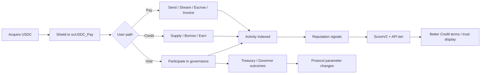

### 31.2 FHE transaction lifecycle (all products)

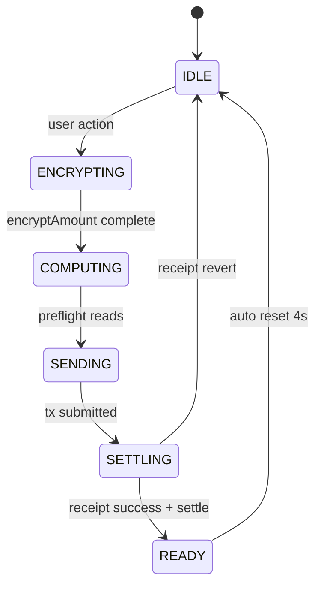

### 31.3 Indexer lifecycle

```mermaid
sequenceDiagram
  participant Chain
  participant Worker
  participant DB as Supabase
  participant API
  participant User

  Chain->>Worker: Event log (poll/getLogs)
  Worker->>Worker: Decode + sanitize
  Worker->>DB: Upsert obscura_activity
  Worker->>DB: Insert reputation_events
  Worker->>User: Web Push (if prefs match)
  DB->>User: Realtime INSERT → ActivityFeed
  User->>API: GET /reputation (optional)
```

### 31.4 Vote full lifecycle

```mermaid
flowchart TD
  C[Create proposal] --> V[Active voting]
  V --> R[Revote optional]
  V --> D[Deadline]
  D --> F[Creator finalize]
  F --> T[FHE.allowPublic tallies]
  T --> U[User decrypt aggregate]
  F --> RW[Rewards accrue]
  F --> TR[Treasury path if attached]
  TR --> TL[Timelock wait]
  TL --> EX[executeSpend]
```

---

## 32. Complete Contract Registry

**Network:** Arbitrum Sepolia · chainId `421614`  
**Registry source:** [contracts-hardhat/deployments/arb-sepolia.json](contracts-hardhat/deployments/arb-sepolia.json)

### 32.1 Shared / cross-product

| Symbol | Address | Status |
|---|---|---|
| `ocUSDC_Pay` | `0xEd46020Df8abe7BB1E096f27d089F4326D223a53` | 🟢 ACTIVE |
| Circle USDC | `0x75faf114eafb1BDbe2F0316DF893fd58CE46AA4d` | 🟢 External |
| `ObscuraStealthRegistry` | `0xa36e791a611D36e2C817a7DA0f41547D30D4917d` | 🟢 ACTIVE |
| `ObscuraAddressBook` | `0x4095065ee7cc4C9f5210A328EC08e29B4Ac74Eef` | 🟢 ACTIVE |
| `ObscuraCreditScoreV2` | `0xe5B0c6c06C0B1fd7d7CD5D2e93997693863d3D4D` | 🟢 ACTIVE |

### 32.2 Pay contracts

| Symbol | Address | Status |
|---|---|---|
| `ObscuraPay` | `0x91CdD9a481C732bEB09Ce039da23DC11e83547a4` | 🟢 ACTIVE |
| `ObscuraPayStreamV3` | `0xE4328F139F03138D63f7fdF90A8Ef240e04653fA` | 🟢 ACTIVE |
| `ObscuraPayrollResolverV3` | `0xB077c231448EF2252060E4B4dD404078DBD94180` | 🟢 ACTIVE |
| `ObscuraConfidentialEscrow` | `0x293810A2081114CcE0c98A709a0c31aE07c01D75` | 🟢 ACTIVE |
| `ObscuraInsuranceSubscriptionV2` | `0xEA9Fc5800F41d090dFB90f9735F4CF3824d6743D` | 🟢 ACTIVE |
| `ObscuraInvoice` | `0x62a86C8d68fF32ea41Faf349db6EF7EF496620b7` | 🟢 ACTIVE |
| `ObscuraInboxIndex` | `0xDF195fcfa6806F07740A5e3Bf664eE765eC98131` | 🟢 ACTIVE |
| `ObscuraSocialResolver` | `0xCe79E7a6134b17EBC7B594C2D85090Ef3cf37578` | 🟢 ACTIVE |
| `ObscuraStealthRotation` | `0x47D4a7c2B2b7EDACCBf5B9d9e9C281671B2b5289` | 🟢 ACTIVE |
| `ObscuraSmartAccountFactory` | `0xFaC683D8AB872cCf5eBfaE1659a9CD44C6FB4feB` | 🟢 ACTIVE |
| `ObscuraSmartAccountImplementation` | `0x0415945e442C4C5533367Fbb6f0D40528e0D7809` | 🟢 ACTIVE |
| `ObscuraPaymaster` v2 | `0x7a8D880D9c5F88Ba8bd4435c450256628F66dd0C` | 🟢 ACTIVE |
| EntryPoint v0.7 | `0x0000000071727De22E5E9d8BAf0edAc6f37da032` | 🟢 External |

### 32.3 Credit contracts

| Symbol | Address | Status |
|---|---|---|
| `CreditCanonicalPayOcUSDCMarket` | `0x1Ec113297c7F9516A6604aa3b18C180559a6f551` | 🟢 CANONICAL |
| `ObscuraCreditRouter` | `0x46275A34e26C9dBb46fB1716852a5D221564a43F` | 🟢 ACTIVE |
| `ObscuraCreditAuction` | `0x205FfC0A3b8207B645c1a6B1b4805eb3FfC828F0` | 🟢 ACTIVE |
| `ObscuraCreditOracle` | `0x5F00910533AB6fc12a35a87BaFe856EF2cb323c3` | 🟢 ACTIVE |
| `ObscuraCreditIRM` | `0xA072c038cE98dEC8F5350D451145fB98F5EA57Bc` | 🟢 ACTIVE |
| `ObscuraCreditFactory` | `0x5aDC1965D155f4b18119222CBA7a7A4be4F45680` | 🟢 ACTIVE |
| `ObscuraCreditGovernanceProxy` | `0x1C6892cCF24A6ade21B6778D9B5C288Ab85DA49C` | 🟢 ACTIVE |
| `ObscuraCreditStreamHook` | `0x740580C5FF321440C61c6Af667C191Eea2249F96` | 🟢 ACTIVE |
| `ObscuraCreditInsuranceHook` | `0x55f632401d238dFBEdd63B4adDF5B64DfB178190` | 🟢 ACTIVE |
| `ChainlinkPriceAdapter USDC/USD` | `0xc65e85926Cb29aaEC74f99cF1591CBa65daa2c4A` | 🟢 ACTIVE |
| `CreditVault Conservative v2` | `0xCEBb042ae8FDE217a9FdE5b8a82E23827FdBB898` | 🟡 LEGACY |
| `CreditVault Balanced v2` | `0xF508315bD4C5EC4c71C5E431AE972C0dC6B78Bbc` | 🟡 LEGACY |

### 32.4 Vote / governance contracts

| Symbol | Address | Status |
|---|---|---|
| `ObscuraVote` V5 | `0xe358776AfdbA95d7c9F040e6ef1f5A021aF91730` | 🟢 ACTIVE |
| `ObscuraTreasury` | `0x89252ee3f920978EEfDB650760fe56BA1Ede8c08` | 🟢 ACTIVE |
| `ObscuraRewards` | `0x435ea117404553A6868fbe728A7A284FCEd15BC2` | 🟢 ACTIVE |
| `ObscuraToken` ($OBS) | `0xf4A1219b0aaB83f772B240Ed508e3A37d7F55ED2` | 🟢 ACTIVE |
| `ObscuraGovernor` | `0xE4807C9F90a0da8F5B5bafa4361B15ff855b7186` | 🟢 ACTIVE |
| `ObscuraTimelock` | `0x07b7961627f433a1d9001F82Ac4af9F19b9a9E05` | 🟢 ACTIVE |
| `ObscuraTreasuryStreamer` | `0x4af75Ae3B46C34B70d6E85FEcDb71E99EC490FeD` | 🟢 ACTIVE |
| `ObscuraPayStreamV2` | `0xb2fF39C496131d4AFd01d189569aF6FEBaC54d2C` | 🟡 Streamer target |

### 32.5 Do-not-confuse list

| Wrong | Correct |
|---|---|
| Pay ocUSDC `0xEd46…` vs Credit faucet `0xf963…` | Use Pay wrapper for Pay + canonical Credit |
| Pay ocUSDC vs superseded `0xEFab…` (v3.15) | Never use v3.15 address in Pay hooks |
| Invoice `recordPayment` vs transfer | Transfer moves funds; record is status flag |
| CCTP claim vs shield | Claim = public USDC; shield = separate step |
| Vote ballot vs Governor vote | Encrypted option vs plaintext For/Against |

---

## 33. Complete Service Registry

### 33.1 Production services

| Service | URL | Platform | Purpose |
|---|---|---|---|
| Frontend | `https://obscura-os-nine.vercel.app` | Vercel | Pay / Credit / Vote UI |
| API | `https://obscura-api-n62v.onrender.com` | Render | Relay, notifications, reputation |
| Worker | `https://obscura-worker-0ppj.onrender.com` | Render | Indexer, reputation, push |
| Supabase | `https://quoovjkjwgtdqwdofubh.supabase.co` | Supabase | Postgres + Realtime |
| Explorer | `https://sepolia.arbiscan.io` | Arbitrum | Block explorer |
| GitHub | `https://github.com/mohamedwael201193/OBSCURA` | GitHub | Source repository |

### 33.2 Frontend routes

| Route | Product |
|---|---|
| `/pay` | Obscura Pay |
| `/credit` | Obscura Credit |
| `/vote` | Obscura Vote |
| `/ecosystem` | Product navigation |
| `/docs` | Documentation |
| `/privacy` | Privacy explainer |

### 33.3 API endpoints (complete)

| Method | Path | Rate limit | Product scope |
|---|---|---|---|
| GET | `/health` | — | All |
| POST | `/relay` | 20/min/IP | Pay (public mode) |
| GET | `/userop-gas-price` | — | Pay (public mode) |
| POST | `/estimate-userop-gas` | 20/min/IP | Pay (public mode) |
| GET | `/userop-receipt/:hash` | — | Pay (public mode) |
| GET | `/vapid-public-key` | — | All |
| POST | `/subscribe` | — | All |
| DELETE | `/subscribe` | — | All |
| POST | `/prefs` | — | All |
| GET | `/prefs/:wallet` | — | All |
| POST | `/debug/push-test` | 5/min/IP | All |
| GET | `/reputation/:wallet` | — | All |

### 33.4 Worker health fields

| Field | Meaning |
|---|---|
| `indexer.consecutiveFailures` | `0` = healthy |
| `indexer.lastSuccessAt` | Last successful poll timestamp |
| `indexer.lastError` | `null` when healthy |
| Watched contracts | Pay (6) + Credit (env) + Vote (4) |

### 33.5 External dependencies

| Dependency | Used by |
|---|---|
| Fhenix CoFHE coprocessor | All FHE writes/decrypts |
| Alchemy / public RPC | Chain reads/writes |
| ERC-4337 bundler | Public-mode UserOps |
| Circle CCTP (testnet) | Cross-chain fund helper |
| Chainlink price feeds | Credit oracle |
| Web Push (VAPID) | Notifications |
| Resend (optional) | Email notifications |

---

## 34. Environment Architecture

### 34.1 Frontend (`VITE_*`)

| Variable | Product | Purpose |
|---|---|---|
| `VITE_OBSCURA_PAY_OCUSDC_ADDRESS` | Pay, Credit | Canonical ocUSDC wrapper |
| `VITE_OBSCURA_PAY_STREAM_V3_ADDRESS` | Pay | Stream V3 |
| `VITE_OBSCURA_CONFIDENTIAL_ESCROW_ADDRESS` | Pay | Escrow |
| `VITE_OBSCURA_INVOICE_ADDRESS` | Pay | Invoices |
| `VITE_OBSCURA_STEALTH_REGISTRY_ADDRESS` | Pay | Stealth |
| `VITE_OBSCURA_VOTE_ADDRESS` | Vote | ObscuraVote |
| `VITE_OBSCURA_TREASURY_ADDRESS` | Vote | Treasury |
| `VITE_OBSCURA_REWARDS_ADDRESS` | Vote | Rewards |
| `VITE_OBSCURA_GOVERNOR_ADDRESS` | Vote | Governor |
| `VITE_OBSCURA_TIMELOCK_ADDRESS` | Vote | Timelock |
| `VITE_NOTIFICATIONS_URL` | All | API base |
| `VITE_RELAY_URL` | Pay | UserOp relay |
| `VITE_SUPABASE_URL` | All | Activity feed |
| `VITE_SUPABASE_ANON_KEY` | All | Supabase read |
| `VITE_ALCHEMY_KEY` / `VITE_ARBITRUM_SEPOLIA_RPC` | All | RPC |
| `VITE_SMART_ACCOUNT_FACTORY_ADDRESS` | Pay | Public mode |
| `VITE_PAYMASTER_ADDRESS` | Pay | Public mode |

Credit market addresses loaded from `src/config/credit.ts` (includes canonical + legacy set).

### 34.2 API secrets (Render dashboard)

| Variable | Purpose |
|---|---|
| `BUNDLER_URL` / `BUNDLER_URL_FALLBACK` | ERC-4337 submission |
| `SUPABASE_SERVICE_ROLE_KEY` | DB writes |
| `VAPID_PRIVATE_KEY` | Web Push signing |
| `RESEND_API_KEY` | Optional email |
| `FRONTEND_URL` | CORS + deep links |

### 34.3 Worker secrets (Render dashboard)

| Variable | Purpose |
|---|---|
| `RPC_URL` | Primary chain RPC |
| `SUPABASE_SERVICE_ROLE_KEY` | DB writes |
| `VAPID_PRIVATE_KEY` | Web Push signing |
| `KEEPER_PRIVATE_KEY` | Optional liquidation keeper |
| `CREDIT_INDEXER_MARKETS` | CSV market addresses |
| `CREDIT_INDEXER_VAULTS` | CSV vault addresses |
| `CREDIT_INDEXER_AUCTIONS` | CSV auction addresses |
| `REPUTATION_EVENTS_ENABLED` | Toggle reputation |
| `REPUTATION_BACKFILL_ON_START` | Startup backfill |

### 34.4 Environment tiers

| Tier | Network | FHE | Purpose |
|---|---|---|---|
| Local dev | Arbitrum Sepolia | CoFHE testnet | `127.0.0.1:5175` |
| Production testnet | Arbitrum Sepolia | CoFHE testnet | Vercel + Render |
| Mainnet (future) | TBD | CoFHE mainnet required | Not deployed |

---

## 35. Operational Model

### 35.1 Monitoring

| Check | Command / URL | Healthy signal |
|---|---|---|
| Worker health | `GET /health` on worker URL | `consecutiveFailures: 0` |
| API health | `GET /health` on API URL | 200 OK |
| Frontend | Load `/pay`, `/credit`, `/vote` | Pages render; wallet connect works |
| Reputation | `GET /reputation/0xWallet` | Returns tier + sources |
| Indexer lag | Compare latest activity block vs chain head | Gap < few minutes |

### 35.2 Failure runbooks

| Failure | Detection | Recovery |
|---|---|---|
| CoFHE rate limit | User error string | Wait ~30s; retry; show countdown |
| RPC 429 on announce | Post-transfer failure | `pendingAnnounce` + Retry button |
| Worker RPC outage | `/health` red | Verify RPC_URL; redeploy; fallback transport |
| Empty activity feed | No rows after known tx | Check worker health; wallet in `participants[]` |
| Push not delivered | Test endpoint fails | Repair subscription; check VAPID keys |
| Wrong network | `eth_chainId != 421614` | Switch to Arbitrum Sepolia |
| Render cold start | First request slow ~30s | Health ping; user retry |

### 35.3 Deploy procedures

**Frontend:** Push to `main` → Vercel auto-build. Verify `VITE_*` env vars match `arb-sepolia.json`.

**Backend:** Push to `main` → Render auto-build. Verify secrets in dashboard.

**Vote contract redeploy:**
1. `deploy-vote-only.ts` (runs `sync-vote-abis`)
2. Update `arb-sepolia.json`
3. `setVoteContract` on Treasury + Rewards
4. Update worker indexer address
5. Redeploy worker + frontend

**Credit market:** Factory deploy via governance proxy; update `credit.ts` + worker env CSVs.

### 35.4 Validation commands

```bash
# Frontend build
cd frontend/obscura-os-main && npm run build

# Vote regression gates
cd frontend/obscura-os-main && npx vitest run src/test/vote-final-v7.test.ts

# Hardhat Vote tests
cd contracts-hardhat && npx hardhat test test/ObscuraVote.test.ts

# Vote ABI sync
cd contracts-hardhat && npm run sync:vote-abis
```

### 35.5 Maintainer documentation rule

Any deploy or UX change must update:
- `contracts-hardhat/deployments/arb-sepolia.json`
- Relevant product config (`pay.ts`, `credit.ts`, `contracts.ts`)
- Worker indexer registry if addresses change
- This architecture reference (§32 registry sections)

---

## 36. Future Expansion Roadmap

> Operational and product expansion roadmap. Not a commitment timeline. Mainnet blocked on CoFHE production availability.

### 36.1 Infrastructure unlocks

| Phase | Scope | Dependency |
|---|---|---|
| **I0 — Current** | Arbitrum Sepolia production testnet | CoFHE testnet (LIVE) |
| **I1 — Schema hardening** | Wallet-scoped RLS, Realtime auth | Pre-mainnet |
| **I2 — Indexer hardening** | Confirmation depth, reorg handling, alerting | Pre-mainnet |
| **I3 — CoFHE mainnet** | Additional network deployment | Fhenix GA |
| **I4 — Audit + incident response** | Independent contract audit, runbooks | Pre-mainnet |

### 36.2 Product extension points

| Extension | Hook point | Products |
|---|---|---|
| Index ocUSDC token events | Worker event matrix | Pay activity completeness |
| Pure V3 subscription scheduling | Replace V2 nuance in SubscriptionForm | Pay |
| Bridge-to-shield flow | Post-CCTP explicit shield step | Pay |
| ocUSDC token indexing | Privacy-reviewed worker addition | Pay + Credit |
| Cross-product auto-routing | Score + reputation consumers | Credit + Vote |
| Sealed bid expansion | Credit auction patterns | Credit + future markets |
| Watchtower decrypt audit | `encEffLLTV` off-chain proof | Credit compliance |

### 36.3 Governance evolution

| Item | Path |
|---|---|
| Governor parameter changes | Successful proposals (`quorumVotes`, `votingPeriod`) |
| Vote contract upgrade | §35.3 redeploy procedure |
| Credit param changes | Timelock → GovernanceProxy → Factory |
| Treasury stream programs | Timelock → TreasuryStreamer → Pay streams |

### 36.4 Documentation maintenance cadence

| Event | Update required |
|---|---|
| Contract redeploy | §32 registry, §21 atlas |
| New indexed events | §13 activity, §12 reputation, §33 worker |
| UX IA change | §27 journeys, §28 UX philosophy |
| FHE SDK breaking change | §18 CoFHE architecture |
| New product surface | §6 overview, §7 architecture map |
| Scale metrics change | §37 Ecosystem Scale |

**Version control:** Increment document version in header; append changelog row below.

---

## 37. Ecosystem Scale

This section reports **verified counts** from the repository, deployment registry, worker indexer, frontend hook directory, Supabase migrations, and API route modules as of the document cut date. Counts reflect **ACTIVE** production wiring on Arbitrum Sepolia unless noted.

### 37.1 System scale snapshot

| Dimension | Count | Source |
|---|--:|---|
| **Active contract addresses (complete registry)** | **38** | (§32) unique addresses across shared, Pay, Credit, and Vote ACTIVE tables |
| **Obscura-deployed active addresses** | **36** | (§32) excluding external Circle USDC and EntryPoint v0.7 |
| **Pay contracts (Obscura-deployed)** | **15** | [docs/pay_wave5.md](docs/pay_wave5.md) §4.1 (6) + §4.3 (6) + §4.4 (3) |
| **Credit contracts (types in ACTIVE registry)** | **12** | (§32.3) canonical core + hooks + vaults + Chainlink adapters |
| **Vote / governance contracts (ACTIVE)** | **8** | (§32.4) Vote stack through TreasuryStreamer |
| **Worker live indexed contract instances** | **19** | [indexer/index.ts](backend/obscura-worker/src/indexer/index.ts) — 10 fixed + 5 markets + 2 vaults + 1 auction + 1 score |
| **Backend services (Render)** | **2** | `obscura-api`, `obscura-worker` — [render.yaml](render.yaml) |
| **Frontend hook modules** | **62** | `frontend/obscura-os-main/src/hooks/*.ts` (unique files) |
| **Indexed event type definitions** | **51** | [indexer/events.ts](backend/obscura-worker/src/indexer/events.ts) — sum of all `*_EVENTS` arrays |
| **Supabase tables** | **4** | [migrations/001](backend/obscura-worker/migrations/001_create_activity_tables.sql) (3) + [migrations/002](backend/obscura-worker/migrations/002_create_reputation_events.sql) (1) |
| **Governance components** | **9** | Vote, Governor, Timelock, Treasury, Rewards, TreasuryStreamer, CreditGovernanceProxy, ObscuraToken, ObscuraPermissions |
| **ERC-4337 on-chain components** | **4** | EntryPoint v0.7, SmartAccountFactory, SmartAccountImplementation, Paymaster v2 |
| **FHE-enabled on-chain contract types (ACTIVE)** | **21** | Solidity sources importing `@fhenixprotocol/cofhe-contracts/FHE.sol` on ACTIVE deployment paths |
| **FHE frontend integration modules** | **6** | `src/lib/fhe.ts` + `useFHEStatus`, `usePreWarmFHE`, `useFHEPermitStatus`, `useEncryptedHandle`, `useDecryptBalance` |
| **Production product routes** | **3** | `/pay`, `/credit`, `/vote` — [App.tsx](frontend/obscura-os-main/src/App.tsx) |
| **Primary navigation modules** | **16** | Pay 6 tabs + Credit 6 tabs + Vote 4 sections |
| **Reputation signal types** | **28** | [reputation.ts](backend/obscura-worker/src/reputation.ts) — 7 Pay + 11 Credit + 10 Vote |
| **API HTTP routes** | **12** | [index.ts](backend/obscura-api/src/index.ts), [relay.ts](backend/obscura-api/src/relay.ts), [notifications.ts](backend/obscura-api/src/notifications.ts), [reputation.ts](backend/obscura-api/src/reputation.ts) |
| **Shared infrastructure components** | **13** | See §37.3 |

### 37.2 Indexed event type breakdown

| Domain | Event definitions | Contracts watched (live) |
|---|---:|---:|
| Pay | 16 | 6 |
| Credit | 13 | 9 instances (5 markets + 2 vaults + 1 auction + 1 score) |
| Vote stack | 22 | 4 |
| **Total** | **51** | **19 instances** |

Pay indexed events (16): `EmployeePaid`; `StreamCreated`, `StreamCancelled`, `CycleSettled`; `InvoiceCreated`, `InvoicePaid`; five escrow events; three subscription events; `Announcement`, `MetaAddressSet`.

Credit indexed events (13): seven market events; three auction events; two vault events; `ScoreUpdated`.

Vote-stack indexed events (22): eight ObscuraVote events; five ObscuraGovernor events; five ObscuraTreasury events; four ObscuraRewards events.

### 37.3 Pay contract inventory (15)

| # | Contract | Address |
|---|---|---|
| 1 | `ocUSDC_Pay` | `0xEd46020Df8abe7BB1E096f27d089F4326D223a53` |
| 2 | `ObscuraPay` | `0x91CdD9a481C732bEB09Ce039da23DC11e83547a4` |
| 3 | `ObscuraPayStreamV3` | `0xE4328F139F03138D63f7fdF90A8Ef240e04653fA` |
| 4 | `ObscuraPayrollResolverV3` | `0xB077c231448EF2252060E4B4dD404078DBD94180` |
| 5 | `ObscuraConfidentialEscrow` | `0x293810A2081114CcE0c98A709a0c31aE07c01D75` |
| 6 | `ObscuraInsuranceSubscriptionV2` | `0xEA9Fc5800F41d090dFB90f9735F4CF3824d6743D` |
| 7 | `ObscuraInvoice` | `0x62a86C8d68fF32ea41Faf349db6EF7EF496620b7` |
| 8 | `ObscuraStealthRegistry` | `0xa36e791a611D36e2C817a7DA0f41547D30D4917d` |
| 9 | `ObscuraInboxIndex` | `0xDF195fcfa6806F07740A5e3Bf664eE765eC98131` |
| 10 | `ObscuraSocialResolver` | `0xCe79E7a6134b17EBC7B594C2D85090Ef3cf37578` |
| 11 | `ObscuraAddressBook` | `0x4095065ee7cc4C9f5210A328EC08e29B4Ac74Eef` |
| 12 | `ObscuraStealthRotation` | `0x47D4a7c2B2b7EDACCBf5B9d9e9C281671B2b5289` |
| 13 | `ObscuraSmartAccountFactory` | `0xFaC683D8AB872cCf5eBfaE1659a9CD44C6FB4feB` |
| 14 | `ObscuraSmartAccountImplementation` | `0x0415945e442C4C5533367Fbb6f0D40528e0D7809` |
| 15 | `ObscuraPaymaster` v2 | `0x7a8D880D9c5F88Ba8bd4435c450256628F66dd0C` |

### 37.4 Shared infrastructure components (13)

| # | Component | Role |
|---|---|---|
| 1 | `obscura-api` | REST API — relay, notifications, reputation |
| 2 | `obscura-worker` | Chain indexer, reputation derivation, push dispatch |
| 3 | Supabase Postgres | Activity, reputation, prefs, subscriptions persistence |
| 4 | Supabase Realtime | `obscura_activity` INSERT fan-out to frontend |
| 5 | Vercel frontend | Static app hosting (`frontend/obscura-os-main`) |
| 6 | RPC fallback mesh | 6-endpoint transport in worker; 6-endpoint pool in frontend |
| 7 | Service worker (`/sw.js`) | Web Push receive + click routing |
| 8 | `HarmonyAppShell` | Shared product chrome and navigation |
| 9 | `ActivityFeed` + `useActivityFeed` | Cross-product indexed history |
| 10 | Reputation pipeline | Worker derive → API `GET /reputation/:wallet` |
| 11 | Notification pipeline | Worker/API dispatch + prefs/subscriptions |
| 12 | `useFHEStatus` + FHE stepper | Shared encrypted-transaction UX state machine |
| 13 | `arb-sepolia.json` | Canonical on-chain address registry |

### 37.5 Scale diagram

```mermaid
flowchart TB
  subgraph ONCHAIN[On-Chain · Arbitrum Sepolia]
    C38[38 ACTIVE registry addresses]
    FHE21[21 FHE-enabled contract types]
    IDX19[19 live indexed instances]
  end

  subgraph FE[Frontend · Vercel]
    R3[3 product routes]
    N16[16 navigation modules]
    H62[62 hook modules]
  end

  subgraph BE[Backend · Render]
    S2[2 services]
    E51[51 indexed event types]
    R28[28 reputation signal types]
  end

  subgraph DATA[Supabase]
    T4[4 tables]
  end

  ONCHAIN --> BE
  BE --> DATA
  DATA --> FE
  FE --> ONCHAIN
```

---

## 38. Why Obscura Is Technically Difficult

Obscura is not a single-product DeFi application with an encrypted token wrapper. It is a **multi-product privacy finance stack** where encrypted state, public metadata, index pipelines, and user-triggered decryption must remain consistent across Pay, Credit, and Vote. The complexity below is architectural — it arises from the interaction of Fhenix CoFHE constraints with standard EVM patterns.

### 38.1 FHE state machines

Each product implements distinct encrypted state machines:

| Product | Encrypted state | Public companion state |
|---|---|---|
| Pay | ocUSDC balances, invoice/escrow/stream amounts | Addresses, announce events, shield/unshield bridge amounts |
| Credit | Supply/borrow/collateral shares, auction bids, encrypted score | TVL, utilization, HF shadows, public tier bucket |
| Vote | Ballot option indices, tallies, treasury attestation, reward balances | Proposal metadata, participation, delegation mapping |

Unlike plaintext DeFi, **every mutation** of `euint64` storage requires an ACL follow-up (`FHE.allowThis`, and often `FHE.allow` or `FHE.allowTransient`). A missed ACL call produces silent failures on subsequent reads — not a revert with a clear message at the UI layer.

### 38.2 CoFHE ACL lifecycle management

CoFHE permissions are **transaction-scoped or persistently scoped** with different semantics:

```mermaid
stateDiagram-v2
  [*] --> EncryptedInput: SDK encryptAmount
  EncryptedInput --> ContractHandle: FHE.asEuint64 / mutation
  ContractHandle --> AllowThis: FHE.allowThis (persistent contract ACL)
  ContractHandle --> AllowUser: FHE.allow(user) (user decrypt)
  ContractHandle --> AllowTransient: FHE.allowTransient(target) (single-tx inter-contract)
  ContractHandle --> AllowPublic: FHE.allowPublic (aggregate reveal)
  AllowUser --> UserDecrypt: user-triggered decrypt permit
  AllowPublic --> AnyoneDecrypt: post-finalize tally
```

Engineering cost: developers must trace ACL grants across **multi-contract call chains** (stream → token, market → oracle → score, vote → treasury → rewards) without using plaintext branching on encrypted conditions.

### 38.3 Encrypted balance accounting

`ocUSDC_Pay` is a confidential FHERC20 whose balances are ciphertext handles, not uint256 mappings. This propagates complexity to:

- **Pay:** shield/unshield bridge events (public) vs confidential transfers (amount-free events)
- **Credit:** two-step supply/borrow (`confidentialTransfer` + `recordWithEnc`) because CoFHE binds `InEuint64` to the encryption signer
- **Hooks:** operator grants on the token for StreamHook and InsuranceHook pull patterns
- **UI:** plaintext shadows for HF display alongside encrypted shares that require explicit reveal

A typical ERC-20 DeFi app reads `balanceOf` in one RPC call. Obscura reads a handle, then optionally triggers a coprocessor decrypt permit on user action.

### 38.4 Cross-product encrypted composability

Obscura's products share one confidential asset and cross-read encrypted/public signals:

```mermaid
flowchart LR
  PAY[Pay streams · contacts] --> SCORE[CreditScoreV2]
  VOTE[Vote participation] --> SCORE
  SCORE --> MARKET[CreditMarket LLTV boost]
  PAY --> HOOK[CreditStreamHook auto-repay]
  HOOK --> MARKET
  ACT[Shared activity index] --> REP[Shared reputation]
  REP --> API[GET /reputation]
```

`ObscuraCreditScoreV2` reads Pay stream counts, address-book contact counts, and Vote participation — then exposes an encrypted score with public tier buckets. Markets consume tier and optionally request transient decrypt permission. This is composability **across three products** with different encryption boundaries per contract.

### 38.5 ERC-4337 and privacy coexistence

Obscura ships a full ERC-4337 stack (EntryPoint, factory, smart account, paymaster, relay API) **alongside** a parallel private-mode path that **must not** use smart accounts for FHE writes.

CoFHE input proofs bind to the immediate caller. Forwarding `InEuint64` through a smart account reverts (`InvalidSigner`). The frontend therefore maintains **two execution planes**:

| Plane | Asset | Signer | FHE |
|---|---|---|---|
| Private Mode | ocUSDC | EOA | Yes |
| Public Mode | Circle USDC | Passkey smart account | No |

Engineering must keep these planes separated in routing, env configuration, and UX — a single miswired hook sends encrypted inputs down the AA path.

### 38.6 Stealth addressing architecture

Private receiving adds an off-chain/on-chain hybrid:

1. Meta-address registration on `ObscuraStealthRegistry` (public)
2. Client-side key derivation and encrypted local storage (private)
3. Per-payment stealth address generation (public)
4. Announcement events indexed to Supabase (public metadata, no amount)
5. Recipient-side scan with view/spend keys after explicit inbox unlock

This is orthogonal to FHE — a payment can be amount-encrypted on-chain while the stealth layer manages recipient discovery. The send path includes **transfer + timed announce + retryable RPC recovery**, documented as a first-class flow in Pay hooks.

### 38.7 Shared reputation graph

The worker derives **28 distinct signal types** from **51 indexed event definitions** across three `source_app` domains (`pay`, `credit`, `vote`). Signals deduplicate on `(wallet, source_app, signal_type, event_ref)` and aggregate through capped weights into a public tier API.

Credit repayment signals carry the highest cap (24). Vote governance signals are sanitized at index time. Pay stealth announcements generate paired sent/received signals. This graph is a **cross-product trust layer** — not a single contract oracle.

### 38.8 Shared activity indexing

One worker indexes **19 live contract instances** into one `obscura_activity` table. The frontend filters the same Realtime stream three ways (`pay`, `credit`, `vote`). Vote filter includes Treasury and Rewards events with **field-level sanitization** before insert (Governor vote support/weight stripped; treasury/reward amounts stripped from JSON args).

Indexing is idempotent on `(tx_hash, log_index)` but must normalize wallet/participant extraction differently per ABI shape — 51 event schemas in one pipeline.

### 38.9 Multi-product infrastructure reuse

Three products share:

- One Supabase project (4 tables)
- Two Render services (12 API routes + worker health/indexer)
- One Harmony design system and FHE stepper
- One deployment registry
- One reputation endpoint consumed by Credit and Vote panels

Changes to indexer sanitization, Realtime schema, or FHE step semantics propagate to all products. This reuse reduces operational surface area but **increases coupling** — a worker outage empties activity feeds across Pay, Credit, and Vote simultaneously.

### 38.10 Encrypted governance

`ObscuraVote` stores ballot choices as `euint64` and updates tallies via `FHE.eq` + `FHE.select` + `FHE.add/sub` — homomorphic vote counting without revealing individual options. Engineering constraints include:

- Revote: subtract old weighted tally, add new, without plaintext branch on prior choice
- Finalize: creator-only `FHE.allowPublic` on aggregates — irreversible public decrypt of totals, not ballots
- Delegation: public weight mapping with encrypted choice — coercion resistance via revote, not via hidden delegation
- Parallel OZ Governor track with plaintext votes for executable proposals — two governance semantics in one product

### 38.11 Treasury and rewards indexing

Treasury and Rewards extend Vote with **FHE-attested ETH flows**:

| System | Encrypted | Indexed | Plain execution |
|---|---|---|---|
| Treasury | `encAmount` per spend request | 5 event types | `amountGwei` execution after timelock |
| Rewards | `encRewardBalance` per voter | 4 event types | Plain `_totalAccruedGwei` / `_totalWithdrawnGwei` ledger |

The worker indexes all four Vote-stack contracts (Vote, Governor, Treasury, Rewards) with product-specific sanitizers. Frontend ABIs sync from Hardhat artifacts via `sync-vote-abis`. This is a **four-contract index plane** for one product route.

### 38.12 Cross-contract data flows

A single user journey can touch five or more contracts and three backend tiers:

```mermaid
sequenceDiagram
  participant UI as Frontend
  participant SDK as CoFHE SDK
  participant Token as ocUSDC_Pay
  participant Stream as PayStreamV3
  participant Escrow as ConfidentialEscrow
  participant WK as obscura-worker
  participant DB as Supabase

  UI->>SDK: encryptAmount
  UI->>Stream: tickStream
  Stream->>Token: confidentialTransferFromHandle
  Stream->>Escrow: fundFromHandle
  Escrow-->>WK: EscrowFunded event
  WK->>DB: insert activity + reputation + push
  DB-->>UI: Realtime INSERT
```

Credit borrow and Vote cast follow similarly multi-hop patterns (see §20 Data Flow Atlas).

### 38.13 Reveal-on-demand UX constraints

FHE decrypt permits are **wallet prompts**. Obscura forbids auto-decrypt on mount — a policy enforced across 62 hook modules. Consequences:

- Balance and position UIs show masked placeholders by default
- `waitForTransactionReceipt` must complete before `FHEStepStatus.READY`
- `writeContractAsync` cannot be silently retried (each retry is a new wallet popup)
- CoFHE rate limits and RPC 429s require distinct recovery UX (cooldown vs announce retry)
- `fhe` must appear in every write-hook dependency array to prevent stale step state

These constraints are product requirements, not optional polish — they prevent MetaMask spam and incorrect READY states on reverted receipts.

### 38.14 Complexity summary

| Layer | Typical DeFi app | Obscura |
|---|---|---|
| On-chain state | Plaintext balances | Encrypted handles + public shadows |
| Contract count (ACTIVE) | 1–3 core | 38 registry addresses across 3 products |
| Indexer scope | Optional subgraph | 19 live instances, 51 event types, sanitization rules |
| Governance | Plaintext votes | FHE ballots + OZ execution + treasury FHE attestation |
| Account abstraction | Single path | Dual plane (EOA FHE vs AA public) |
| UX decrypt model | Auto-read balances | User-triggered reveal only |

Obscura's difficulty is the **intersection** of these layers operating as one deployed system — not any single feature in isolation.

---

## Document Changelog

| Version | Date | Changes |
|---|---|---|
| v1.0 | 2026-05-29 | Initial canonical merge of Pay (`docs/pay_wave5.md`), Credit (`credit_wave5_protocol_bible_v1.md`), Vote (`vote_wave5_protocol_bible_v1.md` v1.3) into unified ecosystem architecture reference. 36 sections, institutional terminology, mermaid diagrams, complete registries. |
| v1.1 | 2026-05-29 | Added §37 Ecosystem Scale (verified codebase counts) and §38 Why Obscura Is Technically Difficult; updated TOC and cross-references. |

---

## Appendix A — Glossary (Ecosystem)

| Term | Definition |
|---|---|
| **CoFHE** | Fhenix coprocessor for FHE operations on EVM chains |
| **`euint64`** | Encrypted uint64 handle (`bytes32` on-chain) |
| **`InEuint64`** | Client encrypted input + proof bound to signer |
| **Handle transfer** | InEuint64 → asEuint64 → allowTransient → confidentialTransferFromHandle |
| **Two-step pattern** | confidentialTransfer then recordWithEnc (Credit) |
| **ocUSDC_Pay** | Canonical Pay-backed confidential USDC wrapper |
| **Reveal-on-demand** | User must click to decrypt; never auto on mount |
| **Plain shadow** | Plaintext mirror for encrypted revert guards |
| **Harmony** | Shared Obscura institutional UI design system |
| **LLTV** | Loan-to-liquidation threshold (bps) |
| **HF** | Health factor from collateral/debt ratio |

---

## Appendix B — Source File Index

| Domain | Primary source files |
|---|---|
| Pay doc | [docs/pay_wave5.md](docs/pay_wave5.md) |
| Credit doc | [credit_wave5_protocol_bible_v1.md](credit_wave5_protocol_bible_v1.md) |
| Vote doc | [vote_wave5_protocol_bible_v1.md](vote_wave5_protocol_bible_v1.md) |
| Deployment | [contracts-hardhat/deployments/arb-sepolia.json](contracts-hardhat/deployments/arb-sepolia.json) |
| Pay frontend | [frontend/obscura-os-main/src/pages/PayPage.tsx](frontend/obscura-os-main/src/pages/PayPage.tsx), [src/config/payV3.ts](frontend/obscura-os-main/src/config/payV3.ts) |
| Credit frontend | [CreditPage.tsx](frontend/obscura-os-main/src/pages/CreditPage.tsx), [useCredit.ts](frontend/obscura-os-main/src/hooks/useCredit.ts) |
| Vote frontend | [VotePage.tsx](frontend/obscura-os-main/src/pages/VotePage.tsx), [useEncryptedVote.ts](frontend/obscura-os-main/src/hooks/useEncryptedVote.ts) |
| Worker | [backend/obscura-worker/src/indexer/](backend/obscura-worker/src/indexer/), [reputation.ts](backend/obscura-worker/src/reputation.ts) |
| API | [backend/obscura-api/src/](backend/obscura-api/src/) |
| Infra | [render.yaml](render.yaml) |

---

*End of Obscura Protocol Architecture Reference v1*
