# Obscura Credit — Wave 5 Protocol Bible (v1, Canonical)

> Status: **CANONICAL · LIVE**
> Chain: **Arbitrum Sepolia (421614)**
> Cut date: **2026-05-28**
> Canonical market: `0x1Ec113297c7F9516A6604aa3b18C180559a6f551` (Private USDC Credit Line)
> Canonical asset: `0xEd46020Df8abe7BB1E096f27d089F4326D223a53` (Pay-backed `ocUSDC_Pay`)
> Code root verified: [contracts-hardhat/contracts/credit](contracts-hardhat/contracts/credit), [frontend/obscura-os-main/src](frontend/obscura-os-main/src), [backend/obscura-worker/src](backend/obscura-worker/src), [backend/obscura-api/src](backend/obscura-api/src)
>
> This document is the single source of truth for Obscura Credit as it is **actually deployed and actually wired** today. It replaces all previous Wave 4 / v3.14 / v3.16 narratives where they conflict. Anything not described here as **ACTIVE** is either archived (§5) or testnet-only.

---

## 0. How To Read This Bible

### 0.1 Visual legend

| Symbol | Meaning |
|---|---|
| 🟢 **ACTIVE** | Deployed, wired, used by the canonical UI today |
| 🟡 **LEGACY/TESTNET** | Deployed, addressable, gated behind an Advanced toggle |
| 🔴 **ARCHIVED** | Deployed but superseded; addresses retained for history only |
| 🔐 **ENCRYPTED** | Stored as `euint64` / `ebool` / `eaddress`, never plaintext on-chain |
| 🌐 **PUBLIC** | Plaintext on-chain (intentional aggregate or admin scalar) |
| 🪞 **SHADOW** | Plaintext mirror kept inside contract storage as a revert guard, **never exposed externally** |
| ⚡ **TWO-STEP** | CoFHE pattern: `cToken.confidentialTransfer(target)` then `target.recordWithEnc(...)` |
| 🛡️ **REVEAL-ON-DEMAND** | User must explicitly click "Reveal" to decrypt; never auto-decrypted |
| ⚠️ **FOOTGUN** | Known sharp edge, see §33 |

### 0.2 Conventions

- All addresses are EIP-55 mixed case; comparisons are lowercased.
- All amounts use **6 decimals** (`ocUSDC` decimals); UI divides by `1e6` for display.
- All event signatures are quoted verbatim from the deployed Solidity.
- All bps fields use `10_000 = 100%`.
- "User" means an EOA wallet; "Router" means `ObscuraCreditRouter`; "Hook" means `StreamHook` or `InsuranceHook`.
- "Bible" sections cross-reference using `(§N)`.

### 0.3 Skill provenance

This document was produced by reading, line-by-line, all files listed in §38 — including [ObscuraCreditMarket.sol](contracts-hardhat/contracts/credit/ObscuraCreditMarket.sol), [ObscuraCreditRouter.sol](contracts-hardhat/contracts/credit/ObscuraCreditRouter.sol), [ObscuraCreditVault.sol](contracts-hardhat/contracts/credit/ObscuraCreditVault.sol), [ObscuraCreditAuction.sol](contracts-hardhat/contracts/credit/ObscuraCreditAuction.sol), [ObscuraCreditFactory.sol](contracts-hardhat/contracts/credit/ObscuraCreditFactory.sol), [ObscuraCreditOracle.sol](contracts-hardhat/contracts/credit/ObscuraCreditOracle.sol), [ObscuraCreditIRM.sol](contracts-hardhat/contracts/credit/ObscuraCreditIRM.sol), [ObscuraCreditScoreV2.sol](contracts-hardhat/contracts/credit/ObscuraCreditScoreV2.sol), [ObscuraCreditStreamHook.sol](contracts-hardhat/contracts/credit/ObscuraCreditStreamHook.sol), [ObscuraCreditInsuranceHook.sol](contracts-hardhat/contracts/credit/ObscuraCreditInsuranceHook.sol), [ObscuraCreditGovernanceProxy.sol](contracts-hardhat/contracts/credit/ObscuraCreditGovernanceProxy.sol), [ChainlinkPriceAdapter.sol](contracts-hardhat/contracts/credit/ChainlinkPriceAdapter.sol), [ObscuraConfidentialToken.sol](contracts-hardhat/contracts/credit/ObscuraConfidentialToken.sol), [useCredit.ts](frontend/obscura-os-main/src/hooks/useCredit.ts), [useCreditRouter.ts](frontend/obscura-os-main/src/hooks/useCreditRouter.ts), [useCreditAlerts.ts](frontend/obscura-os-main/src/hooks/useCreditAlerts.ts), [config/credit.ts](frontend/obscura-os-main/src/config/credit.ts), [CreditPage.tsx](frontend/obscura-os-main/src/pages/CreditPage.tsx), [SetupSheet.tsx](frontend/obscura-os-main/src/components/credit/SetupSheet.tsx), [BorrowForm.tsx](frontend/obscura-os-main/src/components/credit/BorrowForm.tsx), [worker indexer](backend/obscura-worker/src/indexer), [worker keeper](backend/obscura-worker/src/keeper), [reputation.ts](backend/obscura-worker/src/reputation.ts), [notifications.ts](backend/obscura-worker/src/notifications.ts), [api reputation.ts](backend/obscura-api/src/reputation.ts), [api notifications.ts](backend/obscura-api/src/notifications.ts), [api relay.ts](backend/obscura-api/src/relay.ts), [render.yaml](render.yaml), [arb-sepolia.json](contracts-hardhat/deployments/arb-sepolia.json), live browser session at `http://127.0.0.1:5175/credit`, and the prior session record in [memory_credit_5.md](memory_credit_5.md).

---

## 0M. Mega Architecture Map

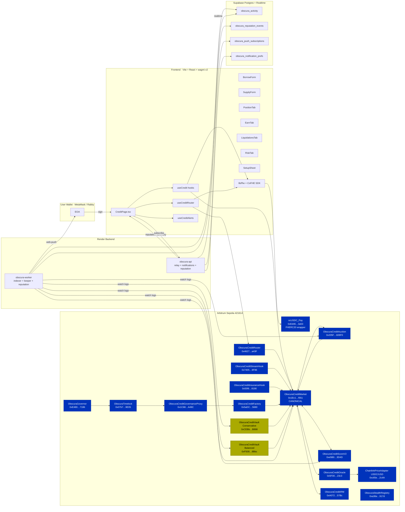

---

## 1. Executive Summary

Obscura Credit is a **privacy-first money market** built on **Fhenix CoFHE** running on **Arbitrum Sepolia**. It is shaped like Morpho Blue at the contract layer (isolated `(loanAsset, collateralAsset, oracle, irm, lltvBps)` markets created by a permissioned factory) but every per-user position — supply shares, borrow shares, and collateral — is stored as `euint64` ciphertext handles, decryptable only by the user. Public aggregates necessary for IRM/UI (utilization, total supply assets, total borrow assets) remain plaintext.

Wave 5 consolidates a **single canonical market** (`Private USDC Credit Line`) using the same **Pay-backed `ocUSDC_Pay`** wrapper as Obscura Pay. This collapses the prior Wave 4 dual-token universe (faucet `ocUSDC` + production Pay `ocUSDC_Pay`) into one shielded balance that flows freely between Pay (streams, payroll, invoices, escrow, insurance) and Credit (supply, borrow, collateral, vault). The faucet-mode markets remain deployed and live but are hidden behind an "Advanced" toggle and labeled `legacy` / `testnet` in [config/credit.ts](frontend/obscura-os-main/src/config/credit.ts).

The Credit surface is integrated with the shared activity feed, shared reputation engine, shared notification dispatcher, and Vote-driven governance proxy — Credit events flow into the same Supabase tables and Web Push pipeline as Pay events, and Credit-derived reputation contributes to the unified per-wallet reputation tier returned by `GET /reputation/:wallet`.

Crucially, every UI surface in Credit follows the **reveal-on-demand** rule: encrypted values are rendered as `███████` until a user explicitly triggers a decrypt permit. No `decryptForView`, no `getOrCreateSelfPermit`, and no FHE permit prompt fires inside a `useEffect`. This is enforced by all hooks in [useCredit.ts](frontend/obscura-os-main/src/hooks/useCredit.ts) and verified live on the running site.

---

## 2. Glossary

| Term | Definition |
|---|---|
| **CoFHE** | Fhenix's Co-processor for Fully Homomorphic Encryption. Off-chain workers compute on `euint*` ciphertext handles and write results back via the FHE precompile. |
| **`euint64`** | An encrypted 64-bit unsigned integer, on-chain represented as a `bytes32` ciphertext handle. The handle is public; the underlying value is recoverable only by holders of the corresponding ACL permission. |
| **`InEuint64`** | An encrypted input struct supplied by a client. Carries the ciphertext + a ZK proof of knowledge bound to the **encryption signer**. Cannot be forwarded across an intermediary that is not the signer in all cases — but **Router pattern (§11)** works because CoFHE binds to signer, not msg.sender. |
| **`eaddress`** | Encrypted address (`utype=12`). **Not supported on the CoFHE testnet** — caused the original `borrow(...)` revert; removed from all market signatures. |
| **`ebool`** | Encrypted boolean handle, used for `FHE.eq`, `FHE.gt`, `FHE.gte`. |
| **`FHE.select(cond, a, b)`** | In-circuit ternary: returns `a` if `cond` else `b`. Replaces `if/else` over encrypted booleans. |
| **`FHE.allowThis(h)`** | Persistent ACL allowing this contract to use handle `h` in future transactions. Required after **every** mutation of a stored encrypted state variable. |
| **`FHE.allow(h, user)`** | Persistent ACL allowing `user` to decrypt handle `h`. Required so the wallet can later reveal. |
| **`FHE.allowTransient(h, target)`** | Single-tx ACL allowing `target` to use `h` in the current transaction only. Used to grant the loan asset contract permission to consume an outbound handle. |
| **`FHE.allowPublic(h)`** | Permanent public decrypt — anyone can recover the plaintext (IRM curve reveal). |
| **`LLTV`** | Loan-to-Liquidation-Threshold ratio in bps. Maximum borrow against collateral value before LLTV breach. Canonical = `8600`. |
| **`liqThreshold`** | Liquidation threshold bps. Below this collateral coverage, position can be liquidated. Canonical = `9000`. |
| **`liqBonus`** | Bonus bps awarded to a liquidator on seized collateral. Canonical = `500`. |
| **HF (Health Factor)** | `(collateral × price × liqThreshold) / (debt × price × 10000)`. UI displays from plaintext shadows. `< 1.0` ⇒ liquidatable. |
| **Plain shadow** | Plaintext mirror kept inside the contract for revert guards and UI hints. Mirrors the encrypted value 1:1 — diverges only if a user "lies" in the `FHE.eq` guard, in which case the shadow advances and the encrypted side does not (loss on the user, safety for the pool). |
| **`ocUSDC_Pay`** | Canonical Pay-backed private USDC. Confidential FHERC20 wrapping real Circle USDC. Used by both Pay and Credit Wave 5. |
| **Operator** | A spender approved on a confidential token via `setOperator(operator, untilTimestamp)`. Required for Router and Hooks. |
| **Two-step pattern** | The CoFHE workaround: user calls `cToken.confidentialTransfer(target, encAmt)` directly, then calls `target.recordWithEnc(amtPlain, encAmt2)` where `encAmt2` re-encrypts the same value. Needed because CoFHE's pending-task rate limiter requires a follow-up FHE op on the same handle (§9.6). |
| **FHE step status** | UI state machine: `IDLE → ENCRYPTING → COMPUTING → SENDING → SETTLING → READY → IDLE`. Drives `FHEStepper` UX. |

---

## 3. Repository Layout

```
contracts-hardhat/
  contracts/
    credit/
      ChainlinkPriceAdapter.sol          🟢 ACTIVE — 8-dec → 18-dec adapter
      IEncryptedScore.sol                🟢 ACTIVE — scoreOf, userTier, allowTransientForMarket
      IObscuraCreditIRM.sol              🟢 ACTIVE
      IObscuraCreditOracle.sol           🟢 ACTIVE
      ObscuraConfidentialToken.sol       🟢 ACTIVE — generic FHERC20 (faucet+wrapper)
      ObscuraConfidentialWrapperFactory.sol — utility
      ObscuraCreditAuction.sol           🟢 ACTIVE — sealed-bid liquidation auction
      ObscuraCreditFactory.sol           🟢 ACTIVE — permissionless market builder
      ObscuraCreditGovernanceProxy.sol   🟢 ACTIVE — Timelock → Factory bridge
      ObscuraCreditInsuranceHook.sol     🟢 ACTIVE — anti-liquidation top-up
      ObscuraCreditIRM.sol               🟢 ACTIVE — linear-kink curve
      ObscuraCreditMarket.sol            🟢 ACTIVE — isolated FHE money market
      ObscuraCreditOracle.sol            🟢 ACTIVE — bridges public feeds → euint64
      ObscuraCreditRouter.sol            🟢 ACTIVE — wallet-native multicall
      ObscuraCreditScoreV2.sol           🟢 ACTIVE — encrypted reputation oracle
      ObscuraCreditStreamHook.sol        🟢 ACTIVE — auto-repay-from-stream
      ObscuraCreditVault.sol             🟡 LEGACY — MetaMorpho-shaped vault (still indexed)
      mocks/                              — test fixtures only
    interfaces/IConfidentialUSDCv2.sol   🟢 ACTIVE — common cUSDC iface
  deployments/arb-sepolia.json           🟢 ACTIVE — canonical address registry

frontend/obscura-os-main/src/
  config/credit.ts                       🟢 ACTIVE — addresses, ABIs, market metadata
  hooks/
    useCredit.ts                         🟢 ACTIVE — markets, vaults, positions, mutations
    useCreditRouter.ts                   🟢 ACTIVE — one-tx setupAndBorrow / repayAndWithdraw
    useCreditAlerts.ts                   🟢 ACTIVE — local browser-Notification engine
    useHealthEngine.ts                   🟢 ACTIVE — HF aggregation across markets
    useNotificationPrefs.ts              🟢 ACTIVE — push prefs (shared)
    useFHEStatus.ts                      🟢 ACTIVE — 5-step UI state machine
  pages/CreditPage.tsx                   🟢 ACTIVE — Overview/Borrow/Position/Earn/Liquidations/Risk
  components/credit/
    BorrowForm.tsx · RepayForm.tsx
    SupplyForm.tsx · SupplyCollateralForm.tsx
    SetupSheet.tsx · OperatorApprovalModal.tsx
    EncryptedTile.tsx · EncryptedValue.tsx
    HealthBar.tsx · HealthBadge.tsx · HealthRibbon.tsx
    CreditScoreCard.tsx · CreditScoreRing.tsx
    SealedAuctionCard.tsx · AuctionCard.tsx
    MarketCard.tsx · MarketStatStrip.tsx
    VaultCard.tsx · VaultPerformanceChart.tsx
    PrivatePortfolio.tsx · PrivateExplorer.tsx
    CreditReputationPanel.tsx
    CreditAlertDrawer.tsx · LiquidationAlertCenter.tsx
    SettingsPanel.tsx · CreditTabBar.tsx · CreditDrawer.tsx
    HistoryFeed.tsx · RiskMonitorCard.tsx
  components/harmony/
    CreditHarmonyOverview.tsx · CreditHarmonyTabShell.tsx
    HarmonyAppShell.tsx · ActivityFeed.tsx

backend/obscura-worker/src/
  index.ts                               🟢 ACTIVE — boot indexer/keeper/reputation
  indexer/{index.ts,events.ts}           🟢 ACTIVE — log watcher + ABI maps
  keeper/{index.ts,config.ts,abi.ts}     🟡 ACTIVE-BUT-DISABLED — dry-run by default
  reputation.ts                          🟢 ACTIVE — Credit signal derivation
  notifications.ts                       🟢 ACTIVE — web-push dispatcher
  db.ts                                  🟢 ACTIVE — supabase client + helpers
  migrations/*.sql                       🟢 ACTIVE — obscura_activity, _reputation_events, _push_subscriptions, _notification_prefs

backend/obscura-api/src/
  index.ts · relay.ts                    🟢 ACTIVE — ERC-4337 bundler proxy
  notifications.ts                       🟢 ACTIVE — prefs + subscriptions + realtime dispatch
  reputation.ts                          🟢 ACTIVE — capped scoring + tiering
  db.ts                                  🟢 ACTIVE

render.yaml                              🟢 ACTIVE — render service config
```

---

## 4. Deployment Registry — ACTIVE (Arbitrum Sepolia 421614)

Source: [contracts-hardhat/deployments/arb-sepolia.json](contracts-hardhat/deployments/arb-sepolia.json) and committed [.env](frontend/obscura-os-main/.env).

### 4.1 Canonical core

| Symbol | Address | Role |
|---|---|---|
| **CreditCanonicalPayOcUSDCMarket** | `0x1Ec113297c7F9516A6604aa3b18C180559a6f551` | 🟢 Canonical Credit market (Private USDC Credit Line). `loanAsset == collateralAsset == ocUSDC_Pay`. `lltvBps=8600`, `liqThresholdBps=9000`, `liqBonusBps=500`. |
| **ocUSDC_Pay** | `0xEd46020Df8abe7BB1E096f27d089F4326D223a53` | 🟢 Canonical Pay-backed private USDC (FHERC20 wrapper, 6 dec). Loan + collateral asset for canonical market. Shared with Pay. |
| **ObscuraCreditRouter** | `0x46275A34e26C9dBb46fB1716852a5D221564a43F` | 🟢 v3.16 wallet-native multicall (setupAndBorrow / repayAndWithdraw / stealth variant). |
| **ObscuraCreditAuction** | `0x205FfC0A3b8207B645c1a6B1b4805eb3FfC828F0` | 🟢 Sealed FHE auction engine. |
| **ObscuraCreditScoreV2** | `0xe5B0c6c06C0B1fd7d7CD5D2e93997693863d3D4D` | 🟢 Encrypted reputation oracle (raw score encrypted, tier 0–3 plaintext). |
| **ObscuraCreditOracle** | `0x5F00910533AB6fc12a35a87BaFe856EF2cb323c3` | 🟢 Public-feed → euint64 bridge + DAO confidential prices. |
| **ObscuraCreditIRM** | `0xA072c038cE98dEC8F5350D451145fB98F5EA57Bc` | 🟢 Linear-kink rate model; curve encrypted, plaintext mirrors used for math. |
| **ObscuraCreditFactory** | `0x5aDC1965D155f4b18119222CBA7a7A4be4F45680` | 🟢 Permissionless CREATE2 market builder, governance-approved sets. |
| **ObscuraCreditGovernanceProxy** | `0x1C6892cCF24A6ade21B6778D9B5C288Ab85DA49C` | 🟢 Bridges Timelock → Factory governor. |
| **ObscuraCreditStreamHook** | `0x740580C5FF321440C61c6Af667C191Eea2249F96` | 🟢 Auto-repay-from-Pay-stream hook (operator-pull pattern). |
| **ObscuraCreditInsuranceHook** | `0x55f632401d238dFBEdd63B4adDF5B64DfB178190` | 🟢 Anti-liquidation collateral top-up hook. |
| **ChainlinkPriceAdapter USDC/USD** | `0xc65e85926Cb29aaEC74f99cF1591CBa65daa2c4A` | 🟢 8-dec → 18-dec re-scaler. Wired as `publicFeed[ocUSDC_Pay]` in Oracle. |
| **ChainlinkPriceAdapter ETH/USD** | `0xe3E388b421bfcF558FD46a18eE3b1c27aD1D36B3` | 🟡 Wired for `ocWETH` legacy markets and keeper pricing. |
| **ObscuraStealthRegistry** | `0xa36e791a611D36e2C817a7DA0f41547D30D4917d` | 🟢 ERC-5564 announcement registry, used by Router's stealth variant. |

### 4.2 Governance plane

| Symbol | Address | Role |
|---|---|---|
| **ObscuraGovernor** | `0xE4807C9F90a0da8F5B5bafa4361B15ff855b7186` | 🟢 OZ Governor on `ObscuraVote` voting power. |
| **ObscuraTimelock** | `0x07b7961627f433a1d9001F82Ac4af9F19b9a9E05` | 🟢 Treasury timelock executor; only signer wired as Credit governor. |
| **ObscuraTreasuryStreamer** | `0x4af75Ae3B46C34B70d6E85FEcDb71E99EC490FeD` | 🟢 Treasury reward streamer. |
| **ObscuraVote** | `0xe358776AfdbA95d7c9F040e6ef1f5A021aF91730` | 🟢 Participation source for ScoreV2 `voterParticipation`. |

### 4.3 Pay integration (asset side)

| Symbol | Address | Role |
|---|---|---|
| **ObscuraPay** | `0x91CdD9a481C732bEB09Ce039da23DC11e83547a4` | 🟢 Pay core (event source). |
| **ObscuraPayStreamV3** | `0xE4328F139F03138D63f7fdF90A8Ef240e04653fA` | 🟢 ScoreV2 reads `streamsByEmployer(user)`. |
| **ObscuraAddressBook** | `0x4095065ee7cc4C9f5210A328EC08e29B4Ac74Eef` | 🟢 ScoreV2 reads `listContactIds(user)`. |
| **ObscuraConfidentialEscrow** (V2) | `0x293810A2081114CcE0c98A709a0c31aE07c01D75` | 🟢 Activity-indexed. |
| **ObscuraInvoice** | `0x62a86C8d68fF32ea41Faf349db6EF7EF496620b7` | 🟢 Activity-indexed. |
| **ObscuraInsuranceSubscriptionV2** | `0xEA9Fc5800F41d090dFB90f9735F4CF3824d6743D` | 🟢 Activity-indexed. |
| **ObscuraSmartAccountFactory** | `0xFaC683D8AB872cCf5eBfaE1659a9CD44C6FB4feB` | 🟢 ERC-4337 AA. |
| **ObscuraPaymaster** | `0x7a8D880D9c5F88Ba8bd4435c450256628F66dd0C` | 🟢 v2 public paymaster. |

### 4.4 Vaults

| Symbol | Address | Status |
|---|---|---|
| **CreditVault Conservative v2** | `0xCEBb042ae8FDE217a9FdE5b8a82E23827FdBB898` | 🟡 LEGACY — routes to legacy M-86 market. Still indexed, exposed under Earn → Advanced. |
| **CreditVault Balanced v2** | `0xF508315bD4C5EC4c71C5E431AE972C0dC6B78Bbc` | 🟡 LEGACY — 60% M-86 / 40% M-70-WETH. Still indexed. |

### 4.5 Legacy / testnet markets (Advanced toggle only)

| Symbol | Address | Status |
|---|---|---|
| **v3.16 v316_ObscuraCreditMarket** | `0x269f59672F3fd7f95bF440941e618b54Ebc5717A` | 🟡 v3.16 reference market against faucet ocUSDC. Indexed. |
| **v2_M86_Market** (`cUSDC↔cUSDC`) | `0xcf98d97934F37Ac9A05bc037437E43cb6788eC8b` | 🟡 Legacy faucet market, 86% LLTV. |
| **v319_M70WETH** (`cWETH↔cUSDC`) | `0x0b645441D65A0CCb91A82b5a2eE3156C1c89207B` | 🟡 Legacy WETH collateral market, 70% LLTV. |
| **v319_M50OBS** (`cOBS↔cUSDC`) | `0x05e58B8D96Bbd752A72Fa02921A0eE31eCB9035d` | 🟡 Risk-lab OBS collateral market, 50% LLTV. |
| **v3.14 faucet ocUSDC** | `0xf963fD86348813786ed57b8b2778A365C6226E43` | 🟡 Faucet-mode ocUSDC for legacy markets. |
| **v3.19 ocWETH** | `0x16896b3D445122a23C36aC618966A842aC9BD56e` | 🟡 6-dec faucet wrapper. |
| **v3.19 ocOBS** | `0x27298A55B80d9b8c4Fc647A6ce2b25246d800778` | 🟡 6-dec faucet wrapper. |

### 4.6 Shared data plane

| System | Endpoint | Role |
|---|---|---|
| Supabase project | `https://quoovjkjwgtdqwdofubh.supabase.co` | Postgres + Realtime + Auth. |
| Render API | `https://obscura-api-n62v.onrender.com` | Notifications + relay + reputation. |
| Vercel frontend | `https://obscura-os-nine.vercel.app` | Production UI. |

---

## 5. Active vs Archived Contracts

### 5.1 ACTIVE (referenced by canonical UI and worker)

All contracts in §4.1 plus §4.2 governance plane plus §4.3 Pay integration plus §4.4 vaults (advanced only) plus §4.5 legacy markets (advanced only). The canonical UI defaults to **only §4.1**.

### 5.2 ARCHIVED (do NOT reference in new code)

From `arb-sepolia.json._archive`, retained only for historical resolution:

```
ObscuraEscrow                          0xa1fF40D70089A6AE45BC6824bca5C54bB7E7059A
ObscuraPayStream (v1)                  0x15d28Cbad36d3aC2d898DFB28644033000F16162
ObscuraPayrollUnderwriter              0x8fA403DDBE7CD30C8b26348E1a41E86ABDD6088c
InsurancePool                          0x5AC95Fa097CAC0a6d98157596Aff386b30b67069
InsuranceSubscriptionConsumer          0x766e9508BD41BCE0e788F16Da86B3615386Ff6f6
SocialResolverEnsVerifier              0xD208aC8327e6479967693Af2F2216e1612D0171A
ObscuraElection                        0xC9432FFB26049A3e4C68a078c256FFE62860f1c5
ObscuraCreditScore (v1)                0xA83aCeE57af79D77cac6854edf92A63A60c28c18  ← replaced by ScoreV2
ObscuraCreditFeedUSDC/OBS/WETH         (per registry)
ObscuraCreditMarket_77 / _86           (pre-v3 markets)
ObscuraCreditVault_Conservative/Aggressive (pre-v2 vaults)
ObscuraConfidentialOBS/WETH            (pre-v3.19 versions)
ObscuraCreditMarket_cOBS_cUSDC         0x48B07bfb760fbee52f45234038875d26B428aB2B
ObscuraCreditMarket_cWETH_cUSDC        0x059B38ed83fCd55A680e96bE50812fBA4DB0FF82
v314_ObscuraCreditMarket_77 / Vault    (pre-v316)
v316_ObscuraCreditMarket / Router      (kept addressable, marked legacy/testnet)
v2_M70WETH_Market / v2_M50OBS_Market   (pre-v319)
ObscuraPayStreamV2_broken              0xb2fF39C496131d4AFd01d189569aF6FEBaC54d2C
ObscuraSmartAccountImplementation_webAuthnLooseChallenge
```

> The frontend [config/credit.ts](frontend/obscura-os-main/src/config/credit.ts) `CREDIT_MARKETS` array deliberately includes only the canonical + a small legacy set. Anything not in that array is invisible to the canonical UI.

> ⚠️ **FOOTGUN**: `CREDIT_SCORE_ADDRESS` (v1) is still exported from config for `@deprecated` reference. New code must use `CREDIT_SCORE_V2_ADDRESS`. The v1 contract returned a constant `5000` for everyone because `try/catch` paths silently fell through on the live Pay/Book/Vote contracts (interface mismatch). v2 fixes the interfaces (§15.2).

---

## 6. Credit Product Surface

Six tabs ship in [CreditPage.tsx](frontend/obscura-os-main/src/pages/CreditPage.tsx), each verified live at `/credit`:

| Tab | Purpose | Wallet needed? | FHE decrypt? |
|---|---|---|---|
| **Overview** | Canonical market status, public TVL, suggested actions, shared ActivityFeed with `defaultFilter="credit"` | No | No |
| **Borrow** | Default market card, three-step explainer, BorrowForm. Advanced toggle reveals legacy markets. | For form submit | Reveal-on-demand |
| **Position** | EncryptedTiles for collateral/borrow shares + plaintext HF (derived from shadows) + per-action sub-forms (borrow/repay/collateral/supply) | Yes | Reveal-on-demand |
| **Earn** | Direct supply (canonical), Earn strategy panel, curated Vaults below | For form submit | Reveal-on-demand for vault shares |
| **Liquidations** | Sealed auction cards (`SealedAuctionCard`), bid/settle | Yes for bid | No (encrypted bid + amount-free events) |
| **Risk** | CreditReputationPanel + public market risk panel + CreditNotificationsPanel + shared ActivityFeed (Credit filter) | No for view, yes for prefs | No |

Settings is a **slide-over** (gear icon header), not a tab. It contains: Advanced markets toggle, shared notifications panel, compact reputation panel, SettingsPanel (router/operator config), CreditScoreRing. SetupSheet is opened from the header **"Set up credit"** button (canonical: collateral + borrow on canonical market in one sheet; legacy: faucet → operator → borrow).

A persistent **HealthRibbon** is sticky-mounted across all tabs except Overview when connected (`useHealthEngine` aggregates HF across all positioned markets).

A persistent **LiquidationAlertCenter** is mounted when connected, surfacing local browser Notifications for severity transitions via [useCreditAlerts.ts](frontend/obscura-os-main/src/hooks/useCreditAlerts.ts).

---

## 7. Canonical Credit Architecture

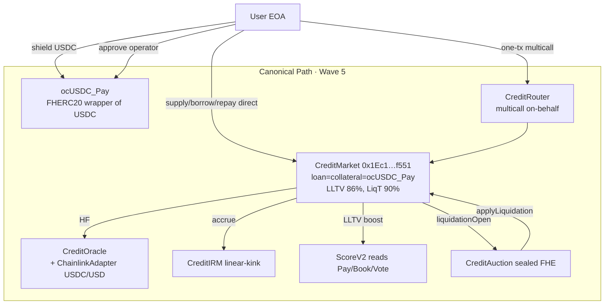

### 7.1 Why canonical exists

The Wave 4 product had two `ocUSDC` tokens:

1. `CREDIT_OCUSDC` (`0xf963…6E43`) — faucet-mode, claim-100k-per-day, isolated to Credit.
2. `ocUSDC_Pay` (`0xEd46…3a53`) — real Pay-backed FHERC20 wrapping Circle USDC.

This made it impossible to use the same private balance for both Pay (streams, payroll, invoices, escrow, insurance) and Credit (supply, borrow, collateral). Users had to bridge between the two, which leaked timing data.

Wave 5 deployed a **new market against `ocUSDC_Pay` for both legs** (`CreditCanonicalPayOcUSDCMarket`). Now a single shielded USDC balance:

- earns yield via Pay streams,
- pays invoices,
- locks as collateral in Credit,
- borrows more `ocUSDC_Pay`,
- repays back to Pay or supplies to a vault.

All of that traffic shares the same Supabase activity feed, the same Web Push channel, and contributes to a single reputation score.

### 7.2 Privacy split

| Field | Storage | Why |
|---|---|---|
| `totalSupplyAssets`, `totalBorrowAssets` | 🌐 PUBLIC `uint128` | Required by IRM to compute utilization → APRs. |
| `utilizationBps`, `lastAccrualTs` | 🌐 PUBLIC | IRM input + accrual timestamp. |
| `_pos[user].borrowShares` | 🔐 `euint64` | Per-user debt. |
| `_pos[user].collateral` | 🔐 `euint64` | Per-user collateral. |
| `_pos[user].disburseTo` | 🔐 `eaddress` (stub — unused on testnet; see §9.5) | Encrypted disbursement target. |
| `_encSupplyShares[user]` | 🔐 `euint64` | Per-user supply position. |
| `_plainSupplyShares`, `_plainBorrow`, `_plainCollateral` | 🪞 SHADOW | Revert guards. Never exposed externally. |
| Market events | All `address indexed user` only | No amounts in event data. |

---

## 8. Contract Inventory — ACTIVE

### 8.1 `ObscuraCreditMarket.sol` — isolated FHE money-market

Authoritative source: [ObscuraCreditMarket.sol](contracts-hardhat/contracts/credit/ObscuraCreditMarket.sol).

**Immutable params** (set at CREATE2 deploy by Factory):
```
loanAsset, collateralAsset : address      // both = ocUSDC_Pay for canonical
oracle                     : address      // ObscuraCreditOracle
irm                        : address      // ObscuraCreditIRM
lltvBps                    : uint64       // 8600
liqBonusBps                : uint64       // 500
liqThresholdBps            : uint64       // 9000
factory                    : address      // CreditFactory
```

**Pre-computed FHE constants** (created once in constructor for gas):
```
_zero  = FHE.asEuint64(0)              + FHE.allowThis
_lltv  = FHE.asEuint64(lltvBps)        + FHE.allowThis
_basis = FHE.asEuint64(10000)          + FHE.allowThis
_liqT  = FHE.asEuint64(liqThresholdBps)+ FHE.allowThis
```

**State (encrypted per-user):**
```
struct Position {
  euint64  borrowShares;   // encrypted outstanding debt
  euint64  collateral;     // encrypted collateral deposited
  eaddress disburseTo;     // unused on testnet (eaddress utype=12 unsupported)
}
mapping(address => Position) _pos
mapping(address => euint64) _encSupplyShares
mapping(address => uint128) _plainSupplyShares    // SHADOW
mapping(address => uint128) _plainBorrow          // SHADOW
mapping(address => uint128) _plainCollateral      // SHADOW
mapping(address => bool)    hasBorrow
address[] _borrowers
address auctionEngine
address scoreOracle
mapping(address => bool) isRepayRouter            // hook whitelist
mapping(address => bool) isOnBehalfRouter         // router whitelist
```

**Events (amount-free by design):**
```solidity
event Supplied(address indexed user);
event Withdrew(address indexed user);
event CollateralSupplied(address indexed user);
event CollateralWithdrawn(address indexed user);
event Borrowed(address indexed user);
event Repaid(address indexed user);
event Accrued(uint128 newTotalBorrowAssets, uint128 ts);
event LiquidationOpened(address indexed borrower, uint256 indexed auctionId);
event AuctionEngineSet(address indexed engine);
event ScoreOracleSet(address indexed oracle);
```

**User-callable functions (canonical):**
```
supply(uint64 amtPlain, InEuint64 encAmt)                  ⚡ TWO-STEP after cToken.confidentialTransfer
withdraw(uint64 amtPlain, InEuint64 encAmt)                 ⚠️ encAmt must equal amtPlain (FHE.eq guard)
supplyCollateral(uint64 amtPlain, InEuint64 encAmt)         ⚡ TWO-STEP
withdrawCollateral(uint64 amtPlain, InEuint64 encAmt)       guards on plaintext shadow LLTV
borrow(uint64 amtPlain, InEuint64 encAmt)                   FHE.eq guard + score-tier LLTV boost
repay(uint64 amtPlain, InEuint64 encAmt)                    ⚡ TWO-STEP
accrueInterest()
```

**Router-only (`onlyOnBehalfRouter`):**
```
supplyCollateralFor(user, amtPlain, encAmt)
borrowFor(user, amtPlain, encAmt)            // disburses to USER, not router
repayFor(user, amtPlain, encAmt)
withdrawCollateralFor(user, amtPlain, encAmt)
```

**Hook-only (`isRepayRouter`):**
```
supplyCollateralFromHook(borrower, amtPlain, euint64 handle)
repayFromHook(borrower, amtPlain, euint64 handle)
```

**Engine-only:** `applyLiquidation(borrower, seizedColl, repaidDebt)` — invoked by `ObscuraCreditAuction.settle()`.

**Read views:**
```
getPosition(user) -> (encSupplyShares, borrowShares, collateral, disburseTo)
getEncryptedSupplyShares(user) -> euint64
getPlainCollateral(user) -> uint128
getPlainBorrow(user) -> uint128
maxBorrowable(user) -> uint128
borrowersLength() -> uint256
borrowerAt(i) -> address
utilizationBps() -> uint256
```

**Interest accrual** (called at top of every state-mutating call):
```
elapsed = block.timestamp - lastAccrualTs
u       = utilizationBps()                       // public
aprBps  = 500 + (1500 * u) / 10000               // simple linear; IRM in v6
interest= (totalBorrowAssets * aprBps * elapsed) / (10000 * 365 days)
totalBorrowAssets += interest
totalSupplyAssets += interest                    // socialized to suppliers
```

This simple curve is hardcoded inside the market (it predates `ObscuraCreditIRM` and remains the actual accrual path; IRM is currently a published-curve oracle used for UI/governance signaling, see §8.4 footnote).

### 8.2 `ObscuraCreditRouter.sol` — wallet-native multicall

Source: [ObscuraCreditRouter.sol](contracts-hardhat/contracts/credit/ObscuraCreditRouter.sol).

```solidity
function setupAndBorrow(
  address market,
  uint256 shieldAmt,                   // must be 0 — shield must be staged by caller
  uint64  collateralPlain,
  InEuint64 calldata encCollPush,      // for cToken.confidentialTransferFrom(user → market)
  InEuint64 calldata encCollMarket,    // for market.supplyCollateralFor(user, ...)
  uint64  borrowPlain,
  InEuint64 calldata encBorrow         // for market.borrowFor(user, ...)
);

function repayAndWithdraw(
  address market,
  uint64  repayPlain,
  InEuint64 encRepayPush,              // cToken.confidentialTransferFrom(user → market)
  InEuint64 encRepayMarket,            // market.repayFor(user, ...)
  uint64  withdrawCollPlain,
  InEuint64 encWithdraw                // market.withdrawCollateralFor(user, ...)
);

function setupAndBorrowStealth(
  ..., address stealthAddress, bytes ephemeralPubKey, bytes1 viewTag, bytes metadata
);
```

Events: `SetupAndBorrow`, `RepayAndWithdraw`, `SetupAndBorrowStealth`.

**Auth model:**
- Router is whitelisted via `Factory.setOnBehalfRouter(router, true)` (today only the canonical Router address is whitelisted on the canonical market).
- User grants operator on **both** loan asset and collateral asset (for canonical that's the same token, so one grant suffices): `cToken.setOperator(routerAddr, until)`.
- CoFHE binds `InEuint64` proofs to the **encryption signer (user)**, not `msg.sender`. The Router can therefore forward the proofs into `cToken.confidentialTransferFrom` and into `market.*For` without violation.

### 8.3 `ObscuraCreditAuction.sol` — sealed-bid FHE auction

Source: [ObscuraCreditAuction.sol](contracts-hardhat/contracts/credit/ObscuraCreditAuction.sol).

```solidity
struct Auction {
  address market;
  address borrower;
  uint64  bidWindowEnds;
  uint64  _bestBidPlain;   // private until settle
  address _bestBidder;     // private until settle
  bool    settled;
  bool    exists;
  euint64 collateralH;     // borrower-allowed for audit
  euint64 debtH;           // borrower-allowed for audit
  euint64 bestBidEnc;      // FHE.select running maximum
}
uint64  DEFAULT_WINDOW = 15 minutes
mapping(uint256 => uint32) bidCount   // PUBLIC count
```

Events:
```solidity
event AuctionOpened(uint256 indexed auctionId, address indexed market, address indexed borrower, uint64 endsAt);
event BidSubmitted(uint256 indexed auctionId, uint32 newCount);   // bidder + amount intentionally omitted
event AuctionSettled(uint256 indexed auctionId, address indexed winner);
```

Functions:
- `openFromMarket(borrower, collateral, debt)` — only callable by a `CreditMarket`. Pre-computes `_zero` for the running-max init, persists `collateral`/`debt` handles with `FHE.allowThis` + `FHE.allow(borrower)`.
- `submitBid(auctionId, bidPlain, InEuint64 encBid)` — anyone. Updates `bestBidEnc` via `FHE.select(FHE.gt(eBid, bestBidEnc), eBid, bestBidEnc)`. Updates plaintext-mirror winner if `bidPlain > _bestBidPlain` (address ≠ amount privacy).
- `settle(auctionId)` — anyone after window. Grants `FHE.allowTransient(bestBidEnc, market)`, calls `market.applyLiquidation(borrower, bestBidPlain, bestBidPlain)`. Emits `AuctionSettled(winner)`.

View: `getAuction(id)` reveals `bestBid` and `bestBidder` **only after `settled == true`**.

### 8.4 `ObscuraCreditOracle.sol`

```solidity
mapping(address => address) public publicFeed;     // asset → Chainlink-shaped feed
mapping(address => euint64) confidentialPx;        // private fallback
mapping(address => bool)    public hasConfidential;

priceOf(asset) returns euint64:
  if hasConfidential[asset]: return confidentialPx[asset] (FHE.allowTransient to caller)
  else: latestAnswer = IPlainFeed(publicFeed[asset]).latestAnswer()
        micro = latestAnswer / 1e12              // 18-dec → 6-dec micro-USD
        return FHE.asEuint64(micro) + allowThis + allowTransient(caller)
```

For canonical USDC the wired public feed is `ChainlinkPriceAdapter USDC/USD` (`0xc65e85926Cb29aaEC74f99cF1591CBa65daa2c4A`), which up-scales Arbitrum-Sepolia Chainlink 8-dec answers to the 18-dec contract expected by `/1e12` → micro-USD.

### 8.5 `ObscuraCreditIRM.sol`

Linear-kink: `borrowApr = base + slope1*u/kink` below kink, then `+ slope2*(u-kink)/(10000-kink)` above. `supplyApr = borrowApr * u/10000 * (10000-reserveBps)/10000`. Curve constants are stored both as encrypted `euint64` (for DAO experiments) and plaintext mirrors `*BpsP` (because utilization is already public, FHE-on-public is gas-wasteful). `revealCurve()` calls `FHE.allowPublic` on every constant.

> Footnote: The deployed `ObscuraCreditMarket` accrues with a simpler local `aprBps = 500 + 1500*u/10000` (see §8.1). The IRM contract is plugged via `irm` immutable but its `getRates()` output is currently a published-curve telemetry surface for UI / governance signaling. Switching to IRM-driven accrual is the natural Wave 6 move; today, IRM is **wired but not yet authoritative for accrual**.

### 8.6 `ObscuraCreditFactory.sol`

CREATE2 with `salt = keccak256(loanAsset, collateralAsset, oracle, irm, lltvBps)`. Governance-approved sets for `lltv`, `liqBonus`, `liqThreshold`, `irm`, `oracle`. Anyone can call `createMarket` against approved values. Governor-only post-creation: `setMarketAuctionEngine`, `setMarketRepayRouter`. (`setOnBehalfRouter` exists on the market and is gated by factory; the Governance Proxy exposes both surfaces.)

### 8.7 `ObscuraCreditGovernanceProxy.sol`

Single immutable `treasury` (Timelock) is the only allowed caller. Forwards approvals to `Factory` and post-deploy wiring to markets. Emits `Forwarded(bytes4 selector)` for every call so the indexer/governance UI can summarise treasury actions.

### 8.8 `ObscuraCreditScoreV2.sol` — see §15.

### 8.9 `ObscuraCreditStreamHook.sol` — see §11.4.

### 8.10 `ObscuraCreditInsuranceHook.sol` — see §11.5.

### 8.11 `ObscuraConfidentialToken.sol`

Wave 3.15 FHERC20 used for the legacy faucet `ocUSDC` and for `ocWETH`/`ocOBS`. Dual-mode: `setUnderlying(0)` ⇒ faucet, `setUnderlying(addr)` ⇒ wrapper (`shield`/`unshield`). Guardian-paused, per-block unshield cap, operator model identical to canonical `ocUSDC_Pay`. Provides both inbound `confidentialTransferFrom(InEuint64)` and outbound `confidentialTransfer(uint256 handle)` so markets can push debt handles. **Crucially**, also exposes `confidentialTransfer(to, InEuint64)` matching the call-shape used by the canonical Pay-backed `ocUSDC_Pay`, keeping all hooks/markets call-shape-portable.

---

## 9. FHE / CoFHE Mechanics

### 9.1 Type vocabulary

```
euint64    bytes32  encrypted unsigned 64-bit int handle
ebool      bytes32  encrypted boolean handle
eaddress   bytes32  encrypted address (NOT supported on Fhenix CoFHE testnet — utype=12)
InEuint64  struct   { bytes32 ctHash; uint8 securityZone; uint8 utype; bytes signature; }
                    Carries ZK proof of knowledge bound to encryption signer.
```

### 9.2 ACL model

Every encrypted handle has an Access Control List (ACL). Persistence levels:

```
FHE.allowThis(h)                — this contract may use h in future txs
FHE.allow(h, user)              — `user` may decrypt h (forever)
FHE.allowTransient(h, target)   — `target` may use h within the current tx only
FHE.allowPublic(h)              — anyone may decrypt h (forever) — IRM revealCurve
```

**Rule, enforced everywhere in the canonical market:** after every encrypted state mutation, both `allowThis(newHandle)` and `allow(newHandle, user)` are called. See e.g. `_ensurePos`, `_ensureEncSupply`, every `p.borrowShares = …`.

### 9.3 The "two-step" CoFHE pattern (⚡)

CoFHE's input verifier binds an `InEuint64` proof to the recovered signer. When the immediate caller is also the encrypting signer, `FHE.asEuint64(encAmt)` succeeds and the pending CoFHE task is settled. When a contract receives an `InEuint64` and tries to forward it to another contract without consuming it, the task manager rate-limits the same-sender follow-up tx.

Workaround used throughout `useCredit.ts`:

```
Step 1 (user signs): cToken.confidentialTransfer(target, encAmt1)
Step 2 (user signs): target.recordWithEnc(amtPlain, encAmt2)   // encAmt2 = re-encryption of same amount
```

`encAmt2` is consumed inside `target.recordWithEnc` by `FHE.asEuint64(encAmt2)`. This settles the pending task carried over from Step 1's handle, and the contract uses it to update its encrypted accounting. Without Step 2's FHE op, the next user tx would hit the CoFHE rate limit.

The frontend additionally sleeps **10 seconds** between Step 1 and Step 2 (`useCredit.ts` lines visible in `supply` / `supplyCollateral` / `repay` / vault `deposit`) to let Tenderly's free-tier RPC window recover from the `awaitCoFHESettle` polling burst (§29.3).

### 9.4 The "FHE.eq guard" pattern (⚠️ FOOTGUN)

Reineira `cUSDC` (and the canonical Pay-backed wrapper) **reject trivially-encrypted handles** in `confidentialTransfer(to, uint256 handle)` outbound paths. The market must derive its outbound handle from a user-supplied `InEuint64`. But a malicious user could submit `amtPlain = 600` with `encAmt` encrypting `999` to drain the pool.

The market defends like this in every withdraw/borrow path:

```solidity
euint64 req      = FHE.asEuint64(encAmt);          // real ciphertext
euint64 expected = FHE.asEuint64(amtPlain);         // trivially encrypted
ebool   matches  = FHE.eq(req, expected);
euint64 safe     = FHE.select(matches, req, _zero); // clamp to 0 on lie
```

If the user lies, `safe = 0` (silent no-op on the cToken side); **plaintext shadow still decreases by `amtPlain`** so the user's accounting moves but no funds leave. The pool is safe; the user loses their position. UI never displays the encrypted lie — only the plaintext shadow.

### 9.5 `eaddress` is unavailable on testnet

The original `borrow` signature included an `InEaddress disburseTo`. CoFHE coprocessor input validation rejected utype=12 and every borrow reverted at input-validation time, even when `FHE.asEaddress` was never called. The fix in [ObscuraCreditMarket.sol](contracts-hardhat/contracts/credit/ObscuraCreditMarket.sol#L405) removed `encDest` from `borrow`/`borrowFor` entirely; loans disburse to `msg.sender` (or to `user` in the router path). True on-chain stealth disbursement is deferred until CoFHE supports `eaddress`. Stealth is currently achieved one layer up: Router's `setupAndBorrowStealth` announces a stealth address via [ObscuraStealthRegistry](contracts-hardhat/contracts/ObscuraStealthRegistry.sol), and the user makes a subsequent shielded transfer.

### 9.6 Pre-computed FHE constants

Every market caches `_zero`, `_lltv`, `_basis`, `_liqT` at deploy time. This avoids per-call `FHE.asEuint64(plaintext)` which is gas-prohibitive on the CoFHE testnet coprocessor (~hundreds of thousands of gas per call). The auction does the same for its per-auction `bestBidEnc` initialisation.

### 9.7 Gas caps

`CREDIT_GAS_CAPS` in [config/credit.ts](frontend/obscura-os-main/src/config/credit.ts) sets per-function caps so MetaMask can pre-warn out-of-gas before signing. Notable: `borrow = 4_000_000n`, `withdrawCollateral = 3_500_000n`, `vaultDeposit = 2_200_000n`.

---

## 10. Transaction Lifecycles

### 10.1 Canonical Borrow (direct market path)

The canonical UI uses the direct market path (not the Router path) for the canonical market because the Router path requires an extra operator grant on the canonical token. The Router path is exposed as an alternate flow; canonical default is direct.

```mermaid
sequenceDiagram
  autonumber
  participant U as User wallet
  participant FE as BorrowForm / useCredit
  participant FHE as CoFHE SDK
  participant CT as ocUSDC_Pay
  participant M as CreditMarket
  participant OC as ChainlinkAdapter
  participant OR as Oracle
  participant IRM as IRM
  participant S as ScoreV2

  Note over FE: Pre-flight: maxBorrowable, totalSupply, totalBorrow read
  FE->>FHE: encryptAmount(amount)
  FHE-->>FE: InEuint64 enc
  FE->>U: sign borrow(amount, enc)
  U->>M: borrow(amount, enc)
  M->>S: userTier(user)
  S-->>M: uint8 tier
  alt tier >= 3
    M->>M: effectiveLLTV = min(lltv+400, 9000)
    M->>S: allowTransientForMarket(user, market)
    S-->>M: ok (or revert if not attested)
    M->>S: scoreOf(user)
    S-->>M: euint64 eScore
    M->>M: ebool tier3 = FHE.gte(eScore, 750)
    M->>M: encEffLLTV = FHE.select(tier3, asEuint64(eff), _lltv)
    M->>M: allowThis(encEffLLTV)         // stored for audit
  end
  M->>M: require plain LLTV + liquidity pass
  M->>M: accrueInterest()
  M->>M: req=asEuint64(enc); expected=asEuint64(amount)
  M->>M: safe = FHE.select(FHE.eq(req,expected), req, _zero)
  M->>M: p.borrowShares = FHE.add(p.borrowShares, safe)
  M->>M: allowThis + allow(user)
  M->>M: _plainBorrow[user]+=amount; totalBorrowAssets+=amount
  M->>CT: allowTransient(safe, ocUSDC_Pay)
  M->>CT: confidentialTransfer(user, uint256(safe))
  M-->>U: emit Borrowed(user)
```

The pre-flight reads in [useCredit.ts](frontend/obscura-os-main/src/hooks/useCredit.ts) (`maxBorrowable`, `totalSupplyAssets`, `totalBorrowAssets`) translate raw revert reasons into human-readable errors ("LLTVBreach — max borrowable is X ocUSDC", "InsufficientLiquidity — only X available") before MetaMask prompts.

### 10.2 Canonical Supply (two-step)

```mermaid
sequenceDiagram
  autonumber
  participant U as User
  participant FE as SupplyForm / useCredit
  participant CT as ocUSDC_Pay
  participant M as CreditMarket
  Note over FE: ENCRYPTING
  FE->>FE: enc1 = encryptAmount(amount)
  FE->>U: sign cToken.confidentialTransfer(market, enc1)
  U->>CT: confidentialTransfer(market, enc1)
  Note over FE: SETTLING (awaitCoFHESettle + 10s cool-down)
  FE->>FE: enc2 = encryptAmount(amount)
  FE->>U: sign market.supply(amount, enc2)
  U->>M: supply(amount, enc2)
  M->>M: eAmt = asEuint64(enc2)         // settles pending task
  M->>M: _ensureEncSupply; newSupply = FHE.add(_encSupplyShares, eAmt)
  M->>M: allowThis + allow(user); _plainSupplyShares+=amount
  M->>M: totalSupplyAssets += amount
  M-->>U: emit Supplied(user)
  Note over FE: READY → IDLE
```

### 10.3 Repay-and-withdraw via Router (legacy/alt)

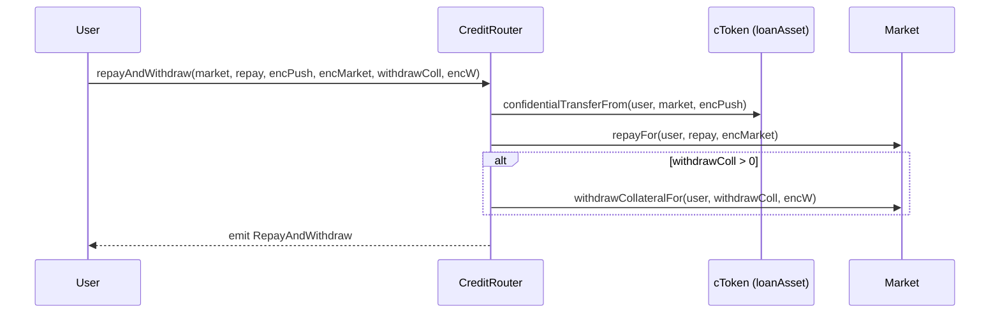

### 10.4 Liquidation open

```mermaid
sequenceDiagram
  participant K as Keeper / anyone
  participant M as Market
  participant A as Auction
  K->>M: liquidationOpen(borrower)
  M->>A: openFromMarket(borrower, p.collateral, p.borrowShares)
  Note over M: FHE.allowTransient(p.collateral, A); FHE.allowTransient(p.borrowShares, A)
  A->>A: store handles, allowThis + allow(borrower)
  A-->>K: emit AuctionOpened(id, market, borrower, endsAt)
```

### 10.5 Bid + settle

```mermaid
sequenceDiagram
  participant B as Bidder (stealth EOA)
  participant A as Auction
  participant M as Market
  B->>A: submitBid(id, bidPlain, encBid)
  A->>A: eBid=asEuint64(encBid); allowThis + allow(B)
  A->>A: newMax = FHE.select(FHE.gt(eBid, bestBidEnc), eBid, bestBidEnc)
  A->>A: if bidPlain > _bestBidPlain: _bestBidPlain=bidPlain; _bestBidder=B
  A-->>B: emit BidSubmitted(id, count)
  Note over A: window passes
  participant K as Anyone
  K->>A: settle(id)
  A->>A: allowTransient(bestBidEnc, market)
  A->>M: applyLiquidation(borrower, _bestBidPlain, _bestBidPlain)
  M->>M: p.collateral -= sc; p.borrowShares -= rd; shadows-=
  A-->>K: emit AuctionSettled(id, winner)
```

### 10.6 Vault deposit / withdraw / claim-queue

`requestWithdraw → 24h → claimWithdraw` is free; `instantWithdraw` charges `INSTANT_FEE_BPS = 20` (0.2%). Both are FHE-encrypted at the share level. See [ObscuraCreditVault.sol](contracts-hardhat/contracts/credit/ObscuraCreditVault.sol).

---

## 11. Router + Operator Model

### 11.1 Why a router

Without the router, a borrow requires: shield USDC in Pay → operator grant on cToken → cToken.confidentialTransfer(market, enc1) → wait CoFHE settle → market.supplyCollateral(amt, enc2) → market.borrow(amt, enc3). Six wallet interactions. The Router collapses the **on-market** half into one transaction at the cost of one operator grant.

### 11.2 Whitelisting

```
Factory.setMarketAuctionEngine(market, AUCTION)        once at deploy
Factory.setMarketRepayRouter(market, hookAddr, true)   for each hook
ObscuraCreditMarket.setOnBehalfRouter(ROUTER, true)    via Factory (only canonical Router whitelisted today)
```

### 11.3 Operator grant

```
cToken.setOperator(ROUTER, until)    expiry = now + 7 days (UX default in SetupSheet / OperatorApprovalModal)
```

The operator address (router) and expiry timestamp are **plaintext**; the balance the router can move stays encrypted. The grant authorises `cToken.confidentialTransferFrom(user, target, encAmt)` calls where the proof signer is `user`.

### 11.4 StreamHook (auto-repay-from-stream)

[ObscuraCreditStreamHook.sol](contracts-hardhat/contracts/credit/ObscuraCreditStreamHook.sol). Per-borrower `Hook { market, borrower, perCycle, periodSeconds, lastPullAt, active, exists }`. Anyone (typically a ticker) calls `pull(hookId, encPull, encPush)`:

1. `cUSDC.confidentialTransferFrom(borrower, this, encPull)` — operator pull.
2. `handle = FHE.asEuint64(encPush)`; forward to market: `cUSDC.confidentialTransfer(market, handle)`.
3. `market.repayFromHook(borrower, perCycle, handle)` — market does `FHE.sub` on borrowShares with capping.
4. Emits `Pulled(hookId, amt)` and `KeeperTip(keeper, hookId, tip)` (5 bps capped at 1 ocUSDC).

Failure isolation: the whole block is wrapped in `try/catch`; failures emit `HookSkipped(hookId, reason)` without reverting.

### 11.5 InsuranceHook (anti-liquidation top-up)

[ObscuraCreditInsuranceHook.sol](contracts-hardhat/contracts/credit/ObscuraCreditInsuranceHook.sol). Identical lifecycle to StreamHook but calls `market.supplyCollateralFromHook(borrower, perCycle, handle)` instead.

---

## 12. Market Architecture

### 12.1 Canonical market accounting

```
totalSupplyAssets [PUBLIC uint128]   = ∑ supplied + accrued interest
totalBorrowAssets [PUBLIC uint128]   = ∑ borrowed + accrued interest
utilizationBps()  [VIEW]             = min(totalBorrow / totalSupply, 1.0) in bps
available         = totalSupply - totalBorrow

per-user [ENCRYPTED euint64 + SHADOW uint128]:
  encSupplyShares[user]    ↔  _plainSupplyShares[user]
  pos[user].collateral     ↔  _plainCollateral[user]
  pos[user].borrowShares   ↔  _plainBorrow[user]
```

Invariant: encrypted handle minus shadow can only **diverge downward** on a user-lie (handle drops to 0 via FHE.eq guard; shadow still decreases). The pool's liquidity is always >= encrypted sum because shadows are authoritative for accounting.

### 12.2 Score-tier LLTV boost

In `borrow` / `borrowFor`:
```
if scoreOracle != 0 and userTier(user) >= 3:
   effectiveLLTV = min(lltvBps + 400, 9000)
```
This is **plaintext gate** (tier 3 is `>= 750` raw score, derived publicly). Additionally, if user has attested for this market, the market computes an FHE proof of boost (`FHE.gte(eScore, 750)`) and stores it `allowThis`-ed for off-chain auditing without ever decrypting the raw score on-chain.

### 12.3 Liquidation conditions

`liquidationOpen(borrower)` is permissionless. The pure HF check is done off-chain by the keeper (or any caller) using the plaintext shadows + Chainlink prices via the Oracle. The contract itself does not gate `liquidationOpen` on HF — once an auction opens, settlement can only seize amounts at the encrypted level via `applyLiquidation`. (Today the auction's `applyLiquidation(seized, repaid)` uses `_bestBidPlain` for both arguments — a simplification that maps "winning bid in stable units" to both legs. Wave 6 may split these.)

---

## 13. Vault Architecture

[ObscuraCreditVault.sol](contracts-hardhat/contracts/credit/ObscuraCreditVault.sol).

```
loanAsset (immutable)
owner (immutable)            = deployer
curator                      = mutable by owner
feeRecipient, feeBps         = ≤ 25%, default 10%
isApprovedMarket[m]          + marketCap[m]
marketsList                  ordered approved set
_zero (euint64)              pre-computed
_encShares[user]             encrypted per-user shares
_plainShares[user]           SHADOW
totalShares (uint128)        public TVL signal
publicTotalDeposited         public TVL display
pendingWithdraw[user]        { amt, claimableAt }
WITHDRAW_DELAY = 24h, INSTANT_FEE_BPS = 20 (0.2%)
```

Curator-only `reallocateSupply(market, amt, encAmt)` pushes vault liquidity to an approved market with `FHE.eq` guard; `reallocateWithdraw(market, amt, encAmt)` pulls back. Vaults are **legacy** in the canonical Wave 5 surface (Earn tab shows direct supply as primary, vaults as Advanced).

---

## 14. Auction / Liquidation Architecture

See §10.4–10.5. Privacy properties:

- **Sealed pre-settle**: `getAuction(id)` returns `bestBid=0, bestBidder=0` until `settled == true`.
- **Bidder address hidden**: `BidSubmitted` event omits bidder.
- **Bid amount hidden forever** (except the winner's plaintext mirror, which becomes public at settle so the market can do `applyLiquidation`).
- **Bid count public**: gives UI an activity signal.
- **Stealth bidding**: documented best-practice — bidders should use fresh per-auction ERC-5564 addresses; not enforced by contract.

---

## 15. Credit Score / Reputation Architecture

### 15.1 ScoreV2 inputs

Per-user, recomputed lazily on `updateScore(user)`:
```
streams  = PayStreamV2.streamsByEmployer(user).length     capped 50  weight 5  → ≤250
contacts = AddressBook.listContactIds(user).length         capped 20  weight 3  → ≤ 60
votes    = Vote.voterParticipation(user)                   capped 30  weight 8  → ≤240
raw      = 100 + 5*streams + 3*contacts + 8*votes          floor 100, ceiling 1000

tier:
  ≥750 → 3 (boost-eligible)
  ≥600 → 2
  ≥300 → 1
  else → 0
```

### 15.2 ScoreV2 storage

```
_score[user]           euint64                    only `user` decryptable
attestedFor[user][m]   bool                       user opt-in disclosure to market m
userTier[user]         uint8                      PUBLIC bucket (NOT raw)
lastUpdate[user]       uint64                     PUBLIC timestamp (anti-spam meta)
isAuthorizedMarket[m]  bool                       markets allowed to bump on first-touch
```

Events: `ScoreUpdated(user, tier)`, `AttestedForMarket(user, market)`, `SourcesSet(...)`, `MarketAuthorized(market, bool)`.

### 15.3 Market integration

```
market.borrow(...)
  ↳ score.userTier(user)              public tier read
  ↳ if tier>=3: effectiveLLTV += 400
  ↳ try score.allowTransientForMarket(user, market)
       ↳ revert "no attest" if user hasn't attested
       ↳ else FHE.allowTransient(_score[user], market)
  ↳ eScore = score.scoreOf(user)
  ↳ ebool tier3 = FHE.gte(eScore, 750)
  ↳ encEffLLTV = FHE.select(tier3, asEuint64(eff), _lltv)
  ↳ FHE.allowThis(encEffLLTV)        // stored for off-chain audit
```

The off-chain auditor (Wave 6 watchtower) can later request decrypt permission on `encEffLLTV` to prove the borrow was correctly boosted, without ever decrypting the raw score.

---

## 16. Shared Reputation System

End-to-end shape:

```
chain event  →  worker indexer  →  obscura_activity  →  reputation.ts derive  →  obscura_reputation_events
                                                                                       ↑
                                                                                       │
                                                                            API /reputation/:wallet (capped + tiered)
                                                                                       │
                                                                                       ↓
                                                                    Frontend CreditReputationPanel
```

### 16.1 Credit signal map (from [worker reputation.ts](backend/obscura-worker/src/reputation.ts))

| Event | `signal_type` | `relation` | API cap |
|---|---|---|---|
| `CreditMarket.Supplied` | `credit_liquidity_supplied` | supplier | 20 |
| `CreditMarket.Withdrew` | `credit_liquidity_withdrawn` | supplier | 10 |
| `CreditMarket.CollateralSupplied` | `credit_collateral_supplied` | borrower | 20 |
| `CreditMarket.CollateralWithdrawn` | `credit_collateral_withdrawn` | borrower | 10 |
| `CreditMarket.Borrowed` | `credit_borrowed` | borrower | 20 |
| `CreditMarket.Repaid` | `credit_repaid` | borrower | **24** (highest, repayment discipline) |
| `CreditMarket.LiquidationOpened` | `credit_liquidation_opened` | borrower | 5 |
| `CreditAuction.AuctionOpened` | `credit_liquidation_opened` | borrower | 5 |
| `CreditAuction.AuctionSettled` | `credit_auction_won` | winner | 10 |
| `CreditVault.Deposited` | `credit_vault_deposited` | vault_user | 20 |
| `CreditVault.Withdrew` | `credit_vault_withdrew` | vault_user | 10 |
| `CreditScore.ScoreUpdated` | `credit_score_updated` | score_subject | 10 |

Deduplication key in Postgres: `(wallet, source_app, signal_type, event_ref)`. `event_ref` references `obscura_activity.id`.

### 16.2 API summary endpoint

`GET https://obscura-api-n62v.onrender.com/reputation/:wallet` returns:

```jsonc
{
  "wallet": "0x...",
  "sourceApp": "all",
  "totalCappedWeight": 47,
  "tier": "steady",     // new < 3 ≤ active < 12 ≤ steady < 24 ≤ reliable
  "signals": {
    "credit_repaid": { "label": "Credit Repaid", "count": 2, "cappedWeight": 24, "latestAt": "..." },
    ...
  },
  "sources": { "credit": 44, "pay": 3, "vote": 0 },
  "updatedAt": "ISO-8601"
}
```

The frontend reputation type was widened (`sourceApp='all'` + `sources` map) to accept the aggregate shape — see `CreditReputationPanel` and shared reputation hook.

---

## 17. Pay Integration

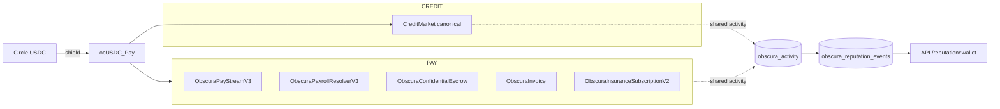

The canonical Credit market and all Pay contracts share `ocUSDC_Pay` as their confidential balance unit. The Setup sheet's onboarding step says verbatim: "Shield in Pay · Reuse the same private ocUSDC here." (See [SetupSheet.tsx](frontend/obscura-os-main/src/components/credit/SetupSheet.tsx) and the Borrow tab's "Start here" card in [CreditPage.tsx](frontend/obscura-os-main/src/pages/CreditPage.tsx).)

Score V2 reads three Pay/Book/Vote per-user counters with correct interfaces (`streamsByEmployer`, `listContactIds`, `voterParticipation`). The previous v1 score returned a constant 5000 because the interface signatures didn't exist on the live contracts; this is fixed.

The Render worker auto-repays Credit positions from Pay streams via `ObscuraCreditStreamHook` once a borrower enables a hook and grants operator approval on `ocUSDC_Pay` for the hook.

---

## 18. Vote / Governance Integration

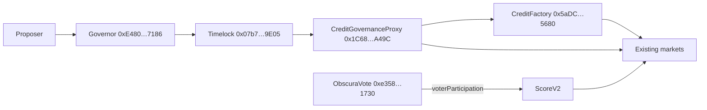

Governance can:
- Approve / revoke LLTV, liqBonus, liqThreshold, IRM, Oracle values.
- Wire an auction engine onto a market (`setMarketAuctionEngine`).
- Whitelist/blacklist hooks as repay routers (`setMarketRepayRouter`).
- Reveal IRM curve publicly (`FHE.allowPublic` on every constant).

Vote participation feeds back into Credit via Score V2 → LLTV boost for active voters (tier ≥ 3 if `votes ≥ ~75/8 = ~10` plus contacts/streams).

The worker indexer subscribes to `ObscuraGovernor` and `ObscuraVote` events as well; vote/governance activity rows appear in the shared `obscura_activity` table (sanitised to omit vote amounts).

---

## 19. Frontend Architecture

### 19.1 Page composition

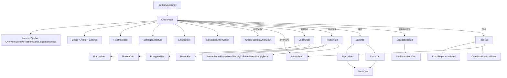

### 19.2 Default workspace logic

```ts
const canonicalMarkets = markets.filter(m => m.isCanonical || m.status === "canonical");
const primaryMarkets = canonicalMarkets.length > 0 ? canonicalMarkets : markets.slice(0, 1);
const workspaceMarkets = showAdvancedMarkets ? markets : primaryMarkets;
```

Advanced toggle lives in both BorrowTab (inline button) and SettingsSlideOver (panel). Toggling exposes legacy/testnet markets in the same workspace.

### 19.3 EncryptedTile / EncryptedValue

`EncryptedTile` and `EncryptedValue` from [components/credit](frontend/obscura-os-main/src/components/credit) render `████████` until the user clicks Reveal. Reveal calls `pos.decryptShares()` which:

1. Reads encrypted handle via `getEncryptedSupplyShares` / `getPosition`.
2. If handle == 0, returns 0 immediately (no FHE).
3. Else calls `initFHEClient(publicClient, walletClient)` then `decryptBalance(handle)`. This is the **only** point where a CoFHE permit prompt fires.

No `useEffect` in any Credit hook auto-calls `decryptForView` / `getOrCreateSelfPermit`.

### 19.4 FHE step status

`useFHEStatus()` returns `{ status, setStep, error }`. Drives `<FHEStepper>` UI between `IDLE → ENCRYPTING → COMPUTING → SENDING → SETTLING → READY → IDLE (auto 4s)`. Every Credit write transitions explicitly:

```
ENCRYPTING  → encryptAmount running
COMPUTING   → fee estimate + pre-flight reads
SENDING     → writeContractAsync awaiting wallet
SETTLING    → waitForTransactionReceipt + awaitCoFHESettle
READY       → success
IDLE        → after 4s auto-reset
```

`fhe` is included in **every** `useCallback` dependency array touching writes — verified across [useCredit.ts](frontend/obscura-os-main/src/hooks/useCredit.ts) and [useCreditRouter.ts](frontend/obscura-os-main/src/hooks/useCreditRouter.ts).

### 19.5 Pre-warm

`usePreWarmFHE` triggers `initFHEClient` on input focus so the first decrypt prompt feels instant. Used by `BorrowForm` amount input.

### 19.6 Gas pre-flight

`useGasPreflight` reads the wallet's native balance and checks against `(2 × maxFeePerGas × gasCap)` before signing, throwing `GasPreflightError` with a readable message. Used by `BorrowForm.submit`.

---

## 20. Hooks Atlas

| Hook | Inputs | Returns | Purpose |
|---|---|---|---|
| `useCreditMarkets` | — | `{ markets, refresh }` | Public scalars across all configured markets via multicall (`totalSupplyAssets`, `totalBorrowAssets`, `utilizationBps`, `borrowersLength`). |
| `useCreditVaults` | — | `{ vaults, refresh }` | Public `publicTotalDeposited`, `feeBps` for vaults. |
| `useVaultPosition(vault)` | vault addr | `{ myShares, tvl, decryptShares, refresh, sharesLoading }` | TVL auto, shares reveal-on-demand. |
| `useEnsureOperator(target)` | target | `{ ensure }` | Idempotent `setOperator` on legacy `CREDIT_OCUSDC`. |
| `useCreditMarket(market)` | market addr | `{ supply, withdraw, supplyCollateral, withdrawCollateral, borrow, repay, accrue, fheStatus }` | All direct-market actions with two-step pattern. |
| `useMarketPosition(market)` | market addr | `{ myCollateral, myBorrow, plainCollateral, plainBorrow, maxBorrowableAmt, decryptShares, refresh, resetDecrypted, sharesLoading }` | Per-user position. Plain values auto-load; encrypted are reveal-on-demand. |
| `useCreditVault(vault)` | vault addr | `{ deposit, withdraw, reallocateSupply, reallocateWithdraw, fheStatus }` | Vault writes. |
| `useCreditAuctions` | — | `{ auctions, refresh, submitBid, settle }` | Auction list + actions. |
| `useApprovedSets` | — | governance approval sets read | Settings panel. |
| `useCreditRouter` | — | `{ setupAndBorrow, repayAndWithdraw, setupAndBorrowStealth, fhe }` | Wallet-native router multicalls. |
| `useVaultQueue` (in useCreditRouter file) | vault addr | request/cancel/claim/instantWithdraw | v3.16 queue surface. |
| `useOperatorGrant` (in useCreditRouter file) | token, operator | one-time grant helper | Used by OperatorApprovalModal. |
| `useCreditAlerts` | — | `{ alerts, push, markAllRead, clear, snooze, permission, requestPermission }` | Local-only browser Notifications keyed off `useHealthEngine`. |
| `useHealthEngine` | — | `{ healthByMarket[], aggregateSeverity, hasDebt }` | Aggregates HF across markets from plaintext shadows. |
| `useNotificationPrefs` | — | `{ prefs, savePrefs, enable, repair, testPush, pushSupported, permission, serviceWorkerReady, isLoading }` | Shared push prefs (Pay + Credit). |
| `useFHEStatus` | — | `{ status, setStep, error }` | Step machine. |
| `useGasPreflight` | — | `{ check }` | Gas balance pre-check. |
| `usePreWarmFHE` | — | `{ onFocus }` | Init FHE client on focus. |

---

## 21. Backend API

### 21.1 Service shape

[backend/obscura-api/src](backend/obscura-api/src) — Node/Express on Render, port `3000`, public URL `https://obscura-api-n62v.onrender.com`.

### 21.2 Routes (Credit-relevant)

| Method | Path | Body / Query | Returns |
|---|---|---|---|
| `GET` | `/health` | — | service status |
| `GET` | `/vapid-public-key` | — | `{ publicKey }` |
| `POST` | `/subscribe` | `{ wallet, subscription }` | `{ ok }` |
| `DELETE` | `/subscribe` | `{ wallet }` | `{ ok }` |
| `POST` | `/prefs` | `NotificationPrefs` | `{ ok }` |
| `GET` | `/prefs/:wallet` | — | `NotificationPrefs` |
| `POST` | `/debug/push-test` | `{ wallet? }` | test result (rate-limited 5/min/IP) |
| `GET` | `/reputation/:wallet` | — | summary (§16.2) |
| `POST` | `/relay` | PackedUserOp | UserOp hash (rate-limited 20/min/IP) |
| `GET` | `/userop-gas-price` | — | gas prices |
| `POST` | `/estimate-userop-gas` | UserOp | gas estimate |
| `GET` | `/userop-receipt/:userOpHash` | — | receipt poll |

### 21.3 Realtime listener

`notifications.ts` subscribes to Supabase Realtime:
```ts
db.channel("obscura_activity_notifications")
  .on("postgres_changes", { event: "INSERT", schema: "public", table: "obscura_activity" },
      (payload) => dispatchNotification(payload.new, "realtime"))
  .subscribe();
```

For each inserted activity it loads `obscura_notification_prefs` for every participant, resolves event aliases (including `credit.*`, see §24), and dispatches Web Push via `web-push` (and optional email via Resend).

---

## 22. Worker / Indexer

[backend/obscura-worker/src](backend/obscura-worker/src) — Node on Render, port `3001`. Three subsystems:

### 22.1 Indexer

Hard-coded Pay contract list + env-driven Credit contract lists:
```
CREDIT_INDEXER_MARKETS  (CSV)
CREDIT_INDEXER_VAULTS   (CSV)
CREDIT_INDEXER_AUCTIONS (CSV)
CREDIT_INDEXER_SCORES   (CSV)
```

Polling cadence and chunking governed by `INDEXER_*` env (§36). Each chunk's logs are upserted to `obscura_activity` with unique key `(tx_hash, log_index)`. On success, reputation signals are derived via [reputation.ts](backend/obscura-worker/src/reputation.ts), then notification dispatch is fired if `inserted || (phase=live && INDEXER_DISPATCH_RECOVERED_DUPLICATES)`.

Phases:
1. **Live**: watch each contract every `INDEXER_LIVE_POLL_MS` (5s). Recovers from RPC errors with capped exponential backoff (`INDEXER_LIVE_RETRY_MAX_MS = 30s`).
2. **Background backfill**: after `INDEXER_BACKGROUND_BACKFILL_DELAY_MS` (15s), gap-fill from last indexed block to (current - STARTUP_RECENT_BLOCKS).

Idempotence: every insert is an upsert; duplicates count as `recoveredDuplicateDispatches` in the health snapshot.

### 22.2 Keeper

[backend/obscura-worker/src/keeper](backend/obscura-worker/src/keeper). Disabled by default (`KEEPER_ENABLED=false`). When enabled with a `KEEPER_PRIVATE_KEY` and `KEEPER_DRY_RUN=true`:

- Every `KEEPER_POLL_MS` (30s) scans `KEEPER_MARKETS` (canonical first).
- Reads `borrowersLength` + `borrowerAt(i)` to enumerate borrowers (plaintext addresses), then per borrower reads `hasBorrow`, `getPlainBorrow`, `getPlainCollateral`.
- Pricing via `ChainlinkPriceAdapter`s (`CHAINLINK_USDCUSD_ADAPTER`, `CHAINLINK_ETHUSD_ADAPTER`).
- Computes `HF = collVal × liqThreshold / debtVal` (bps).
- If `HF <= KEEPER_HF_THRESHOLD_BPS`, calls `market.liquidationOpen(borrower)` (in dry-run: logs only).
- Separately scans `KEEPER_AUCTION` for expired auctions and calls `settle(id)`.

USDC pricing for canonical market is recognised via the Pay `ocUSDC_Pay` address (§9.1 of memory).

### 22.3 Reputation engine

`backfillReputationEvents(limit=500)` runs on startup when `REPUTATION_BACKFILL_ON_START=true` (default). Process last N activity rows chronologically, run `insertReputationSignalsForActivity()` per row. Health snapshot exposes counters at `/health`.

---

## 23. Supabase Schema

Project: `https://quoovjkjwgtdqwdofubh.supabase.co`. No new tables for Wave 5 — Credit reuses existing tables.

### 23.1 `obscura_activity`
```
id, chain_id, block_number, tx_hash, log_index, contract_address,
event_name (TEXT, e.g. "CreditMarket.Borrowed"),
wallet, participants (TEXT[]), args (JSONB), created_at
UNIQUE (tx_hash, log_index)
RLS: anon SELECT, service-role INSERT
Realtime: enabled
Indexes: wallet, participants (GIN), event_name, created_at DESC
```

### 23.2 `obscura_reputation_events`
```
id, wallet, source_app CHECK IN ('pay','credit','vote'),
signal_type, signal_weight (1..10), event_ref REFERENCES obscura_activity(id),
public_context JSONB, created_at
UNIQUE (wallet, source_app, signal_type, event_ref)
RLS: anon SELECT, service-role INSERT
```

### 23.3 `obscura_push_subscriptions`
```
wallet PK, subscription JSONB { endpoint, keys: { auth, p256dh } }, updated_at
RLS: service-role ONLY
```

### 23.4 `obscura_notification_prefs`
```
wallet PK, push_enabled, email_enabled, email TEXT,
events TEXT[] DEFAULT ['*'], updated_at
RLS: anon SELECT, service-role INSERT
```

> Privacy: activity `args` retain amounts for the table but the **notification dispatcher** and the **reputation derivation** both strip amounts before any user-facing payload (§24, §11).

---

## 24. Notifications

### 24.1 Worker dispatch (post-insert)

For each activity inserted by the indexer, candidate wallets = `participants ∪ { wallet }` (lowercased, deduplicated). For each candidate:
1. Load prefs from `obscura_notification_prefs`.
2. Check if any of `["*", eventName, aliases…]` intersects `prefs.events`.
3. If `push_enabled` and subscription exists, send Web Push via VAPID.
4. On 404/410, delete stale subscription.

### 24.2 API realtime dispatch

Same logic but driven by Supabase Realtime INSERT on `obscura_activity`. Worker is authoritative for new inserts; API is a redundant dispatcher to cover backfill / late subscribers.

### 24.3 Credit aliases (verbatim from worker `notificationAliases`)

```
prefix:           credit.*

CreditMarket.Supplied              → credit.supplied
CreditMarket.Withdrew              → credit.withdrew
CreditMarket.CollateralSupplied    → credit.collateral_supplied
CreditMarket.CollateralWithdrawn   → credit.collateral_withdrawn
CreditMarket.Borrowed              → credit.borrowed
CreditMarket.Repaid                → credit.repaid
CreditMarket.LiquidationOpened     → credit.liquidation_opened, credit.health_warning
CreditAuction.AuctionOpened        → credit.liquidation_opened, credit.health_warning
CreditAuction.BidSubmitted         → credit.auction_bid
CreditAuction.AuctionSettled       → credit.auction_settled
CreditVault.Deposited              → credit.vault_deposited
CreditVault.Withdrew               → credit.vault_withdrew
CreditScore.ScoreUpdated           → credit.score_tier_changed
```

### 24.4 Payload shape

```jsonc
{
  "title": "Obscura - {EventName}",
  "body":  "Activity detected for {WalletShort}.",   // NO amount
  "tag":   "obscura-{txHashSlice}-{logIndex}",
  "url":   "/credit",
  "renotify": true,
  "silent": false,
  "sentAt": "ISO-8601",
  "data": { "url", "eventName", "txHash", "activityId", "wallet", "sentAt" }
}
```

### 24.5 Local-only browser alerts

[useCreditAlerts.ts](frontend/obscura-os-main/src/hooks/useCreditAlerts.ts) maintains an in-tab alert list (`localStorage` keyed `obscura:credit:alerts:v1`, 50-entry rolling window). It watches `useHealthEngine.aggregateSeverity` transitions and pushes a `liquidation` alert when severity moves to `warning`/`critical`, respecting per-severity snooze (`obscura:credit:snooze:v1`). The alert title is generic ("Liquidation risk" / "Health declining") and the body is amount-free: "A Credit position needs attention. Review risk before borrowing more."

---

## 25. Shared Activity Feed

`<ActivityFeed mode="private" defaultFilter="credit" filters={["credit","all"]} />` (from `components/harmony/ActivityFeed`) is mounted in:
- Overview tab — `title="Credit activity"`, `eyebrow="Shared feed · Indexed from chain"`.
- Risk tab — `title="Credit risk activity"`, `eyebrow="Realtime · Shared index"`.

Backing hook `useActivityFeed({ filter: "credit" })` enumerates the Credit event names and queries `obscura_activity` filtered to the user's wallet across `participants` GIN index. Realtime updates via Supabase subscription on the same channel as Pay.

---

## 26. Security Model

### 26.1 Trust assumptions

- **Fhenix CoFHE coprocessor** — assumed honest for handle evaluation and ACL enforcement. Threshold-decryption committee is the root trust anchor.
- **Chainlink price feeds** — assumed live and accurate within `maxStaleness = 24h`. Adapter reverts on stale or non-positive answers.
- **Governance Timelock** — assumed honest; controls approved LLTV/IRM/Oracle sets and hook/router whitelisting.
- **Render hosting** — worker and API are best-effort; system is **eventually consistent** for indexed reads. On-chain truth is always authoritative.
- **Supabase RLS** — testnet-permissive (anon can read activity / reputation). Mainnet requires hardened RLS keyed on signed wallet auth.

### 26.2 Operator grant scope

`setOperator(operator, until)` allows `operator` to `confidentialTransferFrom(holder, ?, ?)` on the holder's encrypted balance. The grant is **timestamp-expiring** (UX default 7 days) and **per-token**. A user can revoke by setting `until = 0`.

### 26.3 Plaintext shadow invariant

For every encrypted state variable mutated by user action, the contract carries a `_plain*` shadow updated by `amtPlain`. The encrypted handle is updated by `safe` (`= req` on truthful submit, `= _zero` on lie). On lie, the encrypted handle stays the same but the shadow still advances by `amtPlain` — net result: the user loses position, the pool is whole, no extra tokens leave the contract.

### 26.4 Hook isolation

Hooks (`StreamHook`, `InsuranceHook`) are whitelisted per-market via `setRepayRouter(addr, true)`. Failures inside `pull` / `topUp` are caught and emitted as `HookSkipped(id, reason)` so a single bad hook can't brick keeper ticks for the rest.

---

## 27. Threat Model

| Threat | Mitigation |
|---|---|
| **Borrower lies in `borrow(encAmt, amtPlain)` to drain pool** | `FHE.eq` guard clamps `safe = 0`; plaintext shadow still advances → user loses position, pool safe. |
| **MEV frontrun of liquidation** | Sealed-bid auction; `BidSubmitted` omits bidder + amount; `bestBid` hidden until `settle`. |
| **Snipe at auction close** | 15-min window default; no last-second extension currently — recommended Wave 6 enhancement (anti-snipe extension). |
| **Operator over-approval** | UX defaults to 7-day expiry; user can revoke via `setOperator(_, 0)`. |
| **Stealth bid clustering** | Recommended ERC-5564 fresh per-auction addresses (frontend-only convention; not enforced). |
| **Auto-decrypt MetaMask spam** | Forbidden in every hook/useEffect; verified across [useCredit.ts](frontend/obscura-os-main/src/hooks/useCredit.ts) and `pos.decryptShares()` only fires on explicit user click. |
| **Plaintext leakage via events** | All market/vault events are `address indexed user` only. Auction events omit bidder + amount. Score events emit only tier bucket. |
| **Notification payload leakage** | Worker/API both build amount-free bodies; only event name + wallet shorthand. |
| **Reputation gaming** | API caps per-signal weight (`credit_repaid = 24`, `credit_liquidation_opened = 5`). |
| **Stale price abuse** | `ChainlinkPriceAdapter.latestAnswer()` reverts on `block.timestamp - updatedAt > maxStaleness`. |
| **Score oracle DoS during borrow** | `try/catch` around both `userTier` and `allowTransientForMarket` — borrow falls back to base LLTV without boost. |
| **eaddress utype-12 revert** | Removed `InEaddress` from market signatures; stealth handled by Router + StealthRegistry. |
| **CoFHE rate-limit** | 10-second cool-down between Step 1 and Step 2 of two-step flows. Pre-warm on input focus. |

---

## 28. Privacy Model

### 28.1 What is hidden

- Per-user supply shares (`euint64`).
- Per-user borrow shares (`euint64`).
- Per-user collateral (`euint64`).
- Per-user vault shares (`euint64`).
- Auction bid amounts (during auction; winner's bid revealed only at settle).
- Auction bidder addresses for losing bids (entirely; only winner address revealed at settle).
- Raw credit score (`euint64` 100–1000); only accessible to user, and (transiently) to attested markets.
- IRM curve constants (encrypted; revealable by governance via `revealCurve`).
- Notification bodies (no amounts).
- Reputation `public_context` (no amounts).
- Local browser alert bodies (no amounts).

### 28.2 What is intentionally public

- Aggregate market scalars: `totalSupplyAssets`, `totalBorrowAssets`, `utilizationBps`, `lastAccrualTs`, `borrowersLength`.
- Borrower address list (`borrowerAt`) — required for keeper liquidation scanning. Mainnet wave should consider rotating stealth identities for borrowing.
- Vault `publicTotalDeposited`, `feeBps`, `marketsList`.
- Score tier (0–3), `lastUpdate` timestamp.
- Auction `bidCount`, `bidWindowEnds`, market, borrower.
- Governance proposal IDs and voter addresses (vote *amounts* sanitised out by indexer for `Governor.VoteCast` / `Governor.ProposalCreated`).

### 28.3 Reveal-on-demand

The only client paths that decrypt:
- `useMarketPosition.decryptShares()` — triggered by EncryptedTile/EncryptedValue "Reveal".
- `useVaultPosition.decryptShares()` — triggered by Vault tile reveal.

Nowhere in the canonical UI is decrypt called inside a `useEffect`, on mount, on focus, or on poll.

### 28.4 Plaintext shadows do leak HF

The plaintext shadows are returned by `getPlainCollateral` / `getPlainBorrow`. **Anyone** can call these for any borrower. This is intentional for keeper economics and UI HF rendering, but it means **HF is not private**. True HF privacy is a Wave 6 item (encrypted shadows + ZK-proof of solvency at borrow time).

---

## 29. Failure Modes & Recovery

### 29.1 Borrow reverts with "LLTVBreach"

`pos.plainBorrow + amount > pos.plainCollateral × effectiveLLTV / 10000`. UI translates this to: "LLTVBreach — max borrowable is X ocUSDC. Supply more collateral or repay existing debt first." Recovery: supply collateral via SetupSheet or Position → Add Collateral.

### 29.2 Borrow reverts with "InsufficientLiquidity"

`amount > totalSupplyAssets - totalBorrowAssets`. UI: "InsufficientLiquidity — only X ocUSDC available in pool. Supply ocUSDC as a lender first."

### 29.3 Two-step second call rate-limited

Symptom: Step 2 reverts at fee estimation with HTTP 429 from Tenderly endpoint. Cause: `awaitCoFHESettle` polling burst exhausts Tenderly free tier. Mitigation in code: 10-second `setTimeout` between Step 1 and Step 2, plus `withRateLimitRetry` wrapper around `estimateCappedFees`. Recovery: retry tx (UI button enabled after FHEStepper transitions back to IDLE).

### 29.4 FHE.eq guard mismatch

Symptom: borrow tx succeeds but emits no token transfer; reveal shows no debt change. Cause: client encryption corrupted between attempts (rare). Recovery message in [useCredit.ts](frontend/obscura-os-main/src/hooks/useCredit.ts): "the FHE.eq guard mismatched (encrypted amount ≠ plaintext amount). Retry the transaction; if it persists, refresh the page to reset the FHE client."

### 29.5 Operator expiry

Router calls revert with `NotAuthorized()` after operator expires. UI surfaces this via OperatorApprovalModal re-prompt. Plaintext failure, no FHE state damaged.

### 29.6 Auction settle race

`AuctionSettled` is idempotent (`AlreadySettled` revert). Multiple settlers compete benignly.

### 29.7 Hook pull fails

`pull` / `topUp` wrap their body in `try/catch`. On failure, emit `HookSkipped(id, reason)` and return. Worker continues; user can retry next cycle.

### 29.8 Indexer RPC failure

Capped exponential backoff up to `INDEXER_LIVE_RETRY_MAX_MS = 30s`. Health snapshot exposes `consecutiveFailures`. Background backfill resumes after RPC recovers.

### 29.9 Keeper offline / `KEEPER_ENABLED=false`

Liquidations don't auto-trigger but anyone can call `liquidationOpen(borrower)` manually. Auction settle is also permissionless.

### 29.10 Supabase outage

Frontend ActivityFeed shows last cached state; notifications halt. On recovery, indexer's recovered-duplicate dispatch (`INDEXER_DISPATCH_RECOVERED_DUPLICATES=true`) re-fires push for live-phase events that missed dispatch.

---

## 30. Deployment & Infrastructure

### 30.1 Network

- Chain: **Arbitrum Sepolia (421614)**.
- RPC primary: `https://arb-sepolia.g.alchemy.com/v2/...` (worker), `https://sepolia-rollup.arbitrum.io/rpc` fallback.
- Frontend RPC: configured by wagmi's `arbitrumSepolia` chain default.

### 30.2 Services

| Service | Host | Port | URL | Owner |
|---|---|---|---|---|
| `obscura-api` | Render free web service | 3000 | https://obscura-api-n62v.onrender.com | Notifications + relay + reputation |
| `obscura-worker` | Render free web service | 3001 | (internal) | Indexer + keeper + reputation backfill |
| Frontend | Vercel | — | https://obscura-os-nine.vercel.app | UI |
| Supabase | Supabase Cloud | — | https://quoovjkjwgtdqwdofubh.supabase.co | Activity, prefs, subs, reputation |

### 30.3 Deploy commands

| What | How |
|---|---|
| Compile contracts | `cd contracts-hardhat && npm run compile` |
| Run Credit tests | `cd contracts-hardhat && npx hardhat test test/ObscuraCredit.test.ts` |
| Build frontend | `cd frontend/obscura-os-main && npm run build` |
| Build worker | `cd backend/obscura-worker && npm run build` |
| Build API | `cd backend/obscura-api && npm run build` |
| Deploy canonical market | `cd contracts-hardhat && npx hardhat run scripts/deployCreditCanonicalPayOcUSDC.ts --network arb-sepolia` |
| Sync ABI files | `cd contracts-hardhat && npm run sync-abis` |

### 30.4 Mainnet gate (NOT enabled yet)

Mainnet promotion requires every item in §32 to be ✅. The contracts are written for Arbitrum mainnet compatibility but **Fhenix CoFHE is testnet-only** as of cut date — a true mainnet promotion is gated on Fhenix CoFHE GA.

---

## 31. Operational Playbooks

### 31.1 "User can't borrow"

1. Check `Position` tab → revealed collateral or `getPlainCollateral` ≠ 0?
2. Check `maxBorrowable(user)` via `useMarketPosition` (already shown in `BorrowForm`).
3. Check `availableLiquidity = totalSupplyAssets - totalBorrowAssets` ≥ amount.
4. If both pass and tx reverts, FHE.eq mismatch — refresh page and retry.
5. Inspect tx on Arbiscan Sepolia for revert reason.

### 31.2 "Notifications not arriving"

1. `/health` on worker — `indexer.consecutiveFailures` == 0?
2. `/prefs/:wallet` on API — `push_enabled = true`? `events` contains `*` or `credit.*` / specific?
3. Browser permission for site — `Notification.permission` == `granted`?
4. `POST /debug/push-test?wallet=…` — does test push arrive?
5. Service worker active? (DevTools → Application → Service Workers)

### 31.3 "Hook not pulling"

1. Confirm `cToken.isOperator(borrower, hookAddr) == true` and expiry > now.
2. Confirm `lastPullAt + periodSeconds <= block.timestamp`.
3. Watch `HookSkipped(id, reason)` events for the hook on Arbiscan.

### 31.4 "Enable keeper for a market"

```
1. Set KEEPER_PRIVATE_KEY in Render secrets (signer must have ETH on Arb-Sepolia).
2. Set KEEPER_DRY_RUN=true initially.
3. Set KEEPER_ENABLED=true. Redeploy worker.
4. Watch /health: keeper.enabled=true, keeper.configured=true.
5. Observe console logs for `would-liquidate` messages.
6. When confident, set KEEPER_DRY_RUN=false.
```

### 31.5 "Add a new market via governance"

```
1. Approve params: GovernanceProxy.approveLLTV / approveLiqBonus / approveLiqThreshold /
                   approveIRM / approveOracle
2. Permissionless: Factory.createMarket(loan, coll, oracle, irm, lltvBps, liqBonusBps, liqThresholdBps)
3. GovernanceProxy.setMarketAuctionEngine(market, AUCTION)
4. (Optional) GovernanceProxy.setMarketRepayRouter(market, hook, true)
5. Add to CREDIT_INDEXER_MARKETS env on Render worker. Redeploy.
6. Add to CREDIT_MARKETS in frontend/config/credit.ts. Redeploy frontend.
```

### 31.6 "Rotate the credit score sources"

```
ScoreV2 owner: setSources(payStream, addressBook, vote)
```

---

## 32. Mainnet Readiness Gates

- [ ] Fhenix CoFHE mainnet GA available.
- [ ] Tighten Supabase RLS to require signed wallet auth on `obscura_activity` reads.
- [ ] Switch IRM accrual from inline `500 + 1500*u/10000` to authoritative `ObscuraCreditIRM.getRates`.
- [ ] Remove `_plainBorrow` / `_plainCollateral` external getters or gate behind ZK-proof-of-solvency for HF privacy.
- [ ] Add anti-snipe extension to `ObscuraCreditAuction` (e.g. extend window if bid in last 60s).
- [ ] Split `applyLiquidation(seized, repaid)` to allow partial repays with collateral-bonus math.
- [ ] Rotate stealth borrower identity per-borrow at the UI layer.
- [ ] Replace 24h staleness window on price adapters with 1h.
- [ ] Decommission legacy faucet markets from `CREDIT_INDEXER_MARKETS` and `KEEPER_MARKETS`.
- [ ] Live keeper run on canonical market with `KEEPER_DRY_RUN=false` for ≥ 2 weeks without incident.
- [ ] Third-party audit of `ObscuraCreditMarket`, `ObscuraCreditAuction`, `ObscuraCreditRouter`, `ObscuraCreditVault`.
- [ ] Document and ship `eaddress` disbursement path once CoFHE supports utype=12.

---

## 33. Known Limitations / Footguns

1. **eaddress unsupported** — borrow disburses to `msg.sender` (or `user` in router path), not to an encrypted destination. Stealth requires Router's stealth variant + StealthRegistry.
2. **Plain shadows are public** — HF is publicly computable for any borrower. Privacy on HF deferred to Wave 6.
3. **`borrowersLength` is public** — anyone can enumerate all borrowers. Acceptable for testnet keeper; revisit for mainnet.
4. **IRM not authoritative** — accrual uses an inline simple curve, IRM contract is informational only.
5. **Auction `applyLiquidation` uses `_bestBidPlain` for both `seizedColl` and `repaidDebt`** — collapses partial-vs-full into a single number. Real partial liquidations with bonus split are a Wave 6 enhancement.
6. **No anti-snipe** on auction window.
7. **CoFHE rate-limit** mandates the 10s cool-down in two-step flows — UI feels slow on first interaction; pre-warm helps.
8. **Tenderly free tier rate limits** — frontend pins to `withRateLimitRetry` and 10s sleeps. Production should use a paid RPC.
9. **Operator grant covers all transfers** for the operator — not per-amount. Revocation via `setOperator(_, 0)`.
10. **`v1 ObscuraCreditScore`** silently returned 5000 because Pay/Book/Vote interfaces didn't match. v2 fixes this; v1 is archived but still has a deployed address — must not be passed as `scoreOracle` for any new market.
11. **Faucet legacy markets** can still be supplied/borrowed by Advanced users and the worker still indexes them — purposeful, to preserve repay/withdraw paths. **Do not** route new lending into them.
12. **`KEEPER_ENABLED=false` by default** — no automated liquidations until explicitly enabled.
13. **Notification dispatch may double-fire** during indexer recovery if `INDEXER_DISPATCH_RECOVERED_DUPLICATES=true` — payload `tag` deduplicates browser-side via `renotify`.
14. **Activity `args` retain amounts** at the Supabase row level — readable by anon. Mitigation: tighten RLS for mainnet, or strip amounts at indexer (Wave 6).
15. **`encEffLLTV` is computed and stored but never read** — exists for future off-chain auditing only.

---

## 34. Testing Strategy

| Layer | Tool | Surface | Status |
|---|---|---|---|
| Contracts | Hardhat | `test/ObscuraCredit.test.ts` (19 cases) | ✅ passing |
| Contracts | Hardhat | `npm run compile` | ✅ |
| Frontend | Vitest | `src/test/pay-final-p0.test.ts` (19 cases — shared with Pay) | ✅ passing |
| Frontend | Vitest | `npm run test` (20 total) | ✅ |
| Frontend | Vite build | `npm run build` | ✅ |
| Worker | tsc | `npm run build` | ✅ |
| API | tsc | `npm run build` | ✅ |
| Live smoke | Manual | Vercel + Render + Supabase + Service Worker + Notification prefs + Reputation endpoint | ✅ |
| Live UI | Manual browser | `/credit` tabs Overview / Borrow / Position / Earn / Liquidations / Risk | ✅ verified at cut date |
| Mobile | Source-level responsive grids | `sm:` breakpoints in Borrow/Position/Setup | ✅ patched (shared live browser refused viewport shrink) |

---

## 35. Event Matrix

| Contract | Event | Indexed args | Activity `event_name` | Reputation signal | Notification alias | UI surface |
|---|---|---|---|---|---|---|
| `ObscuraCreditMarket` | `Supplied(user)` | user | `CreditMarket.Supplied` | `credit_liquidity_supplied` | `credit.supplied` | Earn / Position |
|  | `Withdrew(user)` | user | `CreditMarket.Withdrew` | `credit_liquidity_withdrawn` | `credit.withdrew` | Earn / Position |
|  | `CollateralSupplied(user)` | user | `CreditMarket.CollateralSupplied` | `credit_collateral_supplied` | `credit.collateral_supplied` | Position / Setup |
|  | `CollateralWithdrawn(user)` | user | `CreditMarket.CollateralWithdrawn` | `credit_collateral_withdrawn` | `credit.collateral_withdrawn` | Position |
|  | `Borrowed(user)` | user | `CreditMarket.Borrowed` | `credit_borrowed` | `credit.borrowed` | Borrow / Position |
|  | `Repaid(user)` | user | `CreditMarket.Repaid` | `credit_repaid` | `credit.repaid` | Position |
|  | `LiquidationOpened(borrower, auctionId)` | borrower, auctionId | `CreditMarket.LiquidationOpened` | `credit_liquidation_opened` | `credit.liquidation_opened` + `credit.health_warning` | Risk / Liquidations |
|  | `Accrued(newTotalBorrow, ts)` | — | `CreditMarket.Accrued` | — | — | — |
|  | `AuctionEngineSet(engine)` | engine | `CreditMarket.AuctionEngineSet` | — | — | — |
|  | `ScoreOracleSet(oracle)` | oracle | `CreditMarket.ScoreOracleSet` | — | — | — |
| `ObscuraCreditAuction` | `AuctionOpened(id, market, borrower, endsAt)` | id, market, borrower | `CreditAuction.AuctionOpened` | `credit_liquidation_opened` | `credit.liquidation_opened` + `credit.health_warning` | Liquidations |
|  | `BidSubmitted(id, newCount)` | id | `CreditAuction.BidSubmitted` | — | `credit.auction_bid` | Liquidations |
|  | `AuctionSettled(id, winner)` | id, winner | `CreditAuction.AuctionSettled` | `credit_auction_won` | `credit.auction_settled` | Liquidations |
| `ObscuraCreditVault` | `Deposited(user)` | user | `CreditVault.Deposited` | `credit_vault_deposited` | `credit.vault_deposited` | Earn |
|  | `Withdrew(user)` | user | `CreditVault.Withdrew` | `credit_vault_withdrew` | `credit.vault_withdrew` | Earn |
|  | `WithdrawRequested/Cancelled/Instant` | user | — | — | — | Earn (advanced) |
|  | `Reallocated(market, amt, isSupply)` | market | — | — | — | Settings (curator) |
| `ObscuraCreditScoreV2` | `ScoreUpdated(user, tier)` | user | `CreditScore.ScoreUpdated` | `credit_score_updated` | `credit.score_tier_changed` | Risk |
|  | `AttestedForMarket(user, market)` | user, market | — | — | — | Settings |
| `ObscuraCreditRouter` | `SetupAndBorrow(user, market)` | user, market | (not indexed; effects covered by market events) | — | — | (implicit) |
|  | `RepayAndWithdraw(user, market)` | user, market | (not indexed) | — | — | (implicit) |
|  | `SetupAndBorrowStealth(user, market, stealthAddress)` | user, market, stealth | (not indexed) | — | — | (implicit) |
| `ObscuraCreditStreamHook` | `Pulled(hookId, amt)` | hookId | — | — | — | — |
|  | `HookEnabled/Disabled` | hookId, user, market | — | — | — | — |
|  | `HookSkipped(hookId, reason)` | hookId | — | — | — | — |
|  | `KeeperTip(keeper, hookId, amt)` | keeper, hookId | — | — | — | — |
| `ObscuraCreditInsuranceHook` | `ToppedUp(subId, amt)` | subId | — | — | — | — |
|  | `Subscribed/Cancelled` | subId, borrower, market | — | — | — | — |

---

## 36. Environment Variables

### 36.1 Frontend ([.env](frontend/obscura-os-main/.env))

```
VITE_CHAIN_ID=421614

# Canonical Credit
VITE_OBSCURA_CREDIT_MARKET_CANONICAL_ADDRESS = 0x1Ec113297c7F9516A6604aa3b18C180559a6f551
VITE_OBSCURA_CREDIT_CANONICAL_OCUSDC_ADDRESS = 0xEd46020Df8abe7BB1E096f27d089F4326D223a53   # = ocUSDC_Pay
VITE_OBSCURA_PAY_OCUSDC_ADDRESS             = 0xEd46020Df8abe7BB1E096f27d089F4326D223a53

# Core infra
VITE_OBSCURA_CREDIT_FACTORY_ADDRESS         = 0x5aDC1965D155f4b18119222CBA7a7A4be4F45680
VITE_OBSCURA_CREDIT_ORACLE_ADDRESS          = 0x5F00910533AB6fc12a35a87BaFe856EF2cb323c3
VITE_OBSCURA_CREDIT_IRM_ADDRESS             = 0xA072c038cE98dEC8F5350D451145fB98F5EA57Bc
VITE_OBSCURA_CREDIT_AUCTION_ADDRESS         = 0x205FfC0A3b8207B645c1a6B1b4805eb3FfC828F0
VITE_OBSCURA_CREDIT_ROUTER_ADDRESS          = 0x46275A34e26C9dBb46fB1716852a5D221564a43F
VITE_OBSCURA_CREDIT_STREAM_HOOK_ADDRESS     = 0x740580C5FF321440C61c6Af667C191Eea2249F96
VITE_OBSCURA_CREDIT_INSURANCE_HOOK_ADDRESS  = 0x55f632401d238dFBEdd63B4adDF5B64DfB178190
VITE_OBSCURA_CREDIT_GOVERNANCE_PROXY_ADDRESS= 0x1C6892cCF24A6ade21B6778D9B5C288Ab85DA49C

# Score
VITE_OBSCURA_CREDIT_SCORE_V2_ADDRESS        = 0xe5B0c6c06C0B1fd7d7CD5D2e93997693863d3D4D
VITE_OBSCURA_CREDIT_SCORE_ADDRESS           = 0xA83aCeE57af79D77cac6854edf92A63A60c28c18   # @deprecated v1

# Adapters
VITE_OBSCURA_CHAINLINK_USDCUSD_ADAPTER_ADDRESS = 0xc65e85926Cb29aaEC74f99cF1591CBa65daa2c4A
VITE_OBSCURA_CHAINLINK_ETHUSD_ADAPTER_ADDRESS  = 0xe3E388b421bfcF558FD46a18eE3b1c27aD1D36B3

# Legacy
VITE_OBSCURA_CREDIT_OCUSDC_ADDRESS          = 0xf963fD86348813786ed57b8b2778A365C6226E43
VITE_OBSCURA_CONFIDENTIAL_USDC_ADDRESS      = 0xEFab856b903C4106769B14798deDE21C6923d7d2
VITE_OBSCURA_CONFIDENTIAL_WETH_ADDRESS      = 0x16896b3D445122a23C36aC618966A842aC9BD56e
VITE_OBSCURA_CONFIDENTIAL_OBS_ADDRESS       = 0x27298A55B80d9b8c4Fc647A6ce2b25246d800778
VITE_OBSCURA_CREDIT_MARKET_V316_ADDRESS     = 0x269f59672F3fd7f95bF440941e618b54Ebc5717A
VITE_OBSCURA_CREDIT_VAULT_V316_ADDRESS      = 0xE0c5323006AEaF09E449f8B85B24C8A50b389C29
VITE_OBSCURA_CREDIT_MARKET_M86_ADDRESS      = 0xcf98d97934F37Ac9A05bc037437E43cb6788eC8b
VITE_OBSCURA_CREDIT_MARKET_M70WETH_ADDRESS  = 0x0b645441D65A0CCb91A82b5a2eE3156C1c89207B
VITE_OBSCURA_CREDIT_MARKET_M50OBS_ADDRESS   = 0x05e58B8D96Bbd752A72Fa02921A0eE31eCB9035d
VITE_OBSCURA_CREDIT_VAULT_CONSERVATIVE_V2_ADDRESS = 0xCEBb042ae8FDE217a9FdE5b8a82E23827FdBB898
VITE_OBSCURA_CREDIT_VAULT_BALANCED_V2_ADDRESS     = 0xF508315bD4C5EC4c71C5E431AE972C0dC6B78Bbc

# Shared data
VITE_SUPABASE_URL        = https://quoovjkjwgtdqwdofubh.supabase.co
VITE_SUPABASE_ANON_KEY   = (RLS-safe anon JWT)
VITE_NOTIFICATIONS_URL   = https://obscura-api-n62v.onrender.com
VITE_RELAY_URL           = https://obscura-api-n62v.onrender.com
```

### 36.2 Worker ([backend/obscura-worker/.env](backend/obscura-worker/.env))

```
NODE_ENV=development
RPC_URL=https://arb-sepolia.g.alchemy.com/v2/...

SUPABASE_URL=...
SUPABASE_SERVICE_ROLE_KEY=...

CHAINLINK_ETHUSD_ADAPTER=0xe3E388b421bfcF558FD46a18eE3b1c27aD1D36B3
CHAINLINK_USDCUSD_ADAPTER=0xc65e85926Cb29aaEC74f99cF1591CBa65daa2c4A

KEEPER_AUCTION=0x205FfC0A3b8207B645c1a6B1b4805eb3FfC828F0
KEEPER_MARKETS=0x1Ec1…f551,0x269f…717A,0xcf98…eC8b,0x0b64…207B,0x05e5…035d
KEEPER_PRIVATE_KEY=(secret)
KEEPER_DRY_RUN=true
KEEPER_POLL_MS=30000
KEEPER_HF_THRESHOLD_BPS=10000
KEEPER_BID_DISCOUNT_BPS=200
KEEPER_MAX_GAS_GWEI=2
KEEPER_ENABLED=false

INDEXER_GETLOGS_CHUNK_BLOCKS=10
INDEXER_GETLOGS_RETRIES=3
INDEXER_GETLOGS_RETRY_BASE_MS=1000
INDEXER_LIVE_POLL_MS=5000
INDEXER_LIVE_RETRY_MAX_MS=30000
INDEXER_STARTUP_RECENT_BLOCKS=5000
INDEXER_BACKGROUND_BACKFILL_DELAY_MS=15000
INDEXER_DISPATCH_RECOVERED_DUPLICATES=true

CREDIT_INDEXER_MARKETS=0x1Ec1…f551,0x269f…717A,0xcf98…eC8b,0x0b64…207B,0x05e5…035d
CREDIT_INDEXER_VAULTS=0xCEBb…B898,0xF508…8Bbc
CREDIT_INDEXER_AUCTIONS=0x205F…828F0
CREDIT_INDEXER_SCORES=0xe5B0…3D4D

FRONTEND_URL=https://obscura-os-nine.vercel.app
VAPID_CONTACT_EMAIL=noreply@obscura.finance
VAPID_PUBLIC_KEY=(public)
VAPID_PRIVATE_KEY=(secret)

REPUTATION_EVENTS_ENABLED=true
REPUTATION_BACKFILL_ON_START=true
REPUTATION_BACKFILL_LIMIT=500
```

### 36.3 API ([backend/obscura-api/.env](backend/obscura-api/.env))

```
NODE_ENV=development
PORT=3000
ALLOWED_ORIGINS=http://localhost:5173,https://obscura-os-nine.vercel.app

PAYMASTER_ADDRESS=0x7a8D880D9c5F88Ba8bd4435c450256628F66dd0C
BUNDLER_URL=(Alchemy ERC-4337)
BUNDLER_URL_FALLBACK=(Pimlico)

SUPABASE_URL=...
SUPABASE_SERVICE_ROLE_KEY=...

VAPID_CONTACT_EMAIL=noreply@obscura.finance
VAPID_PUBLIC_KEY=(public)
VAPID_PRIVATE_KEY=(secret)
RESEND_API_KEY=(secret, optional email)
```

---

## 37. ABI Cheatsheet

### 37.1 `ObscuraCreditMarket`

```solidity
// Reads
function loanAsset() view returns (address);
function collateralAsset() view returns (address);
function oracle() view returns (address);
function irm() view returns (address);
function lltvBps() view returns (uint64);
function liqBonusBps() view returns (uint64);
function liqThresholdBps() view returns (uint64);
function auctionEngine() view returns (address);
function scoreOracle() view returns (address);
function totalSupplyAssets() view returns (uint128);
function totalBorrowAssets() view returns (uint128);
function lastAccrualTs() view returns (uint128);
function utilizationBps() view returns (uint256);
function borrowersLength() view returns (uint256);
function borrowerAt(uint256) view returns (address);
function hasBorrow(address) view returns (bool);
function isRepayRouter(address) view returns (bool);
function isOnBehalfRouter(address) view returns (bool);
function getPosition(address) view returns (euint64, euint64, euint64, eaddress);
function getEncryptedSupplyShares(address) view returns (euint64);
function getPlainCollateral(address) view returns (uint128);
function getPlainBorrow(address) view returns (uint128);
function maxBorrowable(address) view returns (uint128);

// Writes (user)
function supply(uint64 amtPlain, InEuint64 encAmt);
function withdraw(uint64 amtPlain, InEuint64 encAmt);
function supplyCollateral(uint64 amtPlain, InEuint64 encAmt);
function withdrawCollateral(uint64 amtPlain, InEuint64 encAmt);
function borrow(uint64 amtPlain, InEuint64 encAmt);
function repay(uint64 amtPlain, InEuint64 encAmt);
function accrueInterest();

// Writes (router)
function supplyCollateralFor(address user, uint64 amtPlain, InEuint64 encAmt);
function borrowFor(address user, uint64 amtPlain, InEuint64 encAmt);
function repayFor(address user, uint64 amtPlain, InEuint64 encAmt);
function withdrawCollateralFor(address user, uint64 amtPlain, InEuint64 encAmt);

// Writes (hook)
function supplyCollateralFromHook(address borrower, uint64 amtPlain, euint64 handle);
function repayFromHook(address borrower, uint64 amtPlain, euint64 handle);

// Writes (engine)
function applyLiquidation(address borrower, uint64 seizedColl, uint64 repaidDebt);
function liquidationOpen(address borrower) returns (uint256 auctionId);

// Factory-only
function setAuctionEngine(address engine);
function setRepayRouter(address router, bool ok);
function setOnBehalfRouter(address router, bool ok);
function setScoreOracle(address oracle);

// Events
event Supplied(address indexed user);
event Withdrew(address indexed user);
event CollateralSupplied(address indexed user);
event CollateralWithdrawn(address indexed user);
event Borrowed(address indexed user);
event Repaid(address indexed user);
event Accrued(uint128 newTotalBorrowAssets, uint128 ts);
event LiquidationOpened(address indexed borrower, uint256 indexed auctionId);
event AuctionEngineSet(address indexed engine);
event ScoreOracleSet(address indexed oracle);
```

### 37.2 `ObscuraCreditRouter`

```solidity
function stealthRegistry() view returns (address);
function setupAndBorrow(address market, uint256 shieldAmt, uint64 collateralPlain,
  InEuint64 encCollPush, InEuint64 encCollMarket, uint64 borrowPlain, InEuint64 encBorrow);
function setupAndBorrowStealth(address market, uint64 collateralPlain,
  InEuint64 encCollPush, InEuint64 encCollMarket, uint64 borrowPlain, InEuint64 encBorrow,
  address stealthAddress, bytes ephemeralPubKey, bytes1 viewTag, bytes metadata);
function repayAndWithdraw(address market, uint64 repayPlain,
  InEuint64 encRepayPush, InEuint64 encRepayMarket,
  uint64 withdrawCollPlain, InEuint64 encWithdraw);

event SetupAndBorrow(address indexed user, address indexed market);
event RepayAndWithdraw(address indexed user, address indexed market);
event SetupAndBorrowStealth(address indexed user, address indexed market, address indexed stealthAddress);
```

### 37.3 `ObscuraCreditAuction`

```solidity
uint64 DEFAULT_WINDOW = 900;  // 15 minutes
function openFromMarket(address borrower, euint64 collateral, euint64 debt) returns (uint256);
function submitBid(uint256 auctionId, uint64 bidPlain, InEuint64 encBid);
function settle(uint256 auctionId);
function getAuction(uint256 id) view returns (
  address market, address borrower, uint64 endsAt,
  uint64 bestBid, address bestBidder, bool settled, uint32 bids
);
function bidCount(uint256) view returns (uint32);
function auctionsLength() view returns (uint256);

event AuctionOpened(uint256 indexed auctionId, address indexed market, address indexed borrower, uint64 endsAt);
event BidSubmitted(uint256 indexed auctionId, uint32 newCount);
event AuctionSettled(uint256 indexed auctionId, address indexed winner);
```

### 37.4 `ObscuraCreditVault`

```solidity
function loanAsset() view returns (address);
function owner() view returns (address);
function curator() view returns (address);
function feeRecipient() view returns (address);
function feeBps() view returns (uint16);
function isApprovedMarket(address) view returns (bool);
function marketCap(address) view returns (uint128);
function totalShares() view returns (uint128);
function publicTotalDeposited() view returns (uint128);
function getEncryptedShares(address) view returns (euint64);
function pendingWithdraw(address) view returns (uint128, uint64);
function getPendingWithdraw(address) view returns (uint128 amt, uint64 claimableAt);
function marketsLength() view returns (uint256);
uint64 WITHDRAW_DELAY = 86400;
uint16 INSTANT_FEE_BPS = 20;

function deposit(uint64 amtPlain, InEuint64 encAmt);
function withdraw(uint64 amtPlain);
function requestWithdraw(uint64 amtPlain);
function cancelWithdraw();
function claimWithdraw();
function instantWithdraw(uint64 amtPlain);
function setCurator(address);
function setFee(uint16 bps, address recipient);
function approveMarket(address market, uint128 cap);
function reallocateSupply(address market, uint64 amtPlain, InEuint64 encAmt);
function reallocateWithdraw(address market, uint64 amtPlain, InEuint64 encAmt);
function setOperatorOn(address operator, uint48 until);

event Deposited(address indexed user);
event Withdrew(address indexed user);
event WithdrawRequested(address indexed user, uint128 amt, uint64 claimableAt);
event WithdrawCancelled(address indexed user, uint128 amt);
event InstantWithdrawn(address indexed user, uint128 amt, uint128 fee);
event Reallocated(address indexed market, uint128 amount, bool isSupply);
event CuratorSet(address indexed curator);
event FeeSet(uint16 bps, address indexed recipient);
event MarketApproved(address indexed market, uint128 cap);
```

### 37.5 `ObscuraCreditScoreV2`

```solidity
function scoreOf(address user) view returns (euint64);
function userTier(address user) view returns (uint8);
function lastUpdate(address user) view returns (uint64);
function isAuthorizedMarket(address) view returns (bool);
function attestedFor(address user, address market) view returns (bool);

function updateScore(address user);             // permissionless
function bumpFromMarket(address user);          // markets only
function attestForMarket(address market);       // user opt-in
function allowTransientForMarket(address user, address market);
function setSources(address payStream, address addressBook, address vote);
function setAuthorizedMarket(address market, bool ok);

event ScoreUpdated(address indexed user, uint8 tier);
event AttestedForMarket(address indexed user, address indexed market);
event SourcesSet(address payStream, address addressBook, address voteContract);
event MarketAuthorized(address indexed market, bool ok);
```

### 37.6 `ObscuraCreditFactory`

```solidity
function governor() view returns (address);
function isApprovedLLTV(uint64) view returns (bool);
function isApprovedLiqBonus(uint64) view returns (bool);
function isApprovedLiqThreshold(uint64) view returns (bool);
function isApprovedIRM(address) view returns (bool);
function isApprovedOracle(address) view returns (bool);
function allMarkets(uint256) view returns (address);
function allMarketsLength() view returns (uint256);
function marketOf(bytes32 key) view returns (address);
function marketKey(...) pure returns (bytes32);

function createMarket(address loan, address coll, address oracle, address irm,
                       uint64 lltv, uint64 liqBonus, uint64 liqThreshold) returns (address);
function setApprovedLLTV / setApprovedLiqBonus / setApprovedLiqThreshold / setApprovedIRM / setApprovedOracle;
function setMarketAuctionEngine(address market, address engine);
function setMarketRepayRouter(address market, address router, bool ok);
function setGovernor(address);
```

### 37.7 `ObscuraConfidentialToken` (canonical-shaped FHERC20)

Used both for `ocUSDC_Pay` (Pay wrapper) and the legacy faucet tokens.

```solidity
function name/symbol/decimals/faucetAmount/underlying/publicSupplyMirror/...;
function confidentialBalanceOf(address) view returns (uint256);      // handle as uint256
function isOperator(address holder, address spender) view returns (bool);
function operatorExpiry(address holder, address spender) view returns (uint48);
function setOperator(address operator, uint48 until);
function confidentialTransfer(address to, uint256 handle);            // outbound from market
function confidentialTransfer(address to, InEuint64 amount);           // inbound by user
function confidentialTransferFrom(address from, address to, InEuint64 amount);
function shield(uint256 amount);                                       // wrapper mode
function unshield(uint64 amtPlain, InEuint64 encAmt, address to);      // wrapper mode
function claimFaucet();                                                // faucet mode
function nextFaucetIn(address) view returns (uint256);

event ConfidentialTransfer(address indexed from, address indexed to);
event OperatorSet(address indexed holder, address indexed operator, uint48 until);
event FaucetClaim(address indexed user);
event Shielded(address indexed user, uint256 amount);
event Unshielded(address indexed user, address indexed to, uint256 amount);
```

### 37.8 `ObscuraCreditStreamHook` / `InsuranceHook`

```solidity
// Stream
function enable(address market, uint64 perCycle, uint64 periodSeconds) returns (uint256);
function disable(uint256 hookId);
function pull(uint256 hookId, InEuint64 encPull, InEuint64 encPush);
function hooksOf(address user) view returns (uint256[]);
function getHook(uint256 id) view returns (Hook);

event HookEnabled(uint256 indexed hookId, address indexed user, address indexed market);
event HookDisabled(uint256 indexed hookId);
event Pulled(uint256 indexed hookId, uint64 amt);
event HookSkipped(uint256 indexed hookId, string reason);
event KeeperTip(address indexed keeper, uint256 indexed hookId, uint64 amt);

// Insurance: subscribe/cancel/topUp, mirror events
```

### 37.9 `ObscuraCreditOracle` / `ObscuraCreditIRM` / `ChainlinkPriceAdapter`

```solidity
// Oracle
function priceOf(address asset) returns (euint64);
function setPublicFeed(address asset, address feed);
function setConfidentialPrice(address asset, InEuint64 encPx);
function publicFeed(address) view returns (address);
function hasConfidential(address) view returns (bool);

// IRM
function getRates(uint256 utilizationBps) returns (euint64 borrowApr, euint64 supplyApr);
function setCurve(uint64 base, uint64 slope1, uint64 slope2, uint64 kink, uint64 reserve);
function revealCurve();
function baseBpsP / slope1BpsP / slope2BpsP / kinkBpsP / reserveBpsP view returns (uint64);

// Chainlink adapter
function latestAnswer() view returns (uint256);   // 18-decimal
function chainlinkFeed() view returns (address);
function maxStaleness() view returns (uint256);
function scale() view returns (uint256);
```

---

## 38. Source File Provenance

Files read line-by-line to produce this bible (provenance for §0.3):

```
Contracts:
  contracts-hardhat/contracts/credit/ObscuraCreditMarket.sol
  contracts-hardhat/contracts/credit/ObscuraCreditRouter.sol
  contracts-hardhat/contracts/credit/ObscuraCreditVault.sol
  contracts-hardhat/contracts/credit/ObscuraCreditAuction.sol
  contracts-hardhat/contracts/credit/ObscuraCreditFactory.sol
  contracts-hardhat/contracts/credit/ObscuraCreditOracle.sol
  contracts-hardhat/contracts/credit/ObscuraCreditIRM.sol
  contracts-hardhat/contracts/credit/ObscuraCreditScoreV2.sol
  contracts-hardhat/contracts/credit/ObscuraCreditStreamHook.sol
  contracts-hardhat/contracts/credit/ObscuraCreditInsuranceHook.sol
  contracts-hardhat/contracts/credit/ObscuraCreditGovernanceProxy.sol
  contracts-hardhat/contracts/credit/ChainlinkPriceAdapter.sol
  contracts-hardhat/contracts/credit/ObscuraConfidentialToken.sol
  contracts-hardhat/contracts/credit/IEncryptedScore.sol

Frontend:
  frontend/obscura-os-main/src/config/credit.ts
  frontend/obscura-os-main/src/hooks/useCredit.ts
  frontend/obscura-os-main/src/hooks/useCreditRouter.ts
  frontend/obscura-os-main/src/hooks/useCreditAlerts.ts
  frontend/obscura-os-main/src/pages/CreditPage.tsx
  frontend/obscura-os-main/src/components/credit/{BorrowForm,SetupSheet,OperatorApprovalModal}.tsx

Backend worker:
  backend/obscura-worker/src/index.ts
  backend/obscura-worker/src/indexer/{index.ts,events.ts}
  backend/obscura-worker/src/keeper/{index.ts,config.ts,abi.ts}
  backend/obscura-worker/src/reputation.ts
  backend/obscura-worker/src/notifications.ts
  backend/obscura-worker/src/db.ts
  backend/obscura-worker/migrations/*.sql

Backend API:
  backend/obscura-api/src/index.ts
  backend/obscura-api/src/notifications.ts
  backend/obscura-api/src/reputation.ts
  backend/obscura-api/src/relay.ts
  backend/obscura-api/src/db.ts

Configuration:
  contracts-hardhat/deployments/arb-sepolia.json
  frontend/obscura-os-main/.env
  backend/obscura-worker/.env
  backend/obscura-api/.env
  render.yaml

Memory:
  memory_credit_5.md

Live UI:
  http://127.0.0.1:5175/credit  (Overview / Borrow / Position / Earn / Liquidations / Risk verified)
```

---

## 39. Architecture Decision Records

### ADR-CRED-001 — Canonical Pay-backed ocUSDC for Credit
**Date**: Wave 5 cut · **Status**: Accepted

**Context**: Wave 4 Credit ran against a faucet `ocUSDC` token isolated from Pay's `ocUSDC_Pay`. Users had to bridge between the two, leaking timing info and forcing two separate shielded balances.

**Decision**: Deploy a new Credit market against `ocUSDC_Pay` for both loan and collateral. Make this market the canonical / default in the UI. Demote faucet markets to Advanced-only.

**Consequences**:
- Single shielded USDC flows freely between Pay and Credit.
- Faucet markets remain live for testnet experimentation, gated behind toggle.
- Reputation/activity feeds now reflect cross-app usage automatically.
- Liquidations in canonical market settle in real Pay-backed USDC.

### ADR-CRED-002 — Remove `eaddress` from borrow signatures
**Status**: Accepted

**Context**: CoFHE coprocessor on Arbitrum-Sepolia rejected utype=12 (`eaddress`) inputs at calldata validation. Every borrow reverted.

**Decision**: Strip `InEaddress` from `borrow` / `borrowFor`. Disburse to `msg.sender` / `user`. Move stealth to Router + StealthRegistry layer.

**Consequences**: True on-chain stealth disbursement deferred until `eaddress` GA. Router stealth variant remains best-available privacy.

### ADR-CRED-003 — `FHE.eq` guard + plaintext shadow
**Status**: Accepted

**Context**: Reineira-style cUSDC rejects trivially-encrypted handles on outbound `confidentialTransfer`. Markets must derive outbound handles from user-supplied `InEuint64`, which a malicious user could mismatch.

**Decision**: Compare `req = FHE.asEuint64(encAmt)` with `expected = FHE.asEuint64(amtPlain)` via `FHE.eq` and `FHE.select` to `_zero` on lie. Plaintext shadow always advances by `amtPlain`. User-lies are silent no-ops that lose the user's position; pool stays safe.

### ADR-CRED-004 — Two-step CoFHE pattern + 10s cool-down
**Status**: Accepted

**Context**: CoFHE pending-task rate limiter forces a follow-up FHE op on the same handle. Tenderly free-tier RPC rate-limits the `awaitCoFHESettle` polling burst.

**Decision**: Always split deposits / supplies / repays into `cToken.confidentialTransfer` then `target.recordWithEnc`. Sleep 10s between Step 1 and Step 2.

### ADR-CRED-005 — Pre-compute FHE constants in constructor
**Status**: Accepted

**Decision**: Cache `_zero`, `_lltv`, `_basis`, `_liqT` once at deploy. Saves 100k+ gas per user call. Auction pre-computes its `_zero` once per `openFromMarket`.

### ADR-CRED-006 — Sealed bids with FHE.select running max
**Status**: Accepted

**Decision**: Auction maintains an encrypted running max (`bestBidEnc = FHE.select(FHE.gt(eBid, bestBidEnc), eBid, bestBidEnc)`). `BidSubmitted` event emits only the bid count; `getAuction` hides bid + bidder until `settle`.

### ADR-CRED-007 — Score V2 over Score V1
**Status**: Accepted

**Context**: V1 silently returned `5000` for everyone because Pay/Book/Vote interface signatures didn't match the live contracts (`try/catch` fell through).

**Decision**: Deploy V2 with corrected interfaces (`streamsByEmployer`, `listContactIds`, `voterParticipation`), per-source clamps, tier bucket (0–3) public + raw encrypted. V1 archived; never wire to new markets.

### ADR-CRED-008 — Reveal-on-demand only
**Status**: Accepted

**Decision**: No `useEffect`-driven decrypts anywhere in Credit hooks. EncryptedTile / EncryptedValue show `███████` until user explicitly clicks Reveal. `usePreWarmFHE` may initialise the FHE client on input focus, but it does **not** decrypt.

### ADR-CRED-009 — Single Router whitelist
**Status**: Accepted

**Decision**: Only the canonical `ObscuraCreditRouter` is on `isOnBehalfRouter` for the canonical market. Hooks use `isRepayRouter` (separate flag). Adding a new router requires Governance Timelock.

### ADR-CRED-010 — Shared shared everything
**Status**: Accepted

**Decision**: Credit reuses Pay's Supabase tables (`obscura_activity`, `obscura_reputation_events`, `obscura_notification_prefs`, `obscura_push_subscriptions`), Web Push pipeline, Realtime channel, and reputation API. No Credit-specific data infra.

### ADR-CRED-011 — Amount-free notifications and reputation context
**Status**: Accepted

**Decision**: Worker `dispatchActivityNotification` builds payloads with `body = "Activity detected for {WalletShort}."` — never an amount. Reputation `public_context` excludes amounts. `useCreditAlerts` local-only messages also amount-free.

### ADR-CRED-012 — Keeper opt-in
**Status**: Accepted

**Decision**: `KEEPER_ENABLED=false` and `KEEPER_DRY_RUN=true` by default. Mainnet promotion requires ≥ 2 weeks live with `KEEPER_DRY_RUN=false` on canonical market with no incident.

---

## 40. Final Protocol North Star

> Obscura Credit is a single, canonical, FHE-encrypted money market on the Pay-backed shielded USDC. It is integrated end-to-end with the rest of the Obscura OS — one private balance, one activity feed, one reputation graph, one notification channel, one governance plane. Encrypted by default, revealed only when the user asks, public only where IRM mathematics or keeper economics demand it. Everything else is a footnote.

> When in doubt, the rules are:
> 1. **Encrypted state mutation ⇒ `FHE.allowThis(newHandle)` and `FHE.allow(newHandle, user)`.**
> 2. **Incoming user transfer ⇒ two-step pattern with 10-second cool-down.**
> 3. **Outbound handle ⇒ `FHE.allowTransient(handle, asset)` then `confidentialTransfer(to, uint256(handle))`.**
> 4. **Encrypted boolean branching ⇒ `FHE.select`, never `if/else`.**
> 5. **No decrypt inside `useEffect`. Ever.**
> 6. **Notification bodies and reputation contexts ⇒ amount-free.**
> 7. **Canonical market is `0x1Ec1…f551` and canonical asset is `ocUSDC_Pay 0xEd46…3a53`. Everything else is legacy or archive.**

---

## 41. Live Deployed UI Verification — Vercel Audit Addendum

This addendum records the live deployed Credit app inspected manually at `https://obscura-os-nine.vercel.app/credit` on 2026-05-28 using the already-open shared browser session. It extends §6, §19, §24, and §34 with real UI evidence rather than code-only inference.

### 41.1 Runtime state observed

| Surface | Live evidence |
|---|---|
| Route | `https://obscura-os-nine.vercel.app/credit` |
| Page title | `OBSCURA — The Dark Operating System for Onchain Privacy` |
| Wallet state | Both disconnected and connected states inspected. Connected chip showed `ARB SEPOLIA`, ETH balance, and `0xf76e...71a3`. |
| Canonical public metrics | Overview/Borrow/Earn showed the canonical market with `Borrowable liquidity $0.0065`, `Supplied $0.009`, `Borrowed $0.0025`, `Utilization 27.8%`, `LLTV 86%`. |
| Shared feed | Overview showed indexed Credit rows: `Credit borrow opened`, `Credit collateral supplied`, `Credit vault withdrawal`, `Credit vault deposit`, `Credit supply withdrawn`, with block numbers and tx short hashes. |
| Realtime state | Activity feed reported `Realtime on` / recent `Last sync` after wallet connection. |
| Reputation | Connected state showed `CURRENT TIER Active`, `Score 10`, Pay reliability + Credit discipline categories, and no raw amounts/counterparties. |
| Notifications | Risk and Settings showed shared push prefs: push enabled, browser permission granted, service worker ready, Credit event types enabled. |
| Mobile viewport | 390×844 inspection showed no horizontal overflow (`scrollWidth == clientWidth`), compact bottom nav labels (`Home`, `Borrow`, `Pos`, `Earn`, `Liq`, `Risk`), and a full-height Settings sheet. |

### 41.2 Live tab audit

| Tab | Live deployed behavior | Protocol conclusion |
|---|---|---|
| **Overview** | Shows masked Pay-backed private balance, public market KPIs, masked position preview, direct-market guidance, private reputation, compact Earn CTA, and shared indexed feed. | Overview is a public/private dashboard split: public pool metrics auto-load; encrypted wallet values stay masked. |
| **Borrow** | Leads with canonical `Private USDC Credit Line`, sub-dollar-aware liquidity chips, guided setup, default market card, explicit reveal-only collateral/debt tiles, max borrowable public shadow, and health factor. | Borrow uses canonical direct market defaults; Advanced markets are opt-in only. |
| **Position** | Wallet-gated when disconnected. Connected state supports reveal-all position tiles and action forms for borrow/repay/collateral/supply. | User position is not a public route; values require wallet context and explicit reveal. |
| **Earn** | Shows direct canonical supply/withdraw as primary path, then curated vaults below as Advanced options. | Lender workflow is canonical direct supply first; vaults are secondary. |
| **Liquidations** | Empty state reads `No active auctions`; auction contract had no active auction in the inspected state. | Sealed auction surface is present and inactive without unsafe positions. |
| **Risk** | Shows private reputation, public LLTV/utilization, shared notification controls, alert-category disclosure, and Credit risk activity feed. | Risk is split into public market risk, generic notifications, and indexed activity without amount disclosure. |
| **Setup** | Single bottom sheet opened from `Set up credit`: `Start private credit`, Pay-backed ocUSDC copy, `Open Pay`, `Continue with private USDC`, then collateral and borrow inputs. | Passive duplicate onboarding is removed; SetupSheet is the canonical onboarding surface. |
| **Settings** | Slide-over exposes Advanced markets toggle, shared notifications, compact reputation, legacy faucet/hook tools, governance approvals, and Credit score reveal. | Settings is an operations/configuration surface, not primary product flow. |

### 41.3 Screenshot/UI references

No new screenshot files were created for this bible. The following UI references were captured from the live browser session and should be treated as reproducible anchors for QA/audit reviewers:

| Reference | Live visible text / state | What it proves |
|---|---|---|
| Desktop Overview | `PRIVATE BALANCE •••••• OCUSDC Reveal`, `Primary path DIRECT MARKET`, `Use Pay-backed ocUSDC from Pay...` | Overview masks private balance and documents canonical direct market path. |
| Desktop Borrow | `POOL SUPPLIED $0.009`, `AVAILABLE $0.0065`, `MAX BORROWABLE (public) 0.0044 ocUSDC`, `HEALTH FACTOR 2.75` | Borrow combines public preflight checks with encrypted reveal tiles. |
| Desktop Risk | `Push alerts enabled`, `Browser permission granted`, `Service worker ready`, `Credit event types enabled` | Shared notification runtime is active in production. |
| Mobile Settings | Full-height Settings sheet with `Advanced markets`, `Shared notifications`, `Credit alert categories` disclosure, compact wallet header. | Mobile layout is responsive and does not overflow horizontally. |
| Mobile Bottom Nav | `Home`, `Borrow`, `Pos`, `Earn`, `Liq`, `Risk` | Primary IA is available at mobile width without clipped labels. |

---

## 42. Frontend Provider and State Architecture

The canonical frontend is not one hook. It is a provider/state graph where route state, wallet state, public chain state, private FHE state, Supabase state, and local UI state are deliberately separated.

```mermaid
flowchart TB
  subgraph Providers[App Providers]
    WAGMI[wagmi config\nArbitrum Sepolia]
    APPKIT[Reown/AppKit wallet UI]
    SUPA[Supabase client]
    ROUTER[React Router]
    QUERY[React state/hooks]
  end

  subgraph CreditPage[CreditPage.tsx state]
    TAB[tab: overview | borrow | position | earn | liquidations | risk]
    SETUP[setupOpen]
    SETTINGS[settingsOpen]
    ADV[showAdvancedMarkets]
    ACTIVE[activeMarketAddress]
  end

  subgraph PublicData[Auto-loaded public data]
    MKTS[useCreditMarkets]
    VAULTS[useCreditVaults]
    REPUTE[CreditReputationPanel]
    FEED[ActivityFeed]
    PREFS[useNotificationPrefs]
  end

  subgraph PrivateData[User-triggered private data]
    POS[useMarketPosition.decryptShares]
    VP[useVaultPosition.decryptShares]
    PAY[useOcUSDCBalance.reveal]
    FHE[initFHEClient + decryptBalance]
  end

  WAGMI --> CreditPage
  APPKIT --> WAGMI
  SUPA --> FEED
  ROUTER --> CreditPage
  CreditPage --> TAB & SETUP & SETTINGS & ADV & ACTIVE
  CreditPage --> MKTS & VAULTS & REPUTE & FEED & PREFS
  CreditPage --> POS & VP & PAY
  POS & VP & PAY --> FHE
```

### 42.1 State boundaries

| State class | Source | Auto-loaded? | Contains private amount? | Notes |
|---|---|---:|---:|---|
| Route/tab state | `CreditPage.tsx` local state | Yes | No | Controls IA only. |
| Market public state | `useCreditMarkets()` | Yes | No | `totalSupplyAssets`, `totalBorrowAssets`, `utilizationBps`, borrower count. |
| Vault public state | `useCreditVaults()` | Yes | No | Vault TVL mirror + fee bps only. |
| Position shadow state | `useMarketPosition().refresh()` | Yes | Partial public shadow | `plainCollateral`, `plainBorrow`, `maxBorrowable` are public shadows. |
| Encrypted position state | `useMarketPosition().decryptShares()` | No | Yes | Only user-triggered reveal. |
| Pay-backed balance | `useOcUSDCBalance().reveal()` | No | Yes | Overview private KPI; explicit reveal only. |
| Activity feed | Supabase `obscura_activity` | Yes when wallet connected | No event amounts in canonical Credit events | Participant scoped in UI. |
| Reputation | API `/reputation/:wallet` | Yes when wallet connected | No raw amounts/counterparties | Capped source categories only. |
| Notification prefs | API `/prefs/:wallet` | Yes when wallet connected | No | Push settings + event aliases. |

### 42.2 Wallet and chain handling invariants

- The canonical chain is Arbitrum Sepolia (`421614`, hex `0x66eee`).
- The app must not trust display-only chain state when the injected provider has switched to an unsupported network; wallet-client recovery must verify `eth_chainId` and request `wallet_switchEthereumChain` when needed.
- Wrong-network UI must replace ready-state affordances with `Switch to Arb Sepolia` before any encrypted transaction or decrypt attempt.
- Disconnect must call the active connector and clear `eth_accounts` for the app origin; a visible account chip alone is not proof that the provider is usable.

### 42.3 Reveal state invariants

- Revealed values are local UI state and expire back to masked display.
- A failed decrypt must not flip the tile into a revealed state.
- Missing wallet/client/market context must throw a user-readable reveal error instead of silently returning `undefined`.
- Reveal flows may initialize CoFHE and request a permit, but they must never be called from `useEffect`.

---

## 43. UI → Hook → Contract Flow Matrix

This matrix is the most compact way to audit the deployed product surface end-to-end.

| UI workflow | Primary component | Hook / client path | Contract/API calls | Events / data effects | Privacy behavior |
|---|---|---|---|---|---|
| Overview public load | `CreditHarmonyOverview` | `useCreditMarkets`, reputation panel, ActivityFeed | Market reads: `totalSupplyAssets`, `totalBorrowAssets`, `utilizationBps`; API `/reputation`; Supabase activity query | No chain writes | Public metrics only; private balance masked. |
| Overview private balance reveal | `CreditHarmonyOverview` private KPI | `useOcUSDCBalance.reveal` → `initFHEClient` → `decryptBalance` | `ocUSDC_Pay.confidentialBalanceOf(user)` | No indexed event | User-triggered decrypt; stays masked on failure. |
| Borrow preflight | `BorrowForm` | `useMarketPosition`, `useCreditMarket.borrow` | `getPlainCollateral`, `getPlainBorrow`, `maxBorrowable`, `totalSupplyAssets`, `totalBorrowAssets` | No event | Public shadows only; no FHE decrypt required. |
| Borrow submit | `BorrowForm` | `useCreditMarket.borrow` | `market.borrow(amtPlain, encAmt)` | `CreditMarket.Borrowed` → activity, reputation, notification | Amount encrypted; event amount-free; FHE.eq guard. |
| Setup canonical | `SetupSheet` | Direct `useCreditMarket.supplyCollateral` then `borrow` | `ocUSDC.confidentialTransfer(market, enc1)`, `market.supplyCollateral(amt, enc2)`, `market.borrow(amt, enc3)` | `CollateralSupplied`, `Borrowed` | Canonical direct path; no router approval required. |
| Setup legacy/testnet | `SetupSheet` legacy path | `useCreditRouter` | `setOperator(router)`, `router.setupAndBorrow(...)` | Market emits collateral/borrow events if router succeeds | Kept for testnet markets; not canonical primary. |
| Position reveal | `PositionTab` / `EncryptedTile` | `useMarketPosition.decryptShares` | `getPosition(user)`, `getEncryptedSupplyShares(user)`, CoFHE decrypt | No event | Manual reveal only; values expire. |
| Add collateral | `SupplyCollateralForm` | `useCreditMarket.supplyCollateral` | Two-step `ocUSDC.confidentialTransfer` + `market.supplyCollateral` | `CreditMarket.CollateralSupplied` | Event is amount-free; shadow updates public HF. |
| Repay | `RepayForm` | `useCreditMarket.repay` | Two-step `ocUSDC.confidentialTransfer` + `market.repay` | `CreditMarket.Repaid` | Encrypted repayment accounting; event amount-free. |
| Withdraw collateral | `SupplyCollateralForm` withdraw mode | `useCreditMarket.withdrawCollateral` | `market.withdrawCollateral(amtPlain, encAmt)` | `CreditMarket.CollateralWithdrawn` | FHE.eq guard; public LLTV check via shadow. |
| Direct supply / earn | `SupplyForm` | `useCreditMarket.supply` | Two-step `ocUSDC.confidentialTransfer` + `market.supply` | `CreditMarket.Supplied` | Lender shares encrypted; public TVL mirror increments. |
| Direct withdraw / earn | `SupplyForm` withdraw mode | `useCreditMarket.withdraw` | `market.withdraw(amtPlain, encAmt)` | `CreditMarket.Withdrew` | FHE.eq guard; event amount-free. |
| Vault deposit/withdraw | `VaultsTab` / `VaultCard` | `useCreditVault`, `useVaultPosition` | `vault.deposit`, `vault.withdraw` | `CreditVault.Deposited`, `CreditVault.Withdrew` | Vault shares encrypted; vault TVL public. |
| Auction list | `LiquidationsTab` | `useCreditAuctions.refresh` | `auctionsLength`, `getAuction(id)` | No write | Best bid and bidder hidden until settled. |
| Submit sealed bid | `SealedAuctionCard` | `useCreditAuctions.submitBid` | `auction.submitBid(id, bidPlain, encBid)` | `CreditAuction.BidSubmitted` | Bid amount encrypted; bidder omitted from event. |
| Settle auction | `SealedAuctionCard` | `useCreditAuctions.settle` | `auction.settle(id)` → `market.applyLiquidation` | `AuctionSettled`, updated market shadows | Winner revealed after settlement. |
| Risk notifications | `CreditNotificationsPanel` | `useNotificationPrefs` | API `/prefs`, `/subscribe`, `/debug/push-test` | Pref rows + push dispatch | Payloads generic, amount-free. |
| Activity/reputation | `ActivityFeed`, `CreditReputationPanel` | Supabase + API | `obscura_activity`, `/reputation/:wallet` | Indexed chain events + capped signals | Categories only; no raw score or amount payloads. |

---

## 44. Complete User Workflow Maps

### 44.1 Canonical new-user setup

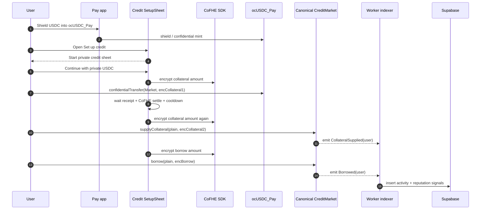

### 44.2 Reveal workflow

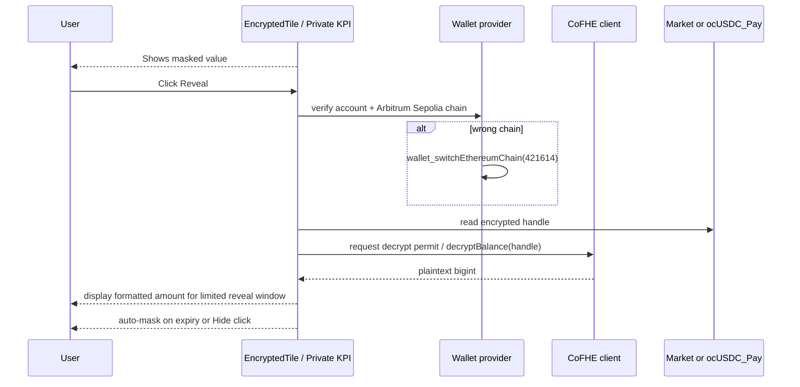

### 44.3 Shared activity and reputation lifecycle

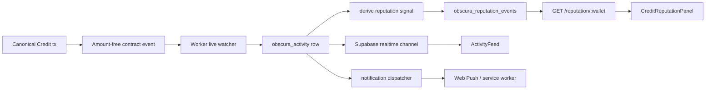

### 44.4 Notification lifecycle

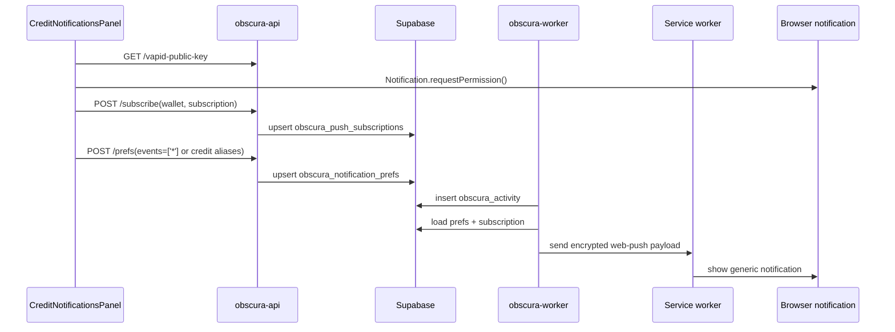

---

## 45. Backend Indexer, Retry, Realtime, and Recovery Deep Dive

### 45.1 Live watcher topology

The deployed worker watches canonical Credit contracts through the same pipeline as Pay and Vote. The canonical market is first in the Credit market list, so catch-up and live polling prioritize the production path before legacy/testnet markets.

```
RPC fallback transport
  -> getLogs in bounded chunks
  -> decode against CREDIT_MARKET_EVENTS / CREDIT_VAULT_EVENTS / CREDIT_AUCTION_EVENTS / CREDIT_SCORE_EVENTS
  -> normalize wallets and participants
  -> insertActivity(tx_hash, log_index)
  -> derive reputation signals
  -> dispatch notifications
```

### 45.2 Retry model

| Layer | Retry behavior | Recovery signal |
|---|---|---|
| RPC live polling | Chunk retries with exponential backoff, then live loop retries up to configured max delay. | Worker `/health.indexer.consecutiveFailures` returns to `0`; `lastSuccessAt` updates. |
| RPC provider outage | Fallback transport tries configured `RPC_URL` first, then public Arbitrum Sepolia endpoints. | Live redeploy validation showed previous `HTTP request failed` state recovered to `lastError=null`. |
| Duplicate logs | Unique `(tx_hash, log_index)` prevents duplicate activity rows. | Duplicate dispatch recovery counter tracks recovered live duplicates. |
| Backfill gaps | Background backfill starts after live catch-up delay and fills from last indexed block. | Missing rows appear in Supabase after worker recovers. |
| Notification stale endpoint | 404/410 push responses remove stale subscriptions. | `staleRemoved` increments in dispatch summary. |
| Reputation backfill | Last N activities are reprocessed with idempotent conflict key. | `/reputation/:wallet` sources update from `pay` only to `pay + credit`. |

### 45.3 Reorg handling reality

The current indexer is idempotent but not a full reorg-indexer. It inserts by `(tx_hash, log_index)` and does not document an explicit tombstone/delete path for removed logs. On Arbitrum Sepolia this is acceptable for testnet production readiness because finality is normally stable by the time the worker backfills, but mainnet promotion should add:

- confirmation-depth indexing for stateful event ingestion,
- removed-log handling if the client surfaces `removed: true`,
- activity row status (`pending`, `finalized`, `reorged`),
- replay-safe notification suppression until finality.

### 45.4 Live production recovery evidence

The live QA log recorded a real worker outage where `/health` showed `lastSuccessAt=null`, `lastError='HTTP request failed.'`, and thousands of consecutive failures. After deploying the fallback transport, worker health recovered with `lastError=null`, `consecutiveFailures=0`, and Credit rows appeared in `obscura_activity`. The bible treats this as a verified operational pattern, not a theoretical one.

---

## 46. Supabase Lifecycle and Schema Semantics

### 46.1 Activity row lifecycle

```mermaid
flowchart TB
  LOG[Decoded chain log] --> WALLETS[extractWallets(args)]
  WALLETS --> SAN[sanitizeActivityArgs]
  SAN --> UPSERT[insert into obscura_activity\nunique tx_hash + log_index]
  UPSERT --> RT[Supabase realtime INSERT]
  UPSERT --> REP[insertReputationSignalsForActivity]
  UPSERT --> NOTIF[dispatchActivityNotification]
  RT --> UI[ActivityFeed]
```

### 46.2 Row privacy classes

| Table | Contains | Canonical privacy expectation |
|---|---|---|
| `obscura_activity` | Event name, wallet, participants, sanitized args, block/tx metadata | Canonical Credit events are amount-free by contract; table still public on testnet. |
| `obscura_reputation_events` | Capped signals + public context | No raw amounts; no raw score; category-level only. |
| `obscura_push_subscriptions` | Browser push endpoint + keys | Service-role only; not exposed to anon clients. |
| `obscura_notification_prefs` | Wallet push/email prefs and event aliases | Readable for UX; updates mediated by API. |

### 46.3 Supabase realtime UX contract

- `ActivityFeed` may show `Connecting`, `Realtime on`, `Idle`, and last sync timestamps.
- No activity rows is not a protocol failure; it can mean no indexed Credit activity for the connected wallet.
- If worker health is green but feed is empty after known txs, check `participants[]` wallet normalization before checking Realtime.
- If worker health is red, no frontend patch can make Credit activity/reputation/push pass; the worker must recover first.

---

## 47. Runtime and Infrastructure Architecture

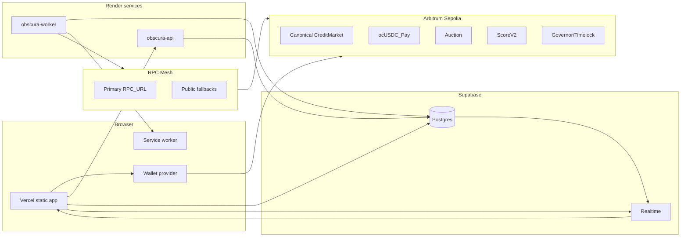

Runtime split:

- **Vercel** serves UI and loads public envs.
- **Wallet provider** signs chain txs and CoFHE decrypt permits.
- **Render worker** is the only component that must continuously poll chain logs.
- **Render API** is request/response: notifications prefs, relay, reputation summary, push tests.
- **Supabase** is the system of record for indexed activity, prefs, subscriptions, and reputation signals.
- **RPC mesh** prevents a single provider from blocking activity/reputation/notification ingestion.

---

## 48. Expanded Threat Model and Security Assumptions

| Threat | Expanded mitigation / current state |
|---|---|
| Wrong-chain decrypt or tx signing | Wallet/provider chain must be verified against `0x66eee`; switch requested before decrypt/write. Live wrong-network QA confirmed app can show `Switch to Arb Sepolia`. |
| Stale wallet-client state after hot reload or connector chain mismatch | Reveal path must recover provider client from active connector and verify chain before CoFHE init. |
| Frontend falsely reports success on reverted tx | Receipt handlers must inspect `receipt.status`; `READY` must never be set on a reverted receipt. |
| RPC outage blocks realtime/reputation | Worker fallback transport; health exposes `lastError`, `consecutiveFailures`, `lastSuccessAt`. |
| Supabase multiple-client warning | Non-blocking in live QA, but mainnet should ensure singleton client construction per browser context. |
| CORS drift across dev ports | API should allow production origin and loopback dev origins deliberately; production CORS validated for Vercel. |
| Activity feed inference | Canonical Credit events omit amounts, but event timing and participant wallet are public. Mainnet privacy docs must call this out. |
| Notification oversharing | Payloads are generic and amount-free; alert categories are hidden behind disclosure in UI. |
| Mobile accidental action | Bottom nav uses short labels; dangerous actions still require form input + wallet signature. |
| Legacy/testnet confusion | Canonical workspace defaults to Pay-backed market only; legacy faucets/hooks live in Settings/Advanced surfaces. |

Security assumptions unchanged from §26: Fhenix ACL correctness, wallet-provider integrity, governance Timelock integrity, and Chainlink feed freshness remain the root assumptions.

---

## 49. Failure Edge Cases and Recovery Runbooks

| Failure | Detection | Recovery |
|---|---|---|
| `Request is being rate limited` during chained FHE txs | Wallet/RPC throws before tx hash. | Wait cooldown; retry. Code wraps fee estimation/write in rate-limit retry and Setup waits after collateral before borrow. |
| CoFHE settle polling times out | FHEStepper stalls in `SETTLING`; receipt may be mined. | Check receipt first; if success, refresh public/position state. Do not repeat transfer blindly. |
| Setup router path reverts | Receipt status `reverted`; no market events. | Canonical setup uses direct market path; router path remains legacy/testnet until fixed. |
| Decrypt returns missing wallet context | Reveal shows inline error and stays masked. | Reconnect wallet; verify chain; retry reveal. |
| Activity missing after successful tx | Supabase has no Credit rows; worker health red or lagging. | Check worker `/health`; if RPC failure, redeploy/fix RPC fallback; if green, inspect `participants[]` normalization and backfill. |
| Reputation stale after activity rows exist | `/reputation/:wallet` lacks Credit source. | Run reputation backfill or inspect `obscura_reputation_events` conflict key. |
| Push test fails while prefs show enabled | Browser permission, service worker, subscription row, VAPID keys. | Use `/debug/push-test`, repair subscription, remove stale endpoints. |
| Mobile overflow | `documentElement.scrollWidth > clientWidth`. | Inspect header/wallet chip, slide-over width, bottom nav labels. Live mobile Settings currently passes. |
| Wrong network | Header shows switch CTA or provider `eth_chainId != 0x66eee`. | Click `Switch to Arb Sepolia` or call wallet switch; block tx/decrypt until fixed. |
| Legacy market accidental selection | Advanced toggle enabled. | Hide Advanced; canonical market remains default. |

---

## 50. Governance Integration Flows

### 50.1 Parameter approval path

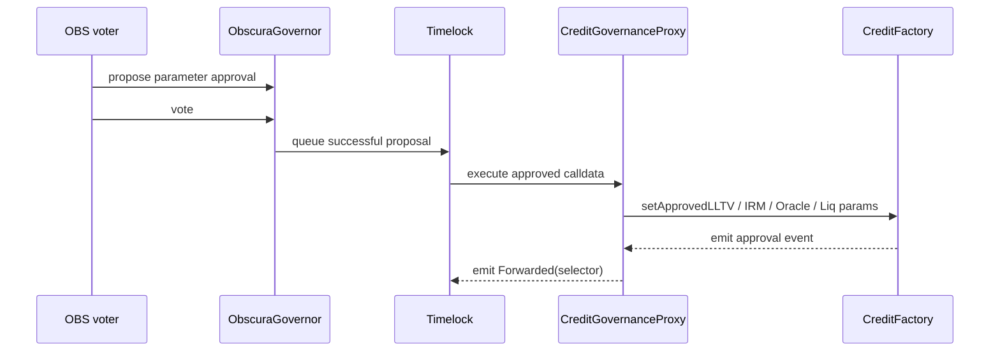

### 50.2 New canonical market candidate path

1. Governance approves the candidate oracle, IRM, LLTV, liquidation bonus, and liquidation threshold.
2. Anyone calls `Factory.createMarket(...)` with the approved tuple.
3. Governance wires `AuctionEngine`, hooks, and any router permissions.
4. Worker env adds the new market to `CREDIT_INDEXER_MARKETS` only after governance labels it active.
5. Frontend `CREDIT_MARKETS` metadata adds the market behind Advanced first; canonical default changes only after a separate product/governance decision.

### 50.3 Emergency response path

| Incident | Governance action |
|---|---|
| Bad oracle/feed | `Oracle.setPublicFeed(asset, replacement)` if governor controls Oracle; otherwise approve new Oracle and migrate market. |
| Broken hook | `setMarketRepayRouter(market, hook, false)`. |
| Broken router | `setOnBehalfRouter(router, false)` via factory/market governance path; canonical direct paths remain usable. |
| Bad LLTV tier | Stop approving that LLTV for new markets; existing markets require migration. |
| Score oracle bad source | `ScoreV2.setSources(...)` or remove market authorization. |

---

## 51. Production Readiness and Mainnet Migration Addendum

### 51.1 Current production readiness evidence

| Area | Status |
|---|---|
| Canonical direct supply/collateral/borrow/repay/withdraw | Verified with live Arbitrum Sepolia txs in QA memory. |
| Worker indexing | Recovered after RPC fallback deploy; Credit rows indexed. |
| Reputation | API aggregates `pay + credit`; live connected wallet showed active tier and score. |
| Notifications | Push prefs/subscription present; Risk test push reported `Server sent 1/1`. |
| Reveal flows | Overview balance and Position reveal verified manually; no auto-decrypt. |
| Mobile UX | 390px width inspected; no horizontal overflow. |
| Legacy isolation | Advanced/testnet tools remain present but are not canonical path. |

### 51.2 Mainnet migration deltas

Before mainnet, add the following in addition to §32:

- Replace testnet-permissive Supabase RLS with signed-wallet-auth policies.
- Add confirmation-depth/finality-aware indexer mode and reorg tombstones.
- Run worker, API, and frontend with paid RPC endpoints and monitored fallbacks.
- Add explicit SLOs: max indexer lag, max notification dispatch delay, max reputation backfill delay.
- Replace testnet faucet surfaces with read-only migration/close-out UI or remove them from production build.
- Separate canonical production hooks from legacy/testnet hooks in Settings so operator grants cannot be confused.
- Add contract-level liquidation health gating or a signed keeper attestation if permissionless `liquidationOpen` remains ungated.
- Re-audit every `FHE.allowThis`, `FHE.allow`, and `FHE.allowTransient` path after any CoFHE SDK upgrade.

---

## 52. Complete Source and Code Reference Map

| System question | Source references |
|---|---|
| What addresses are canonical? | [contracts-hardhat/deployments/arb-sepolia.json](contracts-hardhat/deployments/arb-sepolia.json), [frontend/obscura-os-main/src/config/credit.ts](frontend/obscura-os-main/src/config/credit.ts), [memory_credit_5.md](memory_credit_5.md) |
| How does a borrow execute? | [contracts-hardhat/contracts/credit/ObscuraCreditMarket.sol](contracts-hardhat/contracts/credit/ObscuraCreditMarket.sol), [frontend/obscura-os-main/src/hooks/useCredit.ts](frontend/obscura-os-main/src/hooks/useCredit.ts), [frontend/obscura-os-main/src/components/credit/BorrowForm.tsx](frontend/obscura-os-main/src/components/credit/BorrowForm.tsx) |
| How does setup/onboarding execute? | [frontend/obscura-os-main/src/components/credit/SetupSheet.tsx](frontend/obscura-os-main/src/components/credit/SetupSheet.tsx), [frontend/obscura-os-main/src/hooks/useCredit.ts](frontend/obscura-os-main/src/hooks/useCredit.ts), [frontend/obscura-os-main/src/hooks/useCreditRouter.ts](frontend/obscura-os-main/src/hooks/useCreditRouter.ts) |
| How are position reveals implemented? | [frontend/obscura-os-main/src/hooks/useCredit.ts](frontend/obscura-os-main/src/hooks/useCredit.ts), [frontend/obscura-os-main/src/pages/CreditPage.tsx](frontend/obscura-os-main/src/pages/CreditPage.tsx), [frontend/obscura-os-main/src/components/credit/EncryptedTile.tsx](frontend/obscura-os-main/src/components/credit/EncryptedTile.tsx) |
| How does the shared feed work? | [backend/obscura-worker/src/indexer/index.ts](backend/obscura-worker/src/indexer/index.ts), [backend/obscura-worker/src/indexer/events.ts](backend/obscura-worker/src/indexer/events.ts), [frontend/obscura-os-main/src/components/harmony/ActivityFeed.tsx](frontend/obscura-os-main/src/components/harmony/ActivityFeed.tsx) |
| How are reputation signals produced? | [backend/obscura-worker/src/reputation.ts](backend/obscura-worker/src/reputation.ts), [backend/obscura-api/src/reputation.ts](backend/obscura-api/src/reputation.ts), [frontend/obscura-os-main/src/components/credit/CreditReputationPanel.tsx](frontend/obscura-os-main/src/components/credit/CreditReputationPanel.tsx) |
| How are push notifications configured? | [backend/obscura-api/src/notifications.ts](backend/obscura-api/src/notifications.ts), [backend/obscura-worker/src/notifications.ts](backend/obscura-worker/src/notifications.ts), [frontend/obscura-os-main/src/hooks/useNotificationPrefs.ts](frontend/obscura-os-main/src/hooks/useNotificationPrefs.ts) |
| How are sealed auctions implemented? | [contracts-hardhat/contracts/credit/ObscuraCreditAuction.sol](contracts-hardhat/contracts/credit/ObscuraCreditAuction.sol), [frontend/obscura-os-main/src/components/credit/SealedAuctionCard.tsx](frontend/obscura-os-main/src/components/credit/SealedAuctionCard.tsx) |
| How do hooks integrate? | [contracts-hardhat/contracts/credit/ObscuraCreditStreamHook.sol](contracts-hardhat/contracts/credit/ObscuraCreditStreamHook.sol), [contracts-hardhat/contracts/credit/ObscuraCreditInsuranceHook.sol](contracts-hardhat/contracts/credit/ObscuraCreditInsuranceHook.sol), [frontend/obscura-os-main/src/components/credit/SettingsPanel.tsx](frontend/obscura-os-main/src/components/credit/SettingsPanel.tsx) |
| How does governance reach Credit? | [contracts-hardhat/contracts/credit/ObscuraCreditGovernanceProxy.sol](contracts-hardhat/contracts/credit/ObscuraCreditGovernanceProxy.sol), [contracts-hardhat/contracts/credit/ObscuraCreditFactory.sol](contracts-hardhat/contracts/credit/ObscuraCreditFactory.sol) |
| How is infra deployed? | [render.yaml](render.yaml), [backend/obscura-worker/.env.example](backend/obscura-worker/.env.example), [backend/obscura-api/.env.example](backend/obscura-api/.env.example), [frontend/obscura-os-main/.env](frontend/obscura-os-main/.env) |

---

## 53. Additional Architecture Decisions

### ADR-CRED-013 — Canonical Setup Uses Direct Market Path
**Status**: Accepted

The canonical SetupSheet path uses `useCreditMarket.supplyCollateral` followed by `useCreditMarket.borrow`, not the router. Live QA isolated router failure to the router path while direct canonical market flows succeeded. The router remains documented and available for legacy/testnet and future one-tx flows, but the Pay-backed canonical onboarding path is direct for reliability.

### ADR-CRED-014 — Overview Private Balance Uses Pay-backed ocUSDC Reveal
**Status**: Accepted

The top Overview KPI is the same Pay-backed `ocUSDC_Pay` balance used by Pay and Credit. It must call the real `confidentialBalanceOf` + CoFHE decrypt path on explicit reveal. Placeholder reveal values are forbidden because they create false privacy confidence.

### ADR-CRED-015 — Activity/Reputation/Push Are One Shared Data Plane
**Status**: Accepted

Credit does not own parallel tables. Every Credit lifecycle event joins the existing activity, reputation, and notification plane. The app can filter by Credit, but storage stays shared so Pay/Credit/Vote identity forms one reputation graph.

### ADR-CRED-016 — Mobile Settings Is an Operational Sheet
**Status**: Accepted

Advanced markets, notification repair, legacy faucets, hooks, governance toggles, and score reveal live in Settings. They must remain reachable on mobile, but they are not the main product path. The mobile Settings sheet is full-height and scrollable.

### ADR-CRED-017 — Worker RPC Fallback Is Required Infrastructure
**Status**: Accepted

A single unhealthy RPC provider can halt activity, reputation, and push even while contracts and frontend work. The worker must use a fallback transport and expose health fields that operators can interpret quickly.

### ADR-CRED-018 — Reverted Receipts Are Errors, Never READY
**Status**: Accepted

Any transaction helper that waits for a receipt must inspect `status`. UI can enter `READY` only after a successful receipt. This is especially important for FHE/CoFHE flows where a reverted accounting call can otherwise be confused with a completed encrypted transfer.

---

## 54. Beta Liquidity Architecture Addendum

### 54.1 Status

The canonical Credit market now operates as a real private beta lending pool backed by the same Pay `ocUSDC_Pay` asset used across Pay and Credit. The beta liquidity pool is not a synthetic metric and not a second market. It is the public aggregate liquidity already held by the canonical `ObscuraCreditMarket` at `0x1Ec113297c7F9516A6604aa3b18C180559a6f551`.

Active product labels:

- `Beta Liquidity Pool`
- `Early Access Liquidity`
- `Obscura Treasury Pool`

The product narrative is:

```text
Private Money -> Private Reputation -> Private Credit -> Private Governance
```

### 54.2 Treasury pool seed

On 2026-05-28, the current connected treasury/test wallet supplied `20 ocUSDC` into the canonical market through the same two-step encrypted supply flow that all lenders use.

Seed evidence:

| Step | Tx | Effect |
|---|---|---|
| Token confidential transfer | `0x0cdc9dd303cfbc956a8f323c37f8d54437746d03760c13a26dc6898bba285fda` | `ocUSDC_Pay.confidentialTransfer(market, encAmount)` |
| Market supply accounting | `0xe78c21a231037a981d4de50b78c87feeb4b3158431b56dd438382b39a101ebc6` | `ObscuraCreditMarket.Supplied(user)` |

Post-seed mirrors read from the canonical market:

| Field | Value | Human amount |
|---|---:|---:|
| `totalSupplyAssets` | `20009000` | `20.009 ocUSDC` |
| `totalBorrowAssets` | `2500` | `0.0025 ocUSDC` |
| `utilizationBps` | `1` | `0.01%` |
| `borrowersLength` | `1` | one active borrower |

The UI showed `$20.01` supplied and `$20.01` beta liquidity after refresh. This is intentionally rounded public aggregate display; private wallet balances remain encrypted until reveal.

### 54.3 Privacy-preserving liquidity design

The pool design preserves the existing public/private split:

| Data | Visibility | Why |
|---|---|---|
| Total supplied | Public aggregate | Needed for rates, liquidity, and demo confidence. |
| Total borrowed | Public aggregate | Needed for utilization and market health. |
| User supply shares | Encrypted position tile | Revealed only by explicit wallet action. |
| User borrow debt | Encrypted position tile | Revealed only by explicit wallet action. |
| User collateral | Encrypted position tile | Revealed only by explicit wallet action. |
| Activity rows | Generic, amount-free | Allows realtime UX without leaking financial amounts. |

No fake TVL, faucet balance, or marketing-only liquidity number is used. The public pool numbers come from deployed market mirror reads.

## 55. Beta Borrow Cap Model

### 55.1 Scope

The beta cap model is a lightweight product guard implemented in [useBetaBorrowLimit.ts](frontend/obscura-os-main/src/hooks/useBetaBorrowLimit.ts), [BorrowForm.tsx](frontend/obscura-os-main/src/components/credit/BorrowForm.tsx), and [SetupSheet.tsx](frontend/obscura-os-main/src/components/credit/SetupSheet.tsx). It does not replace contract checks. The contract remains the hard enforcement layer for liquidity, collateral, LLTV, and reverts.

### 55.2 Current tiers

| Reputation tier | Product label | Beta cap |
|---|---|---:|
| `new` | New | `0.25 ocUSDC` |
| `active` | Active | `2 ocUSDC` |
| `steady` | Steady | `5 ocUSDC` |
| `reliable` | Trusted | `8 ocUSDC` |

The effective UI limit is:

```text
min(reputation tier cap, live liquidity guard, protocol max borrowable)
```

The live liquidity guard prevents early-pool drain:

- If available liquidity is below `1 ocUSDC`, the cap is the full available liquidity.
- Once available liquidity is at least `1 ocUSDC`, the cap is at most 25% of available liquidity.

The user's existing borrow is subtracted from the reputation tier cap before the remaining limit is shown.

### 55.3 Product behavior

Borrow surfaces now separate:

- `Protocol max`: public collateral/LLTV maximum from the market.
- `Beta borrow limit`: reputation/liquidity beta allowance from `Obscura Treasury Pool`.

If a requested amount exceeds the beta limit, the UI blocks before wallet signature. If it exceeds protocol max, the UI also warns before transaction construction. This makes beta borrowing feel meaningful without building a new scoring engine or changing deployed contracts.

## 56. Reputation Integration and Unified Ecosystem

### 56.1 Shared reputation graph

Credit reputation is not a Credit-only score. It is the existing aggregate graph from Pay, Credit, and Vote signals:

```text
Pay reliability + Credit discipline + Governance participation = private beta access context
```

The UI copy explicitly explains that Pay, Credit, and Vote activity can raise beta access over time. The current local test wallet moved to `Steady` tier with score `14` after indexed Credit activity was observed.

### 56.2 Activity and notifications

The beta-market polish continues to use the shared activity and notification plane:

- `obscura_activity` for indexed Pay/Credit/Vote events.
- `obscura_reputation_events` for aggregate scoring signals.
- `obscura_notification_prefs` and `obscura_push_subscriptions` for generic alerts.

Manual local testing confirmed new amount-free Credit rows:

- `Credit supplied` for `0xe78c21a231037a981d4de50b78c87feeb4b3158431b56dd438382b39a101ebc6`
- `Credit borrow opened` for `0x24b92686f8d4ad88f8e46a810d64ce52d578b7704172e199f60ec3f81adbf371`
- `Credit repayment recorded` for `0x1b6126a63f6f8daec0edf5d9087c99603f319fe8aabc7b9ea775e65cdad0ca3f`
- `Credit collateral supplied` for `0xf320505fcc0c10349d48e16d6ee6fe7b8300db1463140fa4bc98d02689aca5df`

Risk notification testing reported `Browser displayed. Server sent 1/1.` Push bodies remain generic and amount-free.

## 57. Canonical Market Philosophy and UX Flow

### 57.1 Canonical-first product stance

The beta UI now strongly prioritizes the Pay-backed ocUSDC market:

- Overview leads with beta liquidity and the treasury pool.
- Borrow leads with `Canonical beta market` and hides legacy markets behind Advanced.
- Earn leads with `Supply to Beta Liquidity Pool` before curated vaults.
- Setup starts with Pay-backed private USDC and says `beta liquidity pool - no faucet`.

Legacy markets and vaults remain available only where needed for cleanup, repay, withdraw, and advanced testnet flows. They are no longer the product story.

### 57.2 User testing flow

A private beta tester can validate the market in this order:

1. Open Pay and shield USDC into Pay-backed `ocUSDC` if needed.
2. Open Credit Overview and confirm `Obscura Treasury Pool` plus live beta liquidity.
3. Use Earn to supply Pay-backed `ocUSDC` into the beta pool.
4. Add collateral from Position or Setup.
5. Borrow privately from Borrow, staying under both protocol max and beta cap.
6. Repay from Position.
7. Click Reveal only when they want to view encrypted balances.
8. Check Risk for reputation, notifications, and indexed activity.

### 57.3 Manual validation summary

| Flow | Result |
|---|---|
| Supply beta liquidity | Passed: `20 ocUSDC` seeded into canonical market. |
| Borrow cap warning | Passed: over-limit amount blocked pre-signature. |
| Borrow | Passed: `0.001 ocUSDC` borrow tx `0x24b92686f8d4ad88f8e46a810d64ce52d578b7704172e199f60ec3f81adbf371`. |
| Repay | Passed: `0.001 ocUSDC` repay tx `0x1b6126a63f6f8daec0edf5d9087c99603f319fe8aabc7b9ea775e65cdad0ca3f`. |
| Collateral | Passed: token tx `0xc643f2c650f36cbc0b3af669db277f74d552d4e1c8be1da56126eaea97bb42fb`; market tx `0xf320505fcc0c10349d48e16d6ee6fe7b8300db1463140fa4bc98d02689aca5df`. |
| Reveal/hide | Passed: masked by default, explicit reveal, explicit hide. |
| Activity feed | Passed: realtime feed showed new Credit rows. |
| Reputation | Passed: UI refreshed to `Steady`, score `14`. |
| Notifications | Passed: push test displayed and server sent `1/1`. |
| Mobile | Passed: no horizontal overflow at 390px Risk check; setup copy verified. |

### 57.4 Current limitations before full production maturity

- Beta caps are frontend/product guards, not protocol-level caps. This is acceptable for private beta but should become contract or signed-policy enforced before permissionless production liquidity.
- Current public aggregate market mirrors are intentionally visible; per-user balances remain encrypted. Production docs should explain this split clearly to users.
- The CoFHE SDK default external iframe key storage failed in the local browser profile; Obscura now supplies same-origin FHE key storage for public FHE key/CRS cache. This should be watched during SDK upgrades.
- The router path remains non-canonical for setup. Direct market flows are canonical until the router path is re-audited and revalidated.
- Legacy markets still exist for cleanup and advanced flows. Production mainnet should either remove them from the primary build or keep them in an explicit migration-only surface.

## 58. Validation Commands for Beta Polish

After the beta-market changes:

| Command | Result |
|---|---|
| `npm run test -- src/test/pay-final-p0.test.ts` in [frontend/obscura-os-main](frontend/obscura-os-main) | Passed, 19 tests. |
| `npm run build` in [frontend/obscura-os-main](frontend/obscura-os-main) | Passed with existing Browserslist/Rollup chunk warnings only. |
| VS Code diagnostics on edited frontend files | No errors. |

— END OF BIBLE —
